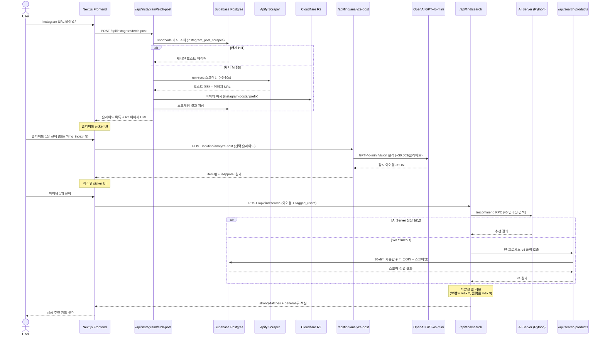
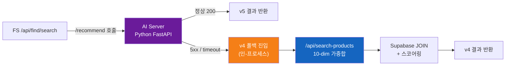
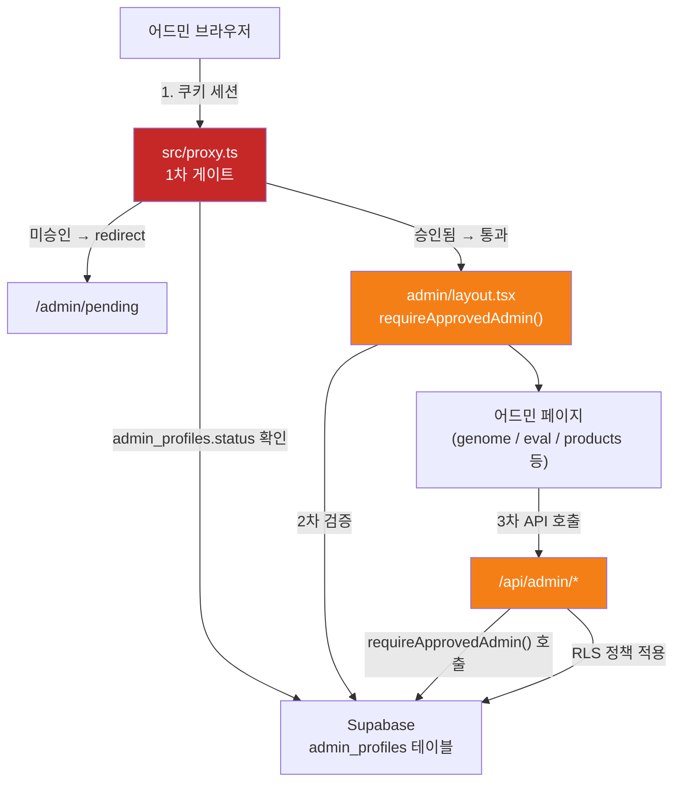

# kiko.ai — 데이터 흐름

> **주의**: 이 문서는 모듈 레벨 추상화를 제공합니다. 가중치·RPC 파라미터·에러 코드 등 세부 비즈니스 룰의 정식 진실 원천은 `docs/features/main-flow.md` 및 `docs/features/search-engine.md`입니다.

---

## 메인 플로우 시퀀스 다이어그램



---

## 폴백 체인



AI Server 미설정 (`AI_SERVER_URL` 환경변수 없음) 시에도 자동으로 v4 경로로 진행합니다.

---

## 어드민 데이터 흐름



---

## 캐시 흐름

| 캐시 키 | 저장소 | 캐시 대상 | 무효화 |
|---|---|---|---|
| `instagram_post_scrapes.shortcode` | Supabase Postgres | Apify 스크래핑 결과 전체 | 수동 (TTL 없음) |
| R2 `instagram-posts/<shortcode>/` | Cloudflare R2 | 포스트 이미지 원본 복사본 | 수동 삭제 |
| R2 `analyses/<shortcode>/` | Cloudflare R2 | Vision 분석 결과 이미지 | 수동 삭제 |

캐시 HIT 시 Apify 호출 비용($0.0023/포스트)과 스크래핑 대기 시간(5-10s)을 절약합니다.

---

## v4 검색 내부 흐름

```
/api/search-products 입력
  → enums/ 기반 쿼리 파라미터 정규화
  → Supabase products 테이블 JOIN (brands, platform_metadata)
  → 10개 차원 가중합 스코어링
      (색상 / 스타일 / 카테고리 / 브랜드 매치 / 가격대 / 소재 / 핏 / 시즌 / 성별 / 태그)
  → strongMatches 필터 (브랜드 필터 매치 상품)
  → general 풀 (전체 결과)
  → 다양성 캡 (브랜드 max 2, 플랫폼 max 3) 적용
  → 결과 반환
```

---

## 필수 동기화 문서 안내

이 코드맵은 모듈 레벨 추상화를 제공합니다. 아래 3개 문서가 세부 흐름의 **단일 진실 원천**입니다.

| 문서 | 담당 내용 |
|---|---|
| `docs/features/main-flow.md` | API 시퀀스 상세, 에러 코드, 캐시 규칙, picker UX |
| `docs/features/search-engine.md` | v4 가중치 상세, v5 인프라 현황, 검색 알고리즘 |
| `docs/ARCHITECTURE.md` | 외부 서비스 토폴로지, 시스템 경계 |

> 자세히: `docs/features/main-flow.md` (메인 플로우 전체), `docs/features/search-engine.md` (검색 엔진 v4/v5)
