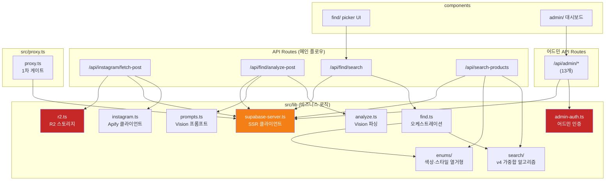

# portal.ai — 의존성 그래프

## 외부 패키지 (카테고리별)

### UI

| 패키지 | 버전 | 역할 |
|---|---|---|
| tailwindcss | 4 | 유틸리티 CSS + 디자인 토큰 |
| shadcn/ui | latest | 재사용 컴포넌트 기반 |
| framer-motion | 12.38 | UX 애니메이션 |
| sonner | 2.0 | 토스트 알림 |
| recharts | 3 | 어드민 차트 |
| @vercel/analytics | — | Web Vitals 수집 |

### 데이터 / 인프라

| 패키지 | 버전 | 역할 |
|---|---|---|
| @supabase/ssr | 0.10 | SSR 쿠키 인증 |
| @supabase/supabase-js | 2.100 | DB 클라이언트 + pgvector + pgroonga |
| @aws-sdk/client-s3 | — | Cloudflare R2 접근 (S3 호환) |

### AI

| 패키지 | 버전 | 역할 |
|---|---|---|
| openai | 6.32 | GPT-4o-mini Vision API |

### 빌드 / 런타임

| 패키지 | 버전 | 역할 |
|---|---|---|
| next | 16.2.4 | 프레임워크 + Turbopack 번들러 |
| react | 19.2.4 | UI 런타임 |
| typescript | 5 | 타입 안전성 |

### 개발 도구

| 패키지 | 역할 |
|---|---|
| vitest | 단위 테스트 |
| playwright | E2E + 크롤러 스크립트 |
| eslint | 코드 품질 린터 |
| pnpm | 10.23.0 — 패키지 매니저 |

---

## 내부 모듈 의존성 그래프

---

## Server-Only 의존성 격리

다음 모듈은 `import "server-only"` 선언이 있어 클라이언트 번들에 포함될 수 없습니다. 이 모듈을 클라이언트 컴포넌트에서 직접 import 하면 빌드 에러가 발생합니다.

| 모듈 | 격리 이유 |
|---|---|
| `src/lib/r2.ts` | R2 API 키 (AWS_ACCESS_KEY_ID 등) 서버 전용 환경변수 사용 |
| `src/lib/supabase-server.ts` | service-role 키 + 쿠키 기반 세션 — 브라우저 노출 금지 |
| `src/lib/admin-auth.ts` | 어드민 검증 로직 + service-role DB 접근 포함 |

---

## 아카이브 격리 존

`src/app/_archive-qa/` 는 완전히 격리된 영역입니다.

- Next.js `_` prefix로 라우팅에서 제외됨
- 내부에서 외부 lib으로의 import는 존재할 수 있으나, 외부에서 이 디렉토리로의 import는 금지
- v5 검색 재설계 완료 시 일괄 삭제 대상

> 자세히: `docs/ARCHITECTURE.md` (외부 서비스 전체 매트릭스), `docs/PATTERNS.md` (import 규칙)
