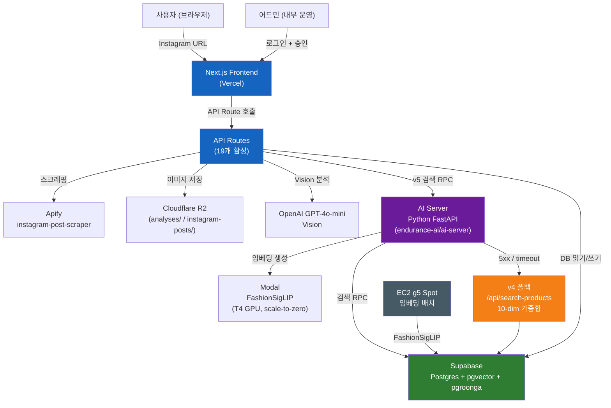

# kiko.ai — 아키텍처 개요

## 한 줄 요약

Instagram 포스트 URL 한 장을 받아 Vision AI로 아이템을 감지하고, 한국 패션 자사몰 32개 ~81k SKU에서 구매 가능한 상품을 추천하는 Next.js 16 모놀리스 웹 앱.

---

## 고수준 아키텍처 다이어그램



---

## 핵심 설계 패턴

| 패턴 | 설명 |
|---|---|
| RSC 기본 / `"use client"` 최소화 | 모든 컴포넌트는 React Server Component 기본. 인터랙션(picker UI, 폼) 시에만 클라이언트 컴포넌트로 분리 |
| `server-only` 격리 | R2 클라이언트, Supabase service-role, 어드민 인증 헬퍼는 `import "server-only"`로 클라이언트 번들 노출 차단 |
| 3중 어드민 가드 | `src/proxy.ts`(엣지 라우팅) → `admin/layout.tsx`(RSC requireApprovedAdmin) → `/api/admin/*`(API 핸들러) 순서로 인증 강제 |
| 인-프로세스 API 호출 | `/api/find/search`가 `/api/search-products`를 외부 HTTP 없이 서버 내에서 직접 호출 (v4 폴백 경로) |
| 폴백 체인 | AI Server `/recommend` → 5xx/timeout → v4 가중합 검색. 서비스 연속성 보장 |
| 캐시-퍼스트 스크래핑 | `instagram_post_scrapes.shortcode` 키로 DB 캐시 조회 후 MISS 시에만 Apify 호출 |

---

## 시스템 경계

```
┌─────────────────────────────────────────────────────┐
│  Next.js 16 모놀리스 (Vercel)                        │
│  - 페이지 라우팅 (App Router)                         │
│  - API Routes (19개)                                 │
│  - 서버 전용 비즈니스 로직 (src/lib/)                  │
│  - 어드민 대시보드 (13개 모듈)                         │
└──────────────────┬──────────────────────────────────┘
                   │ HTTP / Supabase SDK
   ┌───────────────┼───────────────────┐
   ▼               ▼                   ▼
Python AI Server  Supabase Postgres   Cloudflare R2
(별도 레포)        (단일 DB 클러스터)   (오브젝트 스토리지)

                        ▲
                        │ 단발 배치
               EC2 g5 Spot (임베딩 배치, 별도 운영)
```

---

> 자세히: `docs/ARCHITECTURE.md` (전체 토폴로지 + 외부 서비스 매트릭스)
