# kiko.ai — 아키텍처 (Overview)

> 시스템 전체 그림 + 도메인별 doc 매핑. 깊은 내용은 각 `features/*` / `infra/*` 참조.
> 최종 업데이트: 2026-05-21 (feature/admin-wiki — migration 084 `brand_nodes.wiki jsonb` + PATCH /api/admin/brand-nodes/[id]/wiki + brand-node-detail WikiSection/WikiEditor + brand-graph/detail 응답 확장)

## 한 줄 요약

> "Paste any Instagram post. We'll tell you where to buy the fit." — IG 포스트 URL 한 장 → 슬라이드 룩 분해 → 32개 자사몰 ~81k SKU에서 매칭 상품 추천. 단일 Next.js 앱.

별도 백엔드 서버 없음. Next.js App Router(API Routes) 한 덩어리에 분석·검색·어드민이 모두 들어있다. **크롤링은 [`endurance-ai/crawler`](https://github.com/endurance-ai/crawler) 외부 리포** (EC2 batch). AI 인코딩 배치는 AWS EC2 Spot 단발 인스턴스로 외부화.

---

## 활성 진입점

| 경로 | 역할 | 입력 |
|---|---|---|
| `/admin` | **유일 활성 표면** — 운영 대시보드 (Style/Brand Genome, Search Debugger, Products, Brand 검수, 메타 검수, AI Insights, Crawl, Prompts) | — |
| `/` | `/admin` 으로 redirect | — |

> ⚠️ **2026-05-22 admin 전용 전환**: 공개 IG "snitch" 메인플로우가 통째로 제거됨. 제거 대상 = `src/app/page.tsx`(→redirect)·`_components/`·`api/{find,instagram,analyze,feedback}`·`domains/{vision,search,instagram}`·`domains/brand-resolution/resolve-brands`·관련 `lib/{analyze,find,instagram,i18n,r2,...}`. 어드민 `analytics`·`user-voice`·`eval` 페이지도 함께 제거(eval 은 writer 제거로 dead-end). 봇(ai 리포)은 app 을 호출하지 않고 Postgres 직결이므로 영향 없음. 검색·Vision 로직은 ai 리포(자체 포팅) + 어드민 search-debugger 자체 모듈(`domains/admin-tools/search-debug/*`)에 잔존. 마이그레이션 087~089 로 관련 테이블(instagram_post_scrapes·scrape_images·search_quality_logs·user_feedbacks·analysis_sessions·analyses·analysis_items·eval_reviews·api_access_logs) + analyses 레거시 세션 컬럼 DROP.

> 아래 "시스템 토폴로지"·"메인 플로우" 관련 섹션과 [features/main-flow.md](features/main-flow.md) 는 제거된 플로우를 설명 — ⚠️ stale, 이력 참고용.

---

## 시스템 토폴로지

```mermaid
graph TB
    subgraph Browser["🖥️ Browser"]
        U1["/ — IG post URL"]
        U2["/admin — dashboards"]
    end

    subgraph Vercel["⚡ dev-app EC2 — Next.js 16 App Router (standalone)"]
        MW["middleware.ts<br/>/admin/* auth gate"]
        API_IG["/api/instagram/fetch-post<br/>(cache lookup → Apify fallback)"]
        API_FIND_AN["/api/find/analyze-post<br/>(single slide, slideIndex)"]
        API_FIND_S["/api/find/search<br/>(SearchEngine port: v6 embedding-first<br/>Modal /embed/text → search_products_v6 HNSW)"]
        API_SEARCH["/api/admin/search-v6-debug<br/>v6 debugger (admin — AI server proxy + RPC trace)<br/>+ /api/admin/search-debug-runs CRUD"]
        API_ADMIN["/api/admin/*<br/>brand-nodes/ai-insights/style-nodes/[code]/brands"]
        API_INTERNAL["/api/internal/classify-brand<br/>(X-Internal-Key, brand VLM)<br/>LiteLLM 토글 (LITELLM_DISABLED 가드)"]
    end

    subgraph External["🌐 External Services"]
        APIFY["Apify<br/>instagram-post-scraper<br/>(run-sync, ~5-10s)"]
        OAI["OpenAI<br/>GPT-4o-mini Vision"]
        AISERVER["AI Server (EC2)<br/>endurance-ai/ai-server<br/>FastAPI + Modal embed + text tower"]
        LITELLM["LiteLLM proxy<br/>(EC2, AI 서버 옆 컨테이너)"]
    end

    subgraph Data["💾 Persistence"]
        SB["dev-app Postgres 16<br/>+ pgvector<br/>+ PostgREST nginx shim<br/>public schema (app_user)"]
        AIDB["ai schema (ai_user 소유)<br/>card_impression / log_conversation_event<br/>user_taste_profile / user_session<br/>app_user = SELECT-only (068)"]
        R2["Cloudflare R2<br/>analyses/ + instagram-posts/"]
    end

    subgraph Batch["🛠️ Offline Batch"]
        CRAWL["endurance-ai/crawler<br/>(별도 리포 — EC2 batch<br/>Cafe24 Playwright + Shopify JSON)"]
        EMBED["scripts/aws/<br/>EC2 g5 Spot — FashionSigLIP<br/>(test only)"]
        BRANDSCRIPTS["scripts/<br/>fill_brand_meta.py (LiteLLM gpt-4o-mini)<br/>umap_brand_layout.py (BGE-m3 1024D → 2D)"]
    end

    U1 --> API_IG
    API_IG -. cache HIT .-> SB
    API_IG -. cache MISS .-> APIFY
    APIFY --> R2
    API_IG --> SB

    U1 --> API_FIND_AN
    API_FIND_AN --> OAI
    API_FIND_AN -.optional.-> LITELLM --> OAI

    U1 --> API_FIND_S
    API_FIND_S -->|Modal /embed/text + search_products_v6| AISERVER
    AISERVER --> SB
    API_SEARCH --> SB

    U2 --> MW --> API_ADMIN
    API_ADMIN --> SB
    API_ADMIN --> AIDB

    CRAWL --> SB
    CRAWL -->|POST X-Internal-Key| API_INTERNAL
    API_INTERNAL -.litellm ON.-> LITELLM
    API_INTERNAL -.litellm OFF.-> OAI
    API_INTERNAL --> SB
    EMBED --> SB
    BRANDSCRIPTS --> SB

    classDef vercel fill:#1565c0,stroke:#0d47a1,color:#fff
    classDef ext fill:#6a1b9a,stroke:#4a148c,color:#fff
    classDef data fill:#2e7d32,stroke:#1b5e20,color:#fff
    classDef batch fill:#f57f17,stroke:#e65100,color:#fff

    class MW,API_SEARCH,API_IG,API_FIND_AN,API_FIND_S,API_ADMIN,API_INTERNAL vercel
    class APIFY,OAI,LITELLM,AISERVER ext
    class SB,R2,AIDB data
    class CRAWL,EMBED,BRANDSCRIPTS batch
```

---

## 외부 서비스 매트릭스

| 서비스 | 용도 | 상세 |
|---|---|---|
| dev-app EC2 | Next.js 16 호스팅 (output: standalone, GitHub Actions CI/CD, SPEC-INFRA-MIGRATE-001 P5). 2026-05-10 Vercel pause | [infra/deployment.md](infra/deployment.md) |
| dev-app Postgres 16 | 영속 데이터 + RLS + pgvector (자체호스팅, SPEC-INFRA-MIGRATE-001 P2/P4. Auth는 Auth.js v5로 전환 완료. pgroonga는 069로 DROP) | [infra/data-model.md](infra/data-model.md) |
| **PostgREST + nginx shim** | dev-app EC2 자체 호스팅 — Supabase.com REST 대신 로컬 PostgREST 라우팅 (SPEC-INFRA-MIGRATE-001 P6) | aws-infra 리포 |
| Cloudflare R2 | 이미지 저장 (단일 버킷, prefix 분리) | [infra/deployment.md](infra/deployment.md#cloudflare-r2--이미지-저장) |
| **Apify** (`instagram-post-scraper`) | Instagram 포스트 단발 스크래핑 — `run-sync-get-dataset-items`, ~5-10s, $0.0023/post | [features/main-flow.md](features/main-flow.md#step-1--instagram-포스트-스크래핑) |
| OpenAI | GPT-4o-mini Vision (단일 슬라이드 분석) + 브랜드 메타 추론 (`fill_brand_meta.py` via LiteLLM) + **brand-VLM 분류** (`/api/internal/classify-brand`, 5-image multimodal, LiteLLM 토글 가능 — `LITELLM_DISABLED !== "true"` 가드) | [features/main-flow.md](features/main-flow.md#step-2--슬라이드별-vision-분석) |
| **AI Server** ([endurance-ai/ai-server](https://github.com/endurance-ai/ai-server)) | v6 검색 오케스트레이션 (Modal `/embed` + `/embed/text` 텍스트 타워 + dev-app `search_products_v6` RPC). 어드민 **search-debugger**(`/api/admin/search-v6-debug` → `search-debug/ai-client.ts`)가 호출 (구 `/api/find/search` 는 2026-05-22 제거) | [features/search-engine.md](features/search-engine.md) |
| **Modal serverless** | FashionSigLIP `/embed` (이미지 임베딩) + `/embed/text` (텍스트 임베딩, FashionSigLIP 텍스트 타워, T4 GPU, scale-to-zero) — AI 서버가 호출 | (ai-server repo) |
| LiteLLM proxy | LLM 라우팅 + Langfuse callback (AI 서버 EC2 컨테이너, `54.116.116.225:4000`). 브랜드 메타 추론 배치에서도 사용 | [infra/deployment.md](infra/deployment.md) |
| Langfuse self-host | 관측성 (LLM/embed/파이프라인 trace) — AI 서버 EC2 컨테이너 | (ai-server repo) |

> **AI 서버는 별도 repo.** Python FastAPI. `/api/find/search` 는 `SearchEngine` port 뒤로 위임 (SPEC-SEARCH-V6-001). **단일 v6 어댑터**: 쿼리 텍스트 → Modal `/embed/text` → `normalize(0.7·img + 0.3·txt)` 벡터 → `search_products_v6` RPC (cosine HNSW + `primary_style_node_id` EXACT + `category_canonical` family 게이트). EXACT 0건 → degraded ladder (`engine:"v6-degraded"`). `SEARCH_ENGINE_VERSION`·`CB_ENABLED`·회로차단기·v4/v5 어댑터 전부 제거됨 (SPEC-SEARCH-V6-001). 상세: [features/search-engine.md](features/search-engine.md).

---

## 도메인별 doc

| 영역 | doc |
|---|---|
| 메인 플로우 (IG → Vision → 검색) | [features/main-flow.md](features/main-flow.md) |
| 검색 엔진 (v6 embedding-first / v4 어드민) | [features/search-engine.md](features/search-engine.md) |
| 크롤러 (외부 리포) | [endurance-ai/crawler](https://github.com/endurance-ai/crawler) — 데이터 흐름은 [features/crawler.md](features/crawler.md) |
| DB 스키마 / 마이그레이션 / RLS | [infra/data-model.md](infra/data-model.md) |
| 환경변수 / AWS 프로필 | [infra/env.md](infra/env.md) |
| 배포 / EC2 Spot / Git 워크플로 | [infra/deployment.md](infra/deployment.md) |
| 코드 패턴 (API route, DB/PostgREST, LLM, 프론트) | [PATTERNS.md](PATTERNS.md) |
| 디자인 시스템 | [design/system.md](design/system.md) |

아래 두 영역은 별도 doc 없이 본 문서에 직접.

---

## 어드민 (`/admin`)

3중 가드 (SPEC-INFRA-MIGRATE-001 P3, 2026-05-10 — Auth.js v5 전환):

1. `src/middleware.ts` — Auth.js `authorized` 콜백 → JWT 유효 + `admin_profiles.status = 'approved'` 아니면 `/admin/pending` 리다이렉트
2. `src/app/admin/layout.tsx` — RSC에서 `requireApprovedAdmin()` 재확인
3. `/api/admin/*` 라우트 핸들러 — 동일 헬퍼로 한번 더 검증

대시보드 (2026-05-22 admin 전용 전환 후): **분류 체계** (스타일 노드 / 브랜드 노드 / 프롬프트) / **검수 대기** (브랜드 노드 검수 / 메타 검수) / **인사이트** (브랜드 클러스터 / AI 인사이트) / **시스템** (상품 DB / 크롤 모니터 / 검색 디버거). 사이드바 타이틀 **"kiko.ai Admin"**.

> ⚠️ **2026-05-22 제거**: 분석 로그(analytics) / 유저 보이스(user-voice) / 품질 평가(eval) 3개 어드민 페이지 + 관련 테이블(analyses·analysis_items·eval_reviews·api_access_logs·search_quality_logs·user_feedbacks·analysis_sessions) DROP (마이그 087~089). 사유: 공개 IG 플로우 제거로 분석 데이터 writer 소멸 → 해당 페이지 dead-end.

인증 모델 (P3 — Auth.js v5 Credentials Provider):
- 로그인: `signIn("credentials", {email, password})` → bcryptjs hash 검증 → JWT 발급
- 인증 경로: `/api/auth/[...nextauth]` (NextAuth handler)
- DB 직접 접근: `src/lib/db.ts` (pg Pool) → `admin_profiles.password_hash` 조회 (Supabase service role 대신 pg 직접)
- 세션: JWT 쿠키 기반 (구 Supabase SSR 쿠키 → Auth.js JWT)

승인 흐름:
- `/admin/signup` — 셀프 가입 비활성화됨 (redirect). 계정은 관리자가 DB 직접 생성
- 관리자가 DB에서 수동 `'approved'` 전환
- 다음 로그인부터 통과

⚠️ `admin_profiles` 는 own-row SELECT 정책 필수 (RLS 미설정 시 middleware가 null 받아서 무한 리다이렉트). 회고는 메모리 `feedback_supabase_middleware_rls.md`.

핵심 파일:
- `src/auth.ts` (NextAuth 설정), `src/middleware.ts`, `src/lib/admin-auth.ts`, `src/lib/db.ts`
- `src/app/api/auth/[...nextauth]/route.ts`, `src/app/admin/login/page.tsx`
- `src/app/admin/layout.tsx`, `src/app/admin/pending/page.tsx`

v6 검색 디버거 v2 신규 (2026-05-20 — feature/redesign-admin):
- `src/app/admin/search-debugger/page.tsx` — 전면 재작성 (~1710 LOC). text/image/fused 3 모드 + Apify URL resolve + Vision/LLM rewrite trace + 파이프라인 step 토글 + `search_debug_runs` 히스토리 패널. 구 v4 score-breakdown UI 완전 대체.
- `/api/admin/search-v6-debug` — AI 서버(`AI_API_URL`) 프록시 + `search_products_v6` RPC 직접 trace. `AI_API_URL` + `INTERNAL_API_TOKEN` 신규 env 의존.
- `/api/admin/search-debug-runs` (GET/POST) + `[id]` (GET/PATCH/DELETE) — `search_debug_runs` 테이블 CRUD (migration 083). run 저장/히스토리/rating.
- `src/domains/admin-tools/search-debug/` — `v6-debug.route.ts` / `runs.route.ts` / `ai-client.ts` (AI server HTTP client, `X-Internal-Token` 헤더)

크롤 모니터 신규 (2026-05-20):
- `src/app/admin/crawl/page.tsx` — `crawl_platform_stats` 집계 뷰 시각화 (migration 078). 플랫폼별 SKU 카운트 + 최근 크롤 타임스탬프.
- `/api/admin/crawl-monitor/route.ts` — `crawl_platform_stats` 조회 (구 `/api/admin/crawl-coverage` — migration 078 기반 새 라우트).

제거된 라우트 / 컴포넌트 (feature/redesign-admin):
- ~~`/api/admin/brands`~~ / ~~`/api/admin/brands/[id]`~~ / ~~`/api/admin/brands/export`~~ / ~~`/api/admin/brand/[id]/similar`~~ / ~~`/api/admin/brand-clusters`~~ (루트) / ~~`/api/admin/crawl-coverage`~~ — 모두 dead stub, 이 PR에서 삭제.
- ~~`/api/search-products`~~ — v4 어드민 전용 route 삭제. `src/domains/search-v4/` 도메인 전체 삭제 (검색 디버거가 v6으로 전환됨).
- ~~`src/components/admin/crawl-coverage.tsx`~~ / ~~`src/components/admin/search-debugger-results.tsx`~~ — 구 v4 디버거 컴포넌트 삭제.
- ~~`src/lib/brand-embed.ts`~~ / ~~`src/domains/brand-resolution/brand-embed.ts`~~ — 사용처 없음 삭제.
- ~~`src/lib/search/locked-filter.ts`~~ / ~~`src/shared/utils/locked-filter.ts`~~ / ~~`src/lib/enums/season-pattern.ts`~~ / ~~`src/shared/enums/season-pattern.ts`~~ — v4 전용 유틸 삭제.
- ~~`src/__characterization__/arch-app-001/v4-scoring.test.ts`~~ / ~~`src/__characterization__/search-unify-001/search-v4-shape.test.ts`~~ — v4 특성화 테스트 삭제.
- ~~`src/app/admin/brand-graph/page.tsx`~~ / ~~`src/app/admin/genome/page.tsx`~~ — 리다이렉트 페이지 삭제 (리다이렉트 불필요).

브랜드 그래프 관련 신규 (2026-05-10):
- ~~`src/app/admin/brand-graph/page.tsx`~~ — **067 후 redirect → `/admin/brand-clusters`** (037 BGE-m3 자산 폐기. 리다이렉트 페이지 자체는 feature/redesign-admin에서 삭제됨)
- `src/app/admin/brand-proposals/page.tsx` — LLM 추론 검수큐 테이블 뷰
- `src/app/api/admin/brand-graph/route.ts` (노드 + SKU 카운트), `neighbors/route.ts`, `detail/route.ts`
- `src/app/api/admin/brand-proposals/route.ts`, `bulk/route.ts` (일괄 승인/거절)
- ~~`src/components/admin/brand-detail-panel.tsx`~~ — **삭제됨** (브랜드 그래프 페이지 폐기와 함께), `src/lib/brand-normalize.ts`

스타일 노드 taxonomy 관리 신규 (SPEC-NODE-REDESIGN-001, 2026-05-13):
- `src/app/admin/style-nodes/page.tsx` — 노드 리스트 (is_active 필터 토글)
- `src/app/admin/style-nodes/new/page.tsx` — 노드 생성 폼
- `src/app/admin/style-nodes/[code]/page.tsx` — 노드 편집 + 소프트 삭제 (is_active=false)
- `src/app/api/admin/style-nodes/route.ts` — `GET` / `POST`
- `src/app/api/admin/style-nodes/[code]/route.ts` — `GET` / `PATCH` / `DELETE` (soft)
- `src/app/api/style-nodes/route.ts` — `GET` (admin-gated, taxonomy 공개 노출)
- `src/lib/style-nodes-db.ts` — DB fetch wrapper (5 min cache + in-flight dedup, `fetchActiveStyleNodes` / `buildNodeReference` / `getActiveNodeCodes`)

프롬프트 레지스트리 신규 (SPEC-PROMPT-REGISTRY-001, 2026-05-14):
- `src/app/admin/prompts/page.tsx` — situation 별 grouped 리스트 (Server Component)
- `src/app/admin/prompts/[id]/page.tsx` — 편집 + activate/deactivate (Client)
- `src/app/admin/prompts/new/page.tsx` — 신규 생성 / clone (Client)
- `src/app/api/admin/prompts/route.ts` — `GET` / `POST` (requireApprovedAdmin gate)
- `src/app/api/admin/prompts/[id]/route.ts` — `GET` / `PATCH` / `DELETE` (soft)
- `src/lib/prompts/registry.ts` — DB fetch + 5 min cache + in-flight dedup + placeholder resolver (style_nodes / static / enums / runtime 4종)
- `src/lib/prompts/analyze.ts` — thin wrapper → `buildPrompt("vision-analyze")`
- `src/lib/prompts/prompt-search.ts` — thin wrapper → `buildPrompt("prompt-search")`

Brand Node Review admin (SPEC-BRAND-NODE-001 P6, 2026-05-14):
- `src/app/admin/brand-node-review/page.tsx` — Server Component. brand_node_review_queue open 목록, reason별 grouped, pending rerun 카운트 표시
- `src/app/admin/brand-node-review/[id]/page.tsx` — Client Component. brand 상세 + VLM output + representative images + 4 액션 (Approve VLM / Manual 지정 / Rerun / Dismiss)
- `src/app/api/admin/brand-node-review/route.ts` — `GET` (list, ?reason/?status/?limit 필터)
- `src/app/api/admin/brand-node-review/[id]/route.ts` — `GET` (단건+brand 상세) / `PATCH` (approve/manual/dismiss/rerun 4 actions, atomic resolve WHERE resolved_at IS NULL)
- `src/app/api/admin/brand-node-review/process-reruns/route.ts` — `POST` (admin_note='RERUN_REQUESTED' 일괄 처리, 동시성 4, max 50건, 127.0.0.1 self-fetch SSRF 가드, AbortSignal.timeout 25s)
- `src/components/admin/process-reruns-button.tsx` — Client, POST 후 result 표시 + router.refresh

브랜드 노드 관리 페이지 + AI 인사이트 신규 (2026-05-15 admin reskin):
- `src/app/admin/brand-nodes/page.tsx` — 브랜드 노드 목록 (구 `/admin/genome` redirect 대상). 검색 + style_node 필터 + 페이지네이션. 행 클릭 시 detail drawer (brand-node-detail.tsx)
- `src/app/admin/brand-nodes/brand-node-detail.tsx` — 브랜드 상세 Sheet. products 대표이미지 + 유사 브랜드 + price_min/max_usd + **Wiki 섹션** (view/edit, SPEC-BRAND-WIKI-001 M2)
- `src/app/admin/genome/page.tsx` — redirect → `/admin/brand-nodes`
- `src/app/admin/ai-insights/page.tsx` — 대화형 봇 운영 통계 3탭 (추천 성과 CTR / 대화 로그 / 세션). ai 스키마 raw SQL (pg Pool). recharts 시각화
- `src/app/api/admin/brand-nodes/route.ts` — `GET` (list, `?page&search&node_code&wiki=all|with|without` 필터). PostgREST supabase 클라이언트 경유
- `src/app/api/admin/brand-nodes/[id]/wiki/route.ts` — `PATCH` (wiki jsonb merge-update, SPEC-BRAND-WIKI-001 M2). 도메인 실체: `src/domains/admin-tools/brand-management/brand-nodes__id__wiki.route.ts`
- `src/app/api/admin/ai-insights/route.ts` — `GET` (3 영역 집계). **pg Pool 직접 + ai schema-qualified SQL** (`ai.card_impression`, `ai.log_conversation_event`, `ai.user_session`)
- `src/app/api/admin/ai-insights/user/route.ts` — `GET` (단일 user_key 전체 이벤트 시계열)
- `src/app/api/admin/style-nodes/[code]/brands/route.ts` — `GET` (해당 노드에 분류된 brand 목록 + representatives, ?role=primary|secondary|both)
- `src/components/admin/sidebar.tsx` — 4섹션 구조 (`NAV_SECTIONS`)로 리팩터링 + "kiko.ai Admin" 타이틀
- `src/lib/currency-to-usd.ts` — 어드민용 정적 USD 환산 유틸 (`toUsd` / `fmtUsd`). 대상 통화: USD/KRW/GBP/EUR/JPY/CNY

Brand-VLM 분류 endpoint (SPEC-BRAND-NODE-001 P2b + P3', 2026-05-14):
- `src/app/api/internal/classify-brand/route.ts` — `POST` (X-Internal-Key 인증). 흐름: classify_brand_acquire RPC → is_brand_representative 이미지 5장 → buildPrompt('brand-vlm') → OpenAI multimodal → confidence ≥ 0.7 → brand_nodes UPDATE / 미만 → review_queue. 응답: `{ ok, result: 'classified' | 'queued' | 'skipped' }`
- `src/lib/auth/internal.ts` — `requireInternalKey()` 헬퍼 (crypto.timingSafeEqual, 최소 16자)

---

## Brand Graph Infra (2026-05-10)

브랜드 유사도 그래프 + 메타 자율 추론 인프라. 검색 품질 향상의 사전 준비.

토폴로지:
- DB: 마이그레이션 037~043 + 055~056. **migration 067 (2026-05-15)** — brand_nodes.embedding/x_umap/y_umap/sensitivity_tags/brand_keywords/aliases/representative_image_urls/category_type/price_band 포함 13 컬럼 DROP + price_min_usd/price_max_usd 신규. `brand_similar` 그래프(42k edges) + `brand_attribute_proposals` 검수큐 + `brand_sku_counts` materialized view 는 유지. **brand_nodes.id bigserial** (056), primary/secondary_node_id FK + review_queue (055), pg_trgm (056)
- 배치: `scripts/fill_brand_meta.py` (gpt-4o-mini via LiteLLM 메타 추론 — brand_keywords 067 drop으로 dead), `scripts/umap_brand_layout.py` (1024D UMAP — 037 자산 dead), `scripts/register_unmatched_brands.ts`
- API: 5 라우트 (`/api/admin/brand-graph`, `neighbors`, `detail`, `/api/admin/brand-proposals`, `bulk`)
- UI: ~~`/admin/brand-graph`~~ (→ redirect `/admin/brand-clusters`, 037 자산 폐기), `/admin/brand-proposals` (검수큐)

상세: `HANDOFF-brand-graph.md`
스키마: `docs/infra/data-model.md` 의 brand_similar / brand_attribute_proposals 항목

---

## ~~Search Engine v6 Evaluation Infra~~ (드랍됨, 2026-05-13)

> **Migration 048** 로 전체 드랍. eval_golden_queries / eval_golden_set / eval_judgments / eval_runs 4 테이블 삭제. `src/lib/eval/` 전체 삭제. API 7 라우트 삭제. eval_reviews 만 유지. v6 재설계 시 새 SPEC.

SPEC: SPEC-V6-EVAL (완료→드랍), SPEC-V6-EVAL-V2 (완료→드랍)

---

## 코드 구조 — SPEC-ARCH-APP-001 재배치 (2026-05-17)

stack-internal 아키텍처 재설계. **언어·동작·화면 불변**, 레이어만 분리. 옛 `src/lib/*` / `src/app/api/*` 경로는 **thin re-export shim** 으로 남아 동작하며, 실체는 아래로 이동:

| 신규 위치 | 내용 |
|---|---|
| `src/shared/{enums,utils}/` | 순수 enum·유틸 (korean-vocab / color·style-adjacency / locked-filter / currency / format / utils) |
| `src/repositories/clients/` | 단일 DB 접근층 — `postgrest.ts` / `pg-pool.ts` (옛 `src/lib/{supabase,db}.ts`) |
| ~~`src/domains/search-v4/`~~ | **feature/redesign-admin에서 전체 삭제** — v6 search-debugger 전환으로 v4 어드민 소비자 제거됨. `api/search-products/route.ts` 도 삭제. |
| ~~`src/domains/search/`~~ | **2026-05-22 삭제** — 공개 `find/search` 제거에 동반. v6 검색 로직은 어드민 `search-debug/*` 자체 모듈 + ai 리포에 잔존 |
| ~~`src/domains/instagram/` · `src/domains/vision/`~~ | **2026-05-22 삭제** — 공개 IG 플로우 제거 |
| `src/domains/brand-resolution/` | `brand-normalize.ts` 만 잔존 (스크립트 `register_unmatched_brands` 사용). `resolve-brands.ts` 는 2026-05-22 삭제 |
| `src/domains/admin-tools/{brand-management,style-taxonomy,products,prompts,eval,analytics}/` | 28개 admin 라우트 본문. `api/admin/*/route.ts` 는 전부 `export *` thin shim |

> 옛 경로 import 는 shim 으로 전부 유효 — 본 문서 내 다른 `src/lib/...` / `api/admin/...` 표기는 호환 경로이며 실체는 위 신규 위치다. 신규 코드는 신규 위치를 직접 참조.

**구 `src/app/_archive-qa/` (Q&A 6단계 플로우) 는 step 8 에서 삭제됨** (live import 0 검증, dead test 2파일 동반 제거). v4 가 쓰던 enum(korean-vocab/color·style-adjacency 등)은 `src/shared/enums/` 로 살아있음.

> ✅ SEARCH-V6: `api/find/search` 는 SPEC-SEARCH-V6-001 로 v6 단일 어댑터 전환 완료 (2026-05-18). v5/v4-fallback 어댑터·circuit-breaker·PAI·pgroonga 전부 제거. `product_embeddings`(071) + `search_products_v6`(072) + `category_canonical`(073) 활성.
> 📝 doc-sync: `docs/features/main-flow.md` + `docs/features/search-engine.md` + `docs/infra/data-model.md` 모두 갱신 ✅ 완료 (SPEC-SEARCH-V6-001 doc pass).

---

## 다음 단계

1. ~~**검색 엔진 v5 분기 작성**~~ — ✅ 완료 → v6 단일 엔진으로 대체 (SPEC-SEARCH-V6-001)
2. **`product_embeddings` 풀배치 실행** — 인프라(071) + 스크립트(`scripts/aws/embed_products.py`) 준비됨, 81k SKU 풀 실행 미시도
3. **LiteLLM 재가동** — EC2 인스턴스 OFF 상태 (v6 검색은 Modal 직접 호출이라 LiteLLM 미의존, 브랜드 메타 배치용으로 별도 결정 필요)
4. ~~**`product_ai_analysis` 드랍**~~ — ✅ 완료 (migration 069 DROP CASCADE)
5. ~~**archived 코드 처분**~~ — ✅ 완료 (SPEC-ARCH-APP-001 step 8 — `_archive-qa/` 삭제, v4 사용 enum 은 `src/shared/enums/` 존치)

---

## 변경 이력

| 날짜 | 사건 |
|---|---|
| 2026-05-21 | **brand wiki (feature/admin-wiki, SPEC-BRAND-WIKI-001)** — migration 084: `brand_nodes.wiki jsonb` 신규 컬럼 + 인덱스 3종 (country/ig_handle/status). 신규 API `PATCH /api/admin/brand-nodes/[id]/wiki` (wiki merge-update, requireApprovedAdmin 게이트, 입력 검증 ALLOWED_KEYS + URL http/https 체크). `GET /api/admin/brand-graph/detail` 응답 확장: `brand.wiki` 필드 + `similar[].primary_style_node_id` + `nodes_by_id` (유사 브랜드 노드 배지). `GET /api/admin/brand-nodes` 필터 확장: `?wiki=all|with|without`. 어드민 brand-node-detail drawer — WikiSection(view) + WikiEditor(edit) + 드래그 리사이즈 핸들(localStorage 유지). |
| 2026-05-20 | **admin redesign (feature/redesign-admin)** — migration 074 (`get_product_filter_counts()` DROP + `count_products_by()` RPC 신설), 075 (brand-attributes prompt v1 seed), 076 (brand_multimodal_umap + cluster 테이블), 078 (`crawl_platform_stats` 집계 뷰), 079 (products.material DROP), 080 (`brand_similar` DROP), 081 (products.style_node text 레거시 컬럼+인덱스+CHECK DROP), 082 (`search_products_v6` category JOIN verbatim 정정 — fanout 버그 수정), 083 (`search_debug_runs` 테이블 신설). v6 검색 디버거 v2 (text/image/fused 모드, Apify URL resolve, Vision/LLM rewrite trace, Run 히스토리). 크롤 모니터 신설 (`/admin/crawl`). 어드민 사이드바 리그룹. `src/domains/search-v4/` 전체 + dead admin API stubs + v4 특성화 테스트 삭제. brand-node 상세 drawer 13 속성 + 상품 상세 UX 개편. brand-cluster 상세 패널 신설. |
| 2026-05-18 | **검색 엔진 v6 전환 (SPEC-SEARCH-V6-001)** — migration 069(product_ai_analysis + search_products_v5 + product_search_text + pgroonga 인덱스 + 027 임베딩 자산 DROP CASCADE) 070(products.id uuid→bigserial, product_reviews FK swap) 071(product_embeddings halfvec(768) HNSW, SERIAL 빌드) 072(search_products_v6 RPC — cosine HNSW + primary_style_node_id EXACT + category_canonical family 게이트 + degraded ladder) 073(category_canonical 752→20 family 매핑). SearchEngine port: v5/v4-fallback 어댑터·circuit-breaker 제거, v6 단일 어댑터. Modal `/embed/text` 텍스트 타워 신규 의존. `SEARCH_ENGINE_VERSION`·`CB_ENABLED` 등 env 제거. PAI·pgroonga 완전 폐기. |
| 2026-05-18 | **admin brand-nodes 썸네일 쿼리 개선 (bugfix)** — `/api/admin/brand-nodes` 대표 이미지 조회: 단일 `IN(brandIds)+global limit` → 브랜드별 `Promise.all` 병렬 쿼리(limit 20). 이미지 소스: `images[]` 단독 → `image_url`(스칼라, 우선) + `images[0]`(fallback). `/api/admin/brand-graph/detail` 대표 샘플 cap: 5 → 10. 신규 외부 의존성·라우트·에러 코드 없음. |
| 2026-05-15 | **brand_nodes 슬림화 + admin reskin** — migration 067: brand_nodes 13 컬럼 drop (037 BGE-m3 텍스트 임베딩 자산: embedding/embedding_model/embedding_text_hash/embedded_at/x_umap/y_umap/umap_at + 옛 LLM 메타: sensitivity_tags/brand_keywords/aliases/category_type/representative_image_urls + price_band) + price_min_usd/price_max_usd (numeric) 신규 + products 기준 USD backfill. migration 068: app_user → ai 스키마 SELECT-only GRANT (card_impression/log_conversation_event/user_taste_profile/user_session). 신규 admin 페이지 `/admin/brand-nodes` (구 genome rename + redirect), `/admin/ai-insights` (ai 스키마 대화형 봇 통계 3탭). 신규 admin API `/api/admin/brand-nodes`, `/api/admin/ai-insights`, `/api/admin/ai-insights/user`, `/api/admin/style-nodes/[code]/brands`. `/admin/brand-graph` → `/admin/brand-clusters` redirect. 사이드바 4섹션 + "kiko.ai Admin" rebrand + 파비콘 교체. 삭제: brand-detail-panel/edit-panel/table/filters components, `src/lib/brand-cluster.ts`. search-products v4 brandDna 로드 disable (sensitivity_tags 067 drop). `src/lib/currency-to-usd.ts` 신규. |
| 2026-05-15 | **Brand Multimodal Embedding (SPEC-BRAND-EMBED-001)** — migration 063~066: `brand_multimodal_embeddings` (FashionSigLIP 768 halfvec, HNSW), `node_centroids`, `find_similar_brands` RPC, `brand_multimodal_umap`. 스크립트 5종 (`embed_brand_multimodal.py` / `build_node_centroids.py` / `build_adjacency_from_centroids.py` / `build_brand_umap.py` / `refresh_brand_embeddings_all.sh` wrapper). `style_node_adjacency` 자동 채움 인프라 완성 (source='embedding_derived', manual 보존). 신규 admin `/admin/brand-clusters` (UMAP 2D scatter, recharts) + `GET /api/admin/brand/[id]/similar`. `src/lib/brand-embed.ts` helper. **검색 엔진 미통합** — SPEC-SEARCH-V6 가 결합. **현재 11 brand 임베딩**, crawler bulk 완료 후 풀배치 예정. 037 BGE-m3 텍스트 임베딩은 stale (옛 15 코드 풀) — SPEC 5 정리 대상. 상세: `features/brand-embed.md`. |
| 2026-05-10 | **Auth.js v5 마이그 (SPEC-INFRA-MIGRATE-001 P3)** — Supabase Auth 제거 → Auth.js Credentials Provider + bcryptjs + pg Pool. 신규: `src/auth.ts`, `src/lib/db.ts`, `src/middleware.ts`, `/api/auth/[...nextauth]`. 삭제: `src/proxy.ts`, `src/lib/supabase-browser.ts`, `src/lib/supabase-server.ts`, `@supabase/ssr` |
| 2026-05-10 | **PostgREST 자체 호스팅 (SPEC-INFRA-MIGRATE-001 P6)** — dev-app EC2 내부에 PostgREST + nginx shim 구성. Supabase.com REST 엔드포인트 대체 (aws-infra 리포 반영됨) |
| 2026-05-14 | **Brand-VLM 분류 endpoint (SPEC-BRAND-NODE-001 P2b + P3')** — migration 059 (brand-vlm v1 prompt seed, gpt-4o-mini multimodal 5-image). migration 060 (PL/pgSQL 2 함수: `classify_brand_acquire` SELECT FOR UPDATE + 60초 mutex, `enqueue_brand_review` partial unique upsert). `POST /api/internal/classify-brand` 신규 (X-Internal-Key, 크롤러 전용). `src/lib/auth/internal.ts` requireInternalKey (timingSafeEqual). crawler → kiko.ai 내부 API 채널 개통. |
| 2026-05-14 | **Brand Node Review admin UI + LiteLLM 토글 (SPEC-BRAND-NODE-001 P6)** — `/admin/brand-node-review` (Server, grouped by reason, pending rerun count) + `[id]` (Client, 4 actions: approve/manual/rerun/dismiss). admin API 3개 (`GET list`, `GET/PATCH [id]`, `POST process-reruns`). atomic resolve (WHERE resolved_at IS NULL), SSRF 가드 (127.0.0.1 self-fetch), XSS 가드 (http/https URL 검증). classify-brand LiteLLM 토글 (`LITELLM_DISABLED !== "true"` — analyze/route.ts 와 동일 패턴). 사이드바 "브랜드 노드 검수" 메뉴 추가. |
| 2026-05-14 | **Brand Node Redesign schema (SPEC-BRAND-NODE-001 PR-X)** — brand_nodes 에 primary/secondary_node_id FK + node_confidence + representative_image_urls (055). brand_nodes.id uuid → bigserial 전환 + 4 FK bigint swap (brand_similar/brand_attribute_proposals/brand_node_review_queue) + pg_trgm extension (056). `brand_node_review_queue` 신설. 4 admin TS 파일 brand_id 타입 string → number. `supabase/migrations/` → `database/migrations/` 디렉토리 rename (50+ 파일). |
| 2026-05-14 | **Prompt Registry (SPEC-PROMPT-REGISTRY-001)** — `prompts` 테이블 (052) + seed 2 row (053: vision-analyze v1 / prompt-search v1) + `activate_prompt(bigint)` PL/pgSQL RPC (054, atomic activate). `src/lib/prompts/analyze.ts` + `prompt-search.ts` 하드코딩 170+ 라인 → thin wrapper. `PROMPT_SEARCH_USER` sync export 제거 → `getPromptSearchUser()` async. 어드민 프롬프트 CRUD 3 페이지 + API 4 라우트. |
| 2026-05-13 | **Style Node taxonomy DB 이전 (SPEC-NODE-REDESIGN-001)** — `style_nodes` 테이블 (049, A~T 20 node seed via 050) + `style_node_adjacency` (051, 빈 테이블 — SPEC-BRAND-EMBED-001 가 채울 예정). `fashion-genome.ts` STYLE_NODES const → DB fetch wrapper (`style-nodes-db.ts`). Prompt builder 시그니처 const → async fn. 어드민 style-nodes CRUD 3 페이지 + API 4 라우트. |
| 2026-05-13 | **DB cleanup (migrations 044~048)** — legacy 5종 drop (item_search_results, set_hnsw_ef_search, rls_auto_enable, handle_new_admin_user, brand_nodes.platform), PAI v6 axis 8 컬럼 추가 (045), 테이블/컬럼 한글 COMMENT (046), pgcrypto extension drop (047), eval 4 테이블 drop + admin/eval queue-only 단순화 (048) |
| 2026-05-10 | **브랜드 유사도 그래프** — 마이그레이션 037~043 (brand_similar/embedding/proposals/aliases/UMAP/SKU 카운트) + 어드민 2 페이지 + 5 API 라우트 + 배치 스크립트 3종. EC2 self-host CI/CD (Dockerfile + deploy-dev.yml, SPEC-INFRA-MIGRATE-001 P5) |
| 2026-05-05 | **크롤러 외부 리포 분리** — `scripts/crawl.ts` + 32 플랫폼 파서 → [`endurance-ai/crawler`](https://github.com/endurance-ai/crawler). DB 가 양 리포의 계약. kiko.ai package.json 에서 `playwright` 제거 |
| 2026-05-04 | **검색 v6 평가 인프라 (SPEC-V6-EVAL)** — eval_golden_queries / eval_judgments / eval_runs 3 테이블 + NDCG@10/Precision@5 lib + 6 API 라우트 + admin/eval 5탭 UI → 2026-05-13 전체 드랍 |
| 2026-04-26 | **메인 플로우 v2 머지 (PR #31)** — Apify 스크래퍼 + 단일 슬라이드/아이템 정밀 매칭 + 캐시 + 4-step picker UI |
| 2026-04-26 | `/find` 메인 승격 + 구 Q&A `_archive-qa/` 이동 + 문서 도메인별 분할 |
| 2026-04-26 | `/dna`, `/about`, `/archive` 라우트 + 관련 DB 제거 (PR #30) |
| 2026-04-24 | v5 인프라 마이그레이션 027 적용 (pgvector + pgroonga + bulk RPC) |
| 2026-04-23 | 해외 Shopify 자사몰 10개 크롤 — 35,746 SKU 추가 |
