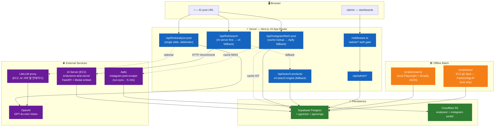

# portal.ai — 아키텍처 (Overview)

> 시스템 전체 그림 + 도메인별 doc 매핑. 깊은 내용은 각 `features/*` / `infra/*` 참조.
> 최종 업데이트: 2026-04-26 (메인 플로우 v2 머지 — Apify 스크래퍼 + 단일 슬라이드/아이템 정밀 매칭)

## 한 줄 요약

> "Paste any Instagram post. We'll tell you where to buy the fit." — IG 포스트 URL 한 장 → 슬라이드 룩 분해 → 32개 자사몰 ~81k SKU에서 매칭 상품 추천. 단일 Next.js 앱.

별도 백엔드 서버 없음. Next.js App Router(API Routes) 한 덩어리에 분석·검색·크롤·어드민이 모두 들어있다. AI 인코딩 배치는 AWS EC2 Spot 단발 인스턴스로 외부화.

---

## 활성 진입점

| 경로 | 역할 | 입력 |
|---|---|---|
| `/` | 메인 플로우 — IG 포스트 → 슬라이드 picker → 아이템 picker → 상품 추천. 상세는 [features/main-flow.md](features/main-flow.md) | IG 포스트 URL (`?img_index=N` 옵션) |
| `/admin` | 운영 대시보드 (Genome, Analytics, Eval, Search Debugger, Products, User Voice 등) | — |

**메인 플로우 v2 핵심 (PR #31, 2026-04-26)**:
- 임의 IG post URL fetch (Apify 스크래퍼 사용 — 기존 `web_profile_info` 의 TOO_OLD 한계 제거)
- URL 의 `?img_index=N` 파싱 → 캐러셀 직접 점프
- img_index 없으면 슬라이드 picker UI 노출 → 사용자가 1장 선택
- 단일 슬라이드 Vision 분석 → 다중 아이템 검출 → 사용자가 1개 선택
- 선택된 1개 + 그 포스트의 tagged_users로 brandFilter 빌드 → strongMatches + general 검색
- `instagram_post_scrapes.shortcode` 로 캐시 (재요청 시 Apify 호출 스킵)

> 구 `/` (Q&A 6단계 에이전트)는 `src/app/_archive-qa/` 로 이동, 라우터 제외. PR #30(2026-04-26)에서 `/dna`, `/about`, `/archive` 도 제거됨.

---

## 시스템 토폴로지

---

## 외부 서비스 매트릭스

| 서비스 | 용도 | 상세 |
|---|---|---|
| Vercel | Next.js 16 호스팅 | [infra/deployment.md](infra/deployment.md) |
| Supabase Postgres | 영속 데이터 + Auth + RLS + pgvector + pgroonga | [infra/data-model.md](infra/data-model.md) |
| Cloudflare R2 | 이미지 저장 (단일 버킷, prefix 분리) | [infra/deployment.md](infra/deployment.md#cloudflare-r2--이미지-저장) |
| **Apify** (`instagram-post-scraper`) | Instagram 포스트 단발 스크래핑 — `run-sync-get-dataset-items`, ~5-10s, $0.0023/post | [features/main-flow.md](features/main-flow.md#step-1--instagram-포스트-스크래핑) |
| OpenAI | GPT-4o-mini Vision (단일 슬라이드 분석) | [features/main-flow.md](features/main-flow.md#step-2--슬라이드별-vision-분석) |
| **AI Server** ([endurance-ai/ai-server](https://github.com/endurance-ai/ai-server)) | v5 검색 오케스트레이션 (Modal embed + Supabase RPC + 다양성 캡). `/api/find/search` 가 호출 | [features/search-engine.md](features/search-engine.md) |
| **Modal serverless** | FashionSigLIP `/embed` (이미지 임베딩, T4 GPU, scale-to-zero) — AI 서버가 호출 | (ai-server repo) |
| LiteLLM proxy | LLM 라우팅 + Langfuse callback (AI 서버 EC2 컨테이너) | [infra/deployment.md](infra/deployment.md) |
| Langfuse self-host | 관측성 (LLM/embed/파이프라인 trace) — AI 서버 EC2 컨테이너 | (ai-server repo) |

> **AI 서버는 별도 repo.** Python FastAPI. `AI_SERVER_URL` 미설정 또는 5xx/timeout 시 자동 v4 폴백.

---

## 도메인별 doc

| 영역 | doc |
|---|---|
| 메인 플로우 (IG → Vision → 검색) | [features/main-flow.md](features/main-flow.md) |
| 검색 엔진 (v4 + v5 인프라) | [features/search-engine.md](features/search-engine.md) |
| 크롤러 (32 플랫폼) | [features/crawler.md](features/crawler.md) |
| DB 스키마 / 마이그레이션 / RLS | [infra/data-model.md](infra/data-model.md) |
| 환경변수 / AWS 프로필 | [infra/env.md](infra/env.md) |
| 배포 / EC2 Spot / Git 워크플로 | [infra/deployment.md](infra/deployment.md) |
| 코드 패턴 (API route, Supabase, LLM, 프론트) | [PATTERNS.md](PATTERNS.md) |
| 디자인 시스템 | [design/system.md](design/system.md) |

아래 두 영역은 별도 doc 없이 본 문서에 직접.

---

## 어드민 (`/admin`)

3중 가드:

1. `src/middleware.ts` — Supabase SSR 쿠키로 user 확인 → `admin_profiles.status = 'approved'` 가 아니면 `/admin/pending` 리다이렉트
2. `src/app/admin/layout.tsx` — RSC에서 `requireApprovedAdmin()` 재확인
3. `/api/admin/*` 라우트 핸들러 — 동일 헬퍼로 한번 더 검증

대시보드: Genome / Analytics / Eval / Search Debugger / Products / User Voice / Pipeline Health / Crawl Coverage.

승인 흐름:
- `/admin/signup` → `admin_profiles` row 자동 생성 (`status=pending`)
- 관리자가 DB에서 수동 `'approved'` 전환
- 다음 로그인부터 통과

⚠️ `admin_profiles` 는 RLS + own-row SELECT 정책 필수 — 없으면 middleware가 null 받아서 무한 리다이렉트. 회고는 메모리 `feedback_supabase_middleware_rls.md`.

핵심 파일:
- `src/middleware.ts`, `src/lib/admin-auth.ts`, `src/lib/supabase-server.ts`
- `src/app/admin/layout.tsx`, `src/app/admin/pending/page.tsx`, `src/app/admin/login/page.tsx`

---

## Archived 코드 (`src/app/_archive-qa/`)

구 `/` Q&A 6단계 플로우 (input → confirm → hold → conditions → results → feedback). 코드만 보존, 라우팅 제외. 함께 미사용 상태로 묶인 것:

- `src/app/api/analyze/route.ts` — Vision/Text 단일 분석 라우트
- `src/app/api/feedback/route.ts` — 6단계 피드백 수집
- `src/lib/enums/korean-vocab.ts`, `color-adjacency.ts`, `style-adjacency.ts` — 검색엔진 v4가 여전히 호출함
- `src/lib/search/locked-filter.ts` — 검색엔진이 호출하나 메인 플로우에서는 미사용

**v5 재설계 결과에 따라 일괄 삭제 가능.** 신규 작업의 reference 금지.

---

## 다음 단계 (v5 재설계와 묶일 결정 항목)

1. **검색 엔진 v5 분기 작성** — `/api/search-products` 에 dense + sparse + RRF 통합 쿼리 + 피처 플래그 `SEARCH_ENGINE_VERSION`
2. **FashionSigLIP 81k 풀배치 실행** — 인프라/스크립트만 준비됨, 실행 미시도
3. **LiteLLM 재가동** — EC2 인스턴스 OFF 상태, v5 인프라 잡을 때 같이 켜기
4. **`product_ai_analysis` 드랍** — v5 검증 완료 후
5. **archived 코드 처분** — `_archive-qa/` + 관련 enum/유틸 일괄 삭제 시점 결정

---

## 변경 이력

| 날짜 | 사건 |
|---|---|
| 2026-04-26 | **메인 플로우 v2 머지 (PR #31)** — Apify 스크래퍼 + 단일 슬라이드/아이템 정밀 매칭 + 캐시 + 4-step picker UI |
| 2026-04-26 | `/find` 메인 승격 + 구 Q&A `_archive-qa/` 이동 + 문서 도메인별 분할 |
| 2026-04-26 | `/dna`, `/about`, `/archive` 라우트 + 관련 DB 제거 (PR #30) |
| 2026-04-24 | v5 인프라 마이그레이션 027 적용 (pgvector + pgroonga + bulk RPC) |
| 2026-04-23 | 해외 Shopify 자사몰 10개 크롤 — 35,746 SKU 추가 |
