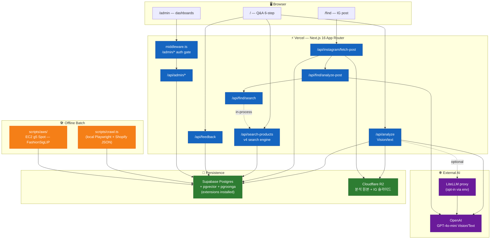
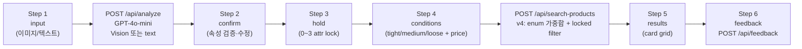

# portal.ai — 아키텍처 (현재 상태)

> 최종 업데이트: 2026-04-26 (v5 임베딩 재설계 직전 스냅샷)
>
> 본 문서는 코드베이스 실측 기반의 **현재 상태(as-is)** 만 다룬다. 향후 변경 계획은 `docs/plans/` 참조.
> "활성 진입점", "프로젝트 구조"의 단일 진실은 여전히 `CLAUDE.md` — 본 문서는 그 위에 깔리는 인프라/플로우 그림.

---

## 1. 한 줄 요약

> "One photo. Every option." — 이미지/IG 포스트/텍스트를 입력으로 받아 룩을 분해하고, 32개 자사몰에서 크롤한 ~81k SKU에서 매칭 상품을 추천하는 단일 Next.js 앱.

별도 백엔드 서버 없음. Next.js App Router(API Routes) 한 덩어리에 분석·검색·크롤·어드민이 모두 들어있다. AI 인코딩 배치는 AWS EC2 Spot 단발 인스턴스로 외부화.

---

## 2. 활성 진입점

| 경로 | 역할 | 메인 모달리티 | 상태 |
|------|------|--------------|------|
| `/` | Q&A 6단계 에이전트 (input → confirm → hold → conditions → results → feedback) | 이미지 또는 텍스트 프롬프트 | **현재 메인 — 아카이브 예정** |
| `/find` | Instagram 포스트 URL → 슬라이드 Vision → 브랜드 매칭 → 상품 | IG 포스트 URL | **다음 메인 (승격 예정)** |
| `/admin` | 운영 대시보드 (Genome, Analytics, Eval, Search Debugger, Products, User Voice) | — | 내부 — 유지 |

> **방향 전환 (2026-04-26 확정)**: `/find` 를 메인으로 승격하고, 기존 `/` (Q&A 6단계)는 **라우터에서 제거하되 코드는 보존**(아카이브성). `/admin` 은 그대로 유지. v5 큰 틀을 잡으며 같이 진행.
>
> `/dna`, `/about`, `/archive` 라우트는 PR #30(2026-04-26)에서 코드/DB까지 제거. 본 문서에 등장하지 않는다.

---

## 3. 시스템 토폴로지



---

## 4. 외부 서비스 / 인프라

| 서비스 | 용도 | 비고 |
|---|---|---|
| **Vercel** | Next.js 16 호스팅 (App Router, Turbopack 빌드) | `vercel.json` 은 framework 지정뿐, 런타임 옵션은 기본값 |
| **Supabase Postgres** | 모든 영속 데이터 + Auth(어드민 한정) + RLS | extensions: `vector`, `pgroonga` 활성화됨 |
| **Cloudflare R2** | 이미지 저장 (분석 원본, IG 슬라이드) | `@aws-sdk/client-s3` 로 접근, public CDN URL 노출 |
| **OpenAI** | GPT-4o-mini Vision/Text 분석 | 단일 프로바이더 |
| **LiteLLM proxy** *(현재 OFF)* | OpenAI 호출 라우팅·로깅·비용 통제 | EC2 호스팅 인스턴스 존재하나 현 시점 미사용. v5 인프라 큰 틀 잡은 뒤 재가동 예정. 코드는 `LITELLM_BASE_URL` 설정 + `LITELLM_DISABLED!=='true'` 일 때만 활성 |
| **AWS EC2 g5.xlarge Spot** | FashionSigLIP 임베딩 배치 인코딩 (단발 spin-up→tear-down) | `scripts/aws/launch_embed_batch.sh` 로 로컬에서 기동, user-data가 끝에 `shutdown -h now` |
| **Instagram (oEmbed + web_profile_info)** | 포스트 스크래핑 | undici 직접 호출, 프록시 옵션 지원 |

> **AI 서버 없음.** Python AI 서비스(FastAPI 등)는 현 시점 0개. 모든 LLM 호출은 Vercel 함수 안에서 OpenAI(또는 LiteLLM 프록시) 로 직접 나간다.

---

## 5. 핵심 데이터 흐름

### 5.1 메인 — Q&A 6단계 (`/`)



- 클라이언트 상태는 `src/app/_qa/agent-reducer.ts` 의 `useReducer` (전역 store 없음)
- Hold = **hard filter** — `src/lib/search/locked-filter.ts:passesLockedFilter` 가 검색 엔진 상단에서 통과/탈락 처리
- 유사도 단계 → 결과 개수 매핑(`toleranceToTargetCount`): tight=10 / medium=15 / loose=20

### 5.2 /find — Instagram 포스트 → 상품

```mermaid
flowchart LR
    URL["IG 포스트 URL"] -->|parsePostUrl| FETCH["/api/instagram/fetch-post"]
    FETCH -->|"oEmbed (~300ms)"| OWNER["owner_handle + caption"]
    OWNER -->|"web_profile_info (~500ms)"| RECENT["recent ~12 posts"]
    RECENT -->|shortcode 매칭| FULL["target post full data<br/>(slides + tagged_users)"]
    FULL -->|R2 copy + DB insert| SCRAPE["scrapeId"]
    SCRAPE --> ANP["/api/find/analyze-post"]
    ANP -->|max 10 slides 병렬| VISION["GPT-4o-mini Vision"]
    VISION -->|isApparel 게이트| SLIDES["SlideAnalysis[]"]
    SLIDES --> SRCH["/api/find/search"]
    SRCH -->|resolve-brands<br/>@handle → brand_id[]| BFILT["brandFilter"]
    BFILT -->|in-process 호출| SP["search-products handler"]
    SP --> RESULTS["strongMatches (브랜드 일치)<br/>+ general (일반)"]
```

- `/api/find/search` 는 HTTP fetch 없이 `search-products` 핸들러를 **인프로세스 직접 호출** — SSRF 회피 + 쿠키 포워딩 회피
- 슬라이드 비디오(`is_video=true`) 자동 스킵, `isApparel=false` 도 스킵
- Vision 비용 상한: 슬라이드 10장 × ~$0.003 = **포스트당 ~$0.03**
- 에러 코드: `INVALID_URL`, `REEL_NOT_SUPPORTED`(파서 단계 즉시 reject), `TOO_OLD`(owner 최근 12 포스트 밖), `PRIVATE`(비공개 계정)

### 5.3 /admin — 어드민

3중 가드:
1. `src/middleware.ts` — Supabase SSR 쿠키로 user 확인 → `admin_profiles.status = 'approved'` 가 아니면 `/admin/pending` 리다이렉트
2. `src/app/admin/layout.tsx` — RSC에서 `requireApprovedAdmin()` 재확인
3. `/api/admin/*` 라우트 핸들러 — 동일 헬퍼로 한번 더 검증

대시보드: Genome / Analytics / Eval / Search Debugger / Products / User Voice / Pipeline Health / Crawl Coverage.

---

## 6. 데이터 저장소

### 6.1 Supabase Postgres — 테이블 인벤토리 (마이그레이션 029까지)

| 영역 | 테이블 | 역할 |
|---|---|---|
| **분석 로그** | `analyses` | 메인 플로우 분석 1건 = 1행. AI raw 응답 + 검색 결과 전체 + `is_pinned` |
| **세션** | `analysis_sessions` | 세션 단위 묶음 (user_voice 분석용) |
| **상품 카탈로그** | `products` | 크롤로 들어온 모든 SKU. `embedding vector(768)`, `embedding_model`, `embedded_at` 컬럼 추가됨 (mig 027) |
| | `product_reviews` | 상품 리뷰 (mig 019) |
| | `product_ai_analysis` | v4 검색이 INNER JOIN 하는 LLM 분석 산출물 (mig 012) — **v5 검증 후 드랍 예정** |
| **브랜드** | `brand_nodes` | Fashion Genome v2: 15 style nodes + brand DNA |
| | `brand_attributes` | 어드민에서 채우는 브랜드 속성 (mig 010) |
| **검색 품질** | `search_quality_logs` | 검색 호출당 score breakdown 로깅 (어드민 디버거에서 시각화) |
| **평가** | `eval_reviews`, `eval_golden_set` | 평가 골든셋 + 리뷰 핀 |
| **유저 피드백** | `user_feedbacks` | Step 6 rating + tag + comment + email |
| **어드민 인증** | `admin_profiles` | `status: pending/approved` 승인 게이트 (mig 022~024) |
| **Instagram** | `instagram_post_scrapes`, `instagram_post_scrape_images` | /find 스크랩 결과 (mig 028); RLS deny-all (서비스 롤만) |
| **API 로깅** | `api_access_logs` | 외부 API 호출 추적 |

### 6.2 Postgres 확장

- **pgvector** — `products.embedding` HNSW 인덱스 (`m=16, ef_construction=200, vector_ip_ops`). `set_hnsw_ef_search(int)` 함수로 런타임 튜닝
- **pgroonga** — `brand + name + description + material + color` concat 표현식에 한국어 토크나이저 BM25 인덱스
- **GIN** — `products.tags` 배열 검색
- **RPC** — `bulk_update_product_embeddings(jsonb)`, `get_product_filter_counts()`

### 6.3 Cloudflare R2

- `@aws-sdk/client-s3` 로 S3 API 호환 접근
- **저장 대상**: 단일 버킷, 폴더(prefix)로 분리
  - `analyses/<timestamp>-<uuid>-<safeName>` — 메인 플로우 분석 원본 (`uploadImage()`)
  - 그 외 prefix는 호출자가 `uploadBufferAtKey()` 로 직접 지정 (예: IG 슬라이드)
- 공개 URL은 `R2_PUBLIC_URL` 한 호스트 — `next.config.ts` 의 `remotePatterns` 에 명시 등록

---

## 7. 검색 엔진 — v4 현재 + v5 전환 인프라(부분 적용)

### v4 (현재 운영)

`src/app/api/search-products/route.ts` (~870 LOC). 핵심 흐름:

1. `products` ⨝ `product_ai_analysis` INNER JOIN — **AI 분석 없는 상품(해외 35k)은 노출 0**
2. `passesLockedFilter` 통과 (Q&A hold hard filter)
3. **10차원 가중합** 스코어링:
   - subcategory 0.25 / colorFamily 0.20 / colorAdjacent 0.10
   - styleNode gradient 0.30 / 0.15
   - fit 0.15 / fabric 0.15 / season 0.15 / pattern 0.15
   - brandDna 0.20 / moodTags 0.05 × N
4. 한국어 어휘 매핑(`korean-vocab.ts` 115+ 항목) + 색상 인접(`color-adjacency.ts` 16색) + 스타일 인접(`style-adjacency.ts` 15노드)
5. 다양성 캡 — 브랜드당 max 2, 플랫폼당 max 3
6. `priceFilter` 가 있으면 DB+인메모리 hard filter (null price 제외)
7. `tight=10 / medium=15 / loose=20` 으로 최종 컷

### v5 전환 인프라 (적용 완료, 미가동)

| 항목 | 상태 |
|---|---|
| 마이그레이션 027 (`vector`, `pgroonga`, HNSW, GIN, bulk RPC, coverage view) | ✅ 적용 |
| `scripts/aws/embed_products.py` (FashionSigLIP 인코더) | ✅ 작성 |
| `scripts/aws/launch_embed_batch.sh` (EC2 Spot 런처) | ✅ 작성 |
| 81k 상품 임베딩 인코딩 1회 실행 | ⚠️ **테스트만 진행, 전체 미실행** (2026-04-26 기준) |
| `/api/search-products` v5 분기 (dense + sparse + RRF) | ⬜ 미작성 |
| 피처 플래그 `SEARCH_ENGINE_VERSION` 로 v4/v5 병행 | ⬜ 미작성 |

> **이번 세션의 v5 재설계는 기존 plan(`26-04-23-embedding-rewrite-plan.md`, `26-04-24-aws-embedding-infra.md`)을 reference로만 두고, 결정 기준을 다시 잡는 것을 전제로 한다** — `CLAUDE.md` 작업 규칙에 따라 archive로 옮기지 않고 plans/에 유지.

---

## 8. AI 분석 파이프라인

### 8.1 단일 진입점: `/api/analyze`

3분기:
- **프롬프트 전용** (텍스트만) → `src/lib/prompts/prompt-search.ts` 시스템 프롬프트로 GPT-4o-mini 텍스트 호출
- **이미지 전용** → Vision 모드, `temperature: 0.3`, `max_tokens: 2500`, `detail: auto`
- **프롬프트 + 이미지** → Vision 호출에 user 텍스트 첨부

응답은 `{ mood, palette, style, items[], _logId }`. R2 업로드 + Supabase `analyses` INSERT 모두 같은 핸들러에서 처리.

### 8.2 OpenAI vs LiteLLM 라우팅

```ts
const useLiteLLM =
  !!process.env.LITELLM_BASE_URL &&
  process.env.LITELLM_DISABLED !== "true"
```

- 켜져있으면 `${LITELLM_BASE_URL}/v1` 로 OpenAI SDK base URL을 덮어씀
- 죽으면 `LITELLM_DISABLED=true` 한 줄로 즉시 직접 호출 폴백
- prod 활성 여부는 §15 확인 필요

### 8.3 /find 전용 Vision 헬퍼

`src/lib/analyze/run-vision.ts` — 단일 이미지 Buffer → Vision 호출, 응답에 `isApparel: boolean` 게이트 필드 포함. 이걸로 비의류 슬라이드 자동 스킵.

---

## 9. 크롤러

| 항목 | 값 |
|---|---|
| 플랫폼 수 | 32개 (22 Cafe24 국내 + 10 Shopify 해외) |
| 누적 SKU | ~81,000 (45k 국내 + 35k 해외) |
| 누적 브랜드 | 697 |
| 엔진 | `scripts/lib/cafe24-engine.ts` (Playwright) + `scripts/lib/shopify-engine.ts` (`/products.json` 페이지네이션) |
| 파서 패턴 | Strategy Pattern — `parsers/detail/` (base + 사이트 오버라이드: adekuver, blankroom, visualaid…), `parsers/review/` (board / inline / composite) |
| 실행 | `pnpm tsx scripts/crawl.ts --site=<key>` 등, **로컬에서만 실행** |
| 임포트 | `scripts/import-products.ts` 가 크롤 산출물 JSON → Supabase upsert. 자사몰은 brand 자동 채움 |

> 크롤러 가이드: `docs/guides/platform-parser-guide.md`

---

## 10. 인증 / 권한

- **메인(`/`, `/find`)** — 로그인 없음, 익명 사용
- **어드민(`/admin/*`)** — Supabase Auth (이메일/비밀번호) + `admin_profiles.status = 'approved'` 승인 게이트
- **신규 가입 흐름** — `/admin/signup` → `admin_profiles` row 자동 생성(status=pending) → 관리자가 DB에서 수동으로 'approved' 전환 → 다음 로그인부터 통과
- **RLS** — `admin_profiles` 는 own-row SELECT 정책 필수 (없으면 middleware가 null만 받아서 무한 리다이렉트). 관련 회고는 메모리 `feedback_supabase_middleware_rls.md`

---

## 11. 보안

| 레이어 | 방어 |
|---|---|
| API 키 | 모두 서버사이드 env, 클라이언트 노출 0 |
| 파일 업로드 | 10MB 제한, jpeg/png/webp/heic 허용 |
| 외부 이미지 | `next.config.ts` `remotePatterns` 화이트리스트 |
| Instagram 다운로드 | 호스트 화이트리스트(`cdninstagram.com`, `fbcdn.net`) + 15MB 캡 |
| /find Vision | 이미지 URL이 `R2_PUBLIC_URL` prefix인 것만 허용 (SSRF 차단) |
| /find 내부 호출 | HTTP fetch 대신 핸들러 인프로세스 호출로 SSRF 표면 자체 제거 |
| DB | service role key는 서버사이드만, 어드민 페이지는 SSR 쿠키 클라이언트 |
| 어드민 | middleware + layout + API 핸들러 3중 승인 체크 |
| 로깅 | LLM 응답에 markdown fence 섞이는 거 대비 try-catch + sanitize |

---

## 12. Observability

- **로깅** — `pino` + `pino-pretty` (`src/lib/logger.ts`)
- **분석 로그** — `analyses`, `search_quality_logs`, `api_access_logs` 테이블 — 어드민 디버거에서 score breakdown 시각화
- **임베딩 진척** — `product_embedding_coverage` 뷰 (플랫폼별 `pct_embedded`)
- **Vercel Analytics** — `@vercel/analytics` 설치, 페이지 뷰 수집
- **AI tracing** — LangSmith 등 미연결. LiteLLM 활성 시 프록시 측에서 비용/호출 추적 가능

---

## 13. 환경 변수

`.env.local`에 들어가는 전체 키 (코드에서 실측):

| 키 | 필수 | 용도 |
|---|---|---|
| `OPENAI_API_KEY` | ✅ | GPT-4o-mini Vision/Text |
| `SUPABASE_URL` / `SUPABASE_SERVICE_ROLE_KEY` | ✅ | 서버 측 DB 접근 (RLS 바이패스) |
| `NEXT_PUBLIC_SUPABASE_URL` / `NEXT_PUBLIC_SUPABASE_ANON_KEY` | ✅ | 어드민 Auth (브라우저) |
| `R2_ACCOUNT_ID` / `R2_ACCESS_KEY_ID` / `R2_SECRET_ACCESS_KEY` / `R2_BUCKET_NAME` / `R2_PUBLIC_URL` | ✅ | Cloudflare R2 |
| `LITELLM_BASE_URL` / `LITELLM_API_KEY` / `LITELLM_MODEL` / `LITELLM_DISABLED` | ⚪ | LiteLLM 프록시 (opt-in) |
| `PROXY_HOST` / `PROXY_PORT` / `PROXY_USER` / `PROXY_PASS` | ⚪ | Instagram 스크래퍼 프록시 (opt-in) |
| `LOG_LEVEL` | ⚪ | pino 레벨 |
| `EVAL_BASE_URL` | ⚪ | 평가 스크립트 타깃 URL |
| `NODE_ENV` | (자동) | — |

AWS 자격증명은 `~/.aws/credentials` 의 `portal-ai` 프로필을 사용 (`scripts/aws/launch_embed_batch.sh`).

---

## 14. 개발 / 배포

```bash
pnpm dev          # localhost:3400
pnpm build        # Turbopack 프로덕션 빌드
pnpm lint         # ESLint
pnpm test         # vitest 1회
pnpm test:watch   # vitest watch
```

- **레포** — `endurance-ai/moodfit` (private)
- **기본 브랜치** — `dev` (PR squash merge → main 승격)
- **배포** — Vercel (dev push 시 preview, main 머지 시 prod)
- **크롤/임베딩** — 로컬에서 수동 실행. 자동 스케줄링 없음.

---

## 15. 다음 단계 (v5 재설계와 함께 잡힐 항목)

본 스냅샷에서 **"존재하지만 아직 가동 안 됨"** 으로 남겨둔 것들. 이번 v5 큰 틀을 잡으면서 같이 결정한다.

1. **`/find` 메인 승격 + `/` 라우터 제거** — 코드는 보존(아카이브성), 라우터에서만 뺀다. 진입점 1개로 단순화.
2. **LiteLLM 재가동** — EC2에 호스팅된 인스턴스를 v5 인프라 잡을 때 같이 켜는 형태로 재배치.
3. **FashionSigLIP 81k 풀배치 실행** — 현재까지 테스트만. 풀배치 가는 시점 + 인프라(EC2 g5 Spot)는 v5 결정에 묶여있음.
4. **`/api/search-products` v5 분기** — pgvector + pgroonga + RRF 통합 쿼리 작성. 피처 플래그(`SEARCH_ENGINE_VERSION`)로 v4와 병행.
5. **`product_ai_analysis` 드랍** — v5 검증이 끝난 뒤 일괄 드랍. 일정은 v5 재설계 결과에 따라 결정.
