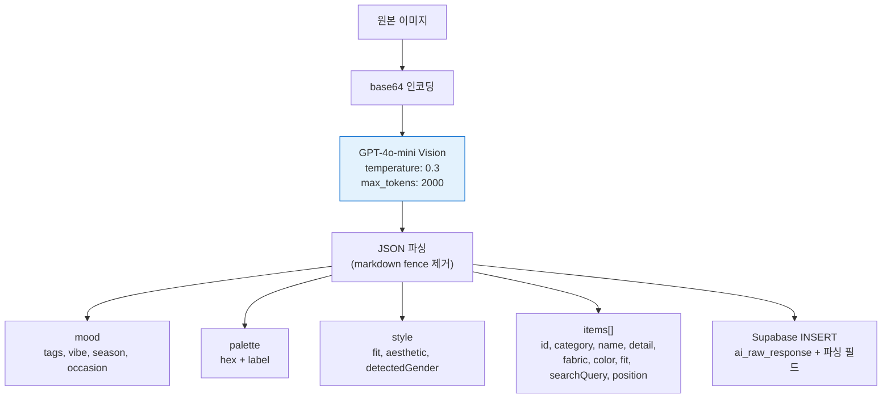
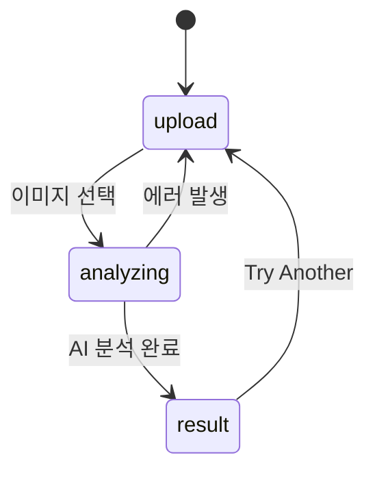
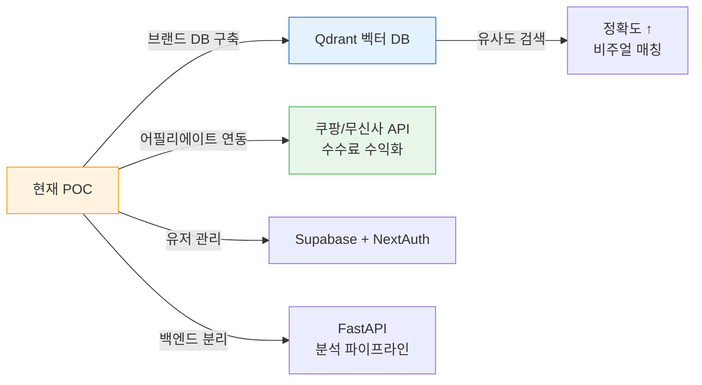

# MOODFIT — 아키텍처 & 기술 선정 이유

> 최종 업데이트: 2026-04-24
>
> ⚠️ **부분 stale 경고**: 본 문서의 일부 다이어그램/설명(SerpApi, 3-screen 상태 머신, `useState` 단일 관리)은
> 2026-04-13 이전 POC 시점 기준이며, 현재는 다음으로 대체됨:
> - 상품 검색: SerpApi → **자체 Cafe24/Shopify 크롤링 DB(81K+ 상품, 32개 플랫폼, 697 브랜드)** + `product_ai_analysis` JOIN 검색 엔진 v4
> - 메인 플로우: 3-screen (upload/analyzing/result) → **4단계 Q&A 에이전트** (input/attributes/refine/results, `useReducer`)
> - 자세한 설계 배경: `docs/research/26-04-13-product-direction-qa-synthesis.md`
> - MVP 구현 플랜: `docs/plans/26-04-13-qa-agent-mvp.md`
> - GABI UX 벤치마크: `docs/research/26-04-13-gabi-ux-deep-analysis.md`
>
> 본 문서는 차주 전면 리라이트 예정. 그 전까지는 CLAUDE.md의 "프로젝트 구조" 섹션을
> 단일 진실(source of truth)로 사용할 것.

AI 이미지 기반 패션 룩 분해 & 크로스플랫폼 상품 추천 서비스. 핀터레스트 스크린샷 한 장으로 "이 스타일 뭔데? 어디서 사?" 에 답한다.

---

## 아키텍처 개요

```mermaid
graph TB
    subgraph Browser["🖥️ Browser (Client)"]
        Upload["이미지 업로드<br/>drag & drop"]
        Analyzing["분석 중 화면<br/>스캔 애니메이션"]
        Result["결과 화면<br/>핫스팟 + 상품 카드"]
    end

    subgraph Server["⚡ Next.js 16 (Vercel)"]
        Page["page.tsx<br/>3-Screen 상태 관리"]
        AnalyzeAPI["POST /api/analyze<br/>이미지 → 무드 + 아이템 분해"]
        SearchAPI["POST /api/search-products<br/>아이템 → 실제 상품 매칭"]
    end

    subgraph External["🌐 External APIs"]
        OpenAI["OpenAI<br/>GPT-4o-mini Vision"]
        SerpApi["SerpApi<br/>Google Shopping"]
    end

    subgraph DB["💾 Supabase (PostgreSQL)"]
        Analyses["analyses 테이블<br/>AI 응답 + 검색 결과 로깅"]
    end

    Upload -->|FormData| AnalyzeAPI
    AnalyzeAPI -->|base64 image| OpenAI
    OpenAI -->|mood, palette, items, position JSON| AnalyzeAPI
    AnalyzeAPI -->|INSERT 분석 로그| Analyses
    AnalyzeAPI -->|분석 결과 + _logId| Page
    Page -->|searchQuery[] + _logId| SearchAPI
    SearchAPI -->|keyword search| SerpApi
    SerpApi -->|상품 데이터| SearchAPI
    SearchAPI -->|UPDATE 검색 결과| Analyses
    SearchAPI -->|products[]| Page
    Page --> Analyzing
    Page --> Result

    classDef client fill:#F3E5F5,stroke:#9C27B0
    classDef server fill:#FFF3E0,stroke:#FF9800
    classDef external fill:#E3F2FD,stroke:#1976D2

    class Upload,Analyzing,Result client
    class Page,AnalyzeAPI,SearchAPI server
    classDef db fill:#E3F2FD,stroke:#1976D2
    class OpenAI,SerpApi external
    class Analyses db
```

### 핵심 원칙

**"프론트 = 백엔드" 단일 앱 구조.** POC 단계에서 별도 백엔드 서버 없이 Next.js API Routes로 모든 서버 로직을 처리한다. 트래픽이 늘면 API Routes를 FastAPI로 분리하면 된다.

---

## 기술 스택 선정 이유

### 프레임워크: Next.js 16 (App Router)

**왜 Next.js인가:** 프론트엔드 + API Route를 하나의 프로젝트에서 처리 가능. Vercel 무료 배포로 인프라 비용 0원. 기존 프로젝트(study-admin)와 스택 통일.

| 탈락 후보 | 이유 |
|-----------|------|
| Vite + Express | 프론트/백 분리 관리 오버헤드. POC에 과함 |
| Remix | 생태계 작고 shadcn/ui 호환 경험 부족 |
| FastAPI + React SPA | 백엔드 분리는 트래픽 늘면 그때. 지금은 과함 |

### UI: Tailwind 4 + shadcn/ui + framer-motion

**왜 이 조합인가:** Tailwind은 빠른 프로토타이핑. shadcn/ui는 복사 기반이라 커스텀 자유도 높음 (MOODFIT 디자인 시스템 적용 용이). framer-motion은 페이지 전환/스캔 애니메이션/핫스팟 인터랙션에 필수.

| 탈락 후보 | 이유 |
|-----------|------|
| Chakra UI | 디자인 커스텀 제한적, 번들 크기 큼 |
| MUI | Material 스타일이 패션 서비스 무드와 안 맞음 |
| CSS Modules | 유틸리티 기반 빠른 이터레이션에 불리 |

### 이미지 분석: GPT-4o-mini Vision

**왜 GPT-4o-mini인가:** 건당 ~$0.003로 POC 비용 최적. 패션 아이템 인식, 색상 추출, 무드 태깅이 충분한 수준. JSON 구조화 출력이 안정적.

| 탈락 후보 | 이유 |
|-----------|------|
| Claude Sonnet Vision | 3배 비쌈 ($0.01/건). 한국어 품질은 좋지만 영어 UI라 이점 적음 |
| Qwen 멀티모달 (자체호스팅) | 인프라 비용 + 관리 부담. POC에 과함 |
| Google Gemini Flash | 품질 차이 미미하고 OpenAI SDK가 더 안정적 |

### 상품 검색: SerpApi (Google Shopping)

**왜 SerpApi인가:** 어필리에이트 API 승인 없이 즉시 사용 가능. 한국/글로벌 브랜드 전부 커버. 월 100회 무료로 POC 충분.

| 탈락 후보 | 이유 |
|-----------|------|
| 쿠팡 파트너스 API | 누적 판매 15만원 이상 필요 → 즉시 사용 불가 |
| Amazon Product API | 글로벌만, 한국 브랜드 커버리지 부족 |
| 직접 크롤링 | 법적 리스크, 유지보수 부담 |

---

## 데이터 흐름

```mermaid
flowchart LR
    A["📸 이미지 업로드"] -->|FormData| B["API: /analyze"]
    B -->|base64 + system prompt| C["GPT-4o-mini Vision"]
    C -->|JSON| B
    B -->|mood, palette, items, detectedGender| D["클라이언트 상태"]
    D -->|searchQuery[] + gender| E["API: /search-products"]
    E -->|keyword + gender filter| F["SerpApi Google Shopping"]
    F -->|shopping_results[]| E
    E -->|스코어링 → 상위 4개| D
    D --> G["🎨 결과 렌더링"]

    style A fill:#F3E5F5,stroke:#9C27B0
    style C fill:#E3F2FD,stroke:#1976D2
    style F fill:#E3F2FD,stroke:#1976D2
    style G fill:#E8F5E9,stroke:#4CAF50
```

---

## /find 데이터 흐름 — Instagram 포스트 → 상품 매칭

```mermaid
flowchart LR
    A["📎 포스트 URL 입력"] -->|parsePostUrl — shortcode 추출| B["API: /api/instagram/fetch-post"]
    B -->|"oEmbed /api/v1/oembed/ (~300ms)"| C["owner_handle + caption"]
    C -->|"web_profile_info (~500ms)"| D["최근 ~12개 포스트 배열"]
    D -->|shortcode로 탐색| E["target post full data\n(slides + tagged_users)"]
    E -->|R2 이미지 복사 + Supabase 저장| F["scrapeId"]
    F -->|"API: /api/find/analyze-post"| G["슬라이드 최대 10장\n병렬 Vision 팬아웃"]
    G -->|isApparel=false 스킵| H["SlideAnalysis[]"]
    H -->|"API: /api/find/search"| I["resolve-brands\n@handle → brand_id[]"]
    I -->|brandFilter 인프로세스 호출| J["search-products 핸들러"]
    J --> K["strongMatches\n(브랜드 필터)"]
    J --> L["general\n(일반 검색)"]
    K --> M["🎨 결과 + 리파인먼트 UI"]
    L --> M
```



**제약 사항:**
- owner 최근 ~12개 포스트 밖 → `TOO_OLD` 에러
- `/reel/` URL → `REEL_NOT_SUPPORTED` 즉시 reject (파서 단계)
- 비공개 계정 → `PRIVATE` (web_profile_info 빈 응답)
- `/api/find/search`는 HTTP fetch 없이 search-products 핸들러 인프로세스 직접 호출 (SSRF 방지)
- SSRF 가드: Vision에 넘기는 이미지는 R2_PUBLIC_URL prefix 확인 후에만 허용

---

### 순차 로딩 + Progress Bar

1. **AI 분석** (0~55%) → progress bar 시뮬레이션으로 대기 UX 개선
2. **상품 검색** (60~92%) → 두 번째 ticker로 시뮬레이션
3. **100% 도달 후** → 결과 화면 전환 (모든 데이터 준비 완료)

분석 + 검색을 모두 완료한 후 결과를 한번에 보여준다. Technical Readout(터미널 스타일 로그)으로 대기 시간 동안 진행 상황을 시각적으로 제공.

---

## AI 분석 파이프라인



### 프롬프트 설계 핵심

- **searchQuery 규칙**: `[fit] [color] [material] [garment type] [gender]` 형식 강제
- **성별 판단**: `detectedGender`를 "male"/"female"/"unisex"로 한정 → 검색 정확도 향상
- **temperature 0.3**: 일관된 JSON 출력을 위해 낮게 설정

---

## 상품 검색 스코어링

SerpApi에서 10개 결과를 가져온 후 자체 스코어링으로 상위 4개 선별:

```
score = (rating × 2) + min(reviews/100, 3) + (thumbnail ? 2 : 0) + (10 - position) × 0.5
```

| 요소 | 가중치 | 이유 |
|------|--------|------|
| 평점 (rating) | ×2 | 품질 신뢰도 |
| 리뷰 수 (reviews) | cap 3 | 인기도, 과도한 가중 방지 |
| 이미지 유무 | +2 | 이미지 없는 결과 제외 |
| 검색 순위 (position) | ×0.5 | Google의 기본 관련성 반영 |

추가로 `extracted_price > 0` 필터로 가격 없는 결과 제거, 성별 키워드 이중 확인 (AI 생성 + API 측 보강).

---

## API 엔드포인트

| Method | Path | 설명 | 입력 | 출력 |
|--------|------|------|------|------|
| POST | `/api/analyze` | 이미지 분석 + 로깅 | `FormData { image: File }` | `{ mood, palette, style, items[], _logId }` |
| POST | `/api/search-products` | 상품 검색 + 로깅 | `{ gender, queries[], _logId }` | `{ results: [{ id, products[] }] }` |
| POST | `/api/instagram/fetch` | Instagram 프로필 스크래핑 (공개) | `{ input: string }` | `{ scrapeId, handle, profilePic, posts[] }` |
| POST | `/api/instagram/fetch-post` | Instagram 단일 포스트 스크래핑 (공개) | `{ input: string }` | `{ scrapeId, shortcode, slides[], taggedUsers[] }` |
| POST | `/api/find/analyze-post` | 포스트 슬라이드 병렬 Vision 분석 | `{ scrapeId, userPrompt? }` | `{ analyses: SlideAnalysis[] }` |
| POST | `/api/find/search` | 브랜드 필터 검색 (인프로세스) | `{ analyses[], taggedHandles[] }` | `{ strongMatches: Product[], general: Product[] }` |
| GET | `/api/admin/products` | 어드민 상품 목록 (fit/fabric 필터, PAGE_SIZE 60) | query params | `{ products[], total }` |
| GET | `/api/admin/products/filter-options` | 상품 필터 옵션 (RPC, 10min CDN cache) | — | `{ platform[], category[], subcategory[], style_node[], color_family[], fit[], fabric[] }` |

---

## 프론트엔드 상태 관리

별도 상태 관리 라이브러리 없이 `useState`로 처리. POC 규모에서 충분.



---

## 보안

| 레이어 | 방어 | 비고 |
|--------|------|------|
| API 키 | `.env.local` 서버 사이드만 접근 | 클라이언트 노출 없음 |
| 파일 업로드 | MIME 타입 + 파일 크기 서버 검증 | 10MB 제한, jpeg/png/webp/heic만 허용 |
| 외부 이미지 | `next.config.ts` remotePatterns | googleusercontent, gstatic, ggpht, serpapi 허용 |
| DB 로깅 | Supabase service role key | `.env.local` 서버 사이드, RLS 바이패스 |
| 어드민 접근 | admin_profiles 승인 게이트 | 미들웨어 + layout + API 3중 체크; 신규 가입 → pending, 관리자 DB 수동 approved 전환 |
| SSRF 방어 | Instagram 이미지 다운로드 허용 호스트 제한 | cdninstagram.com / fbcdn.net만 허용; 15MB 사이즈 캡; /find Vision 분석은 R2_PUBLIC_URL prefix 확인 후에만 이미지 접근 |
| JSON 파싱 | markdown fence 제거 + try-catch | AI 출력 불안정 대비 |

---

## 핵심 의존성 버전

| 패키지 | 버전 | 역할 |
|--------|------|------|
| next | 16.2.1 | 프레임워크 |
| react | 19.2.4 | UI 라이브러리 |
| tailwindcss | 4.2.2 | 스타일링 |
| framer-motion | 12.38.0 | 애니메이션 |
| openai | 6.32.0 | GPT-4o-mini Vision SDK |
| shadcn | 4.1.0 | UI 컴포넌트 (base-nova) |
| lucide-react | 1.0.1 | 아이콘 |
| undici | 6.x | Instagram 스크래퍼 HTTP 클라이언트 (ProxyAgent 지원) |
| @supabase/supabase-js | latest | DB 로깅 클라이언트 |

---

## 향후 확장 포인트



| 시점 | 변경 | 트리거 |
|------|------|--------|
| MVP | Qdrant + 브랜드 DB | 상품 정확도가 POC 피드백에서 이슈될 때 |
| MVP | 어필리에이트 API 전환 | 쿠팡 파트너스 15만원 달성 시 |
| Beta | FastAPI 백엔드 분리 | API Route 응답 시간 > 15초 or Vercel 타임아웃 |
| Beta | Supabase 인증 추가 | 유저 히스토리/구독 기능 필요 시 (DB는 이미 연동) |
| Growth | 비주얼 유사도 검색 | 텍스트 기반 검색 한계 체감 시 |
