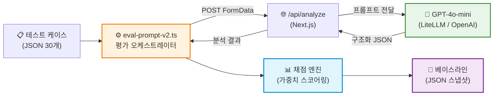
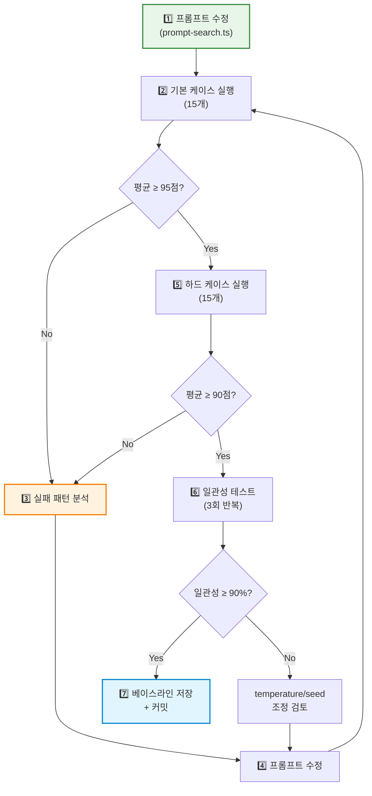
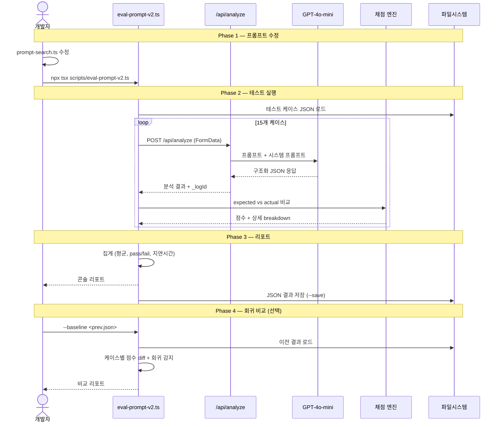
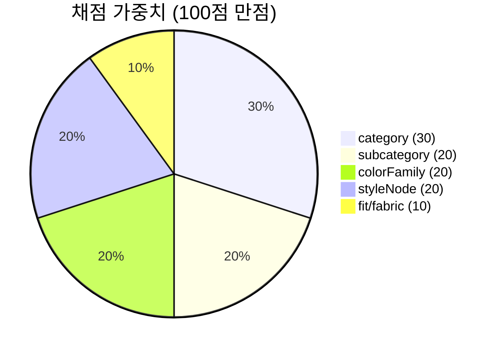
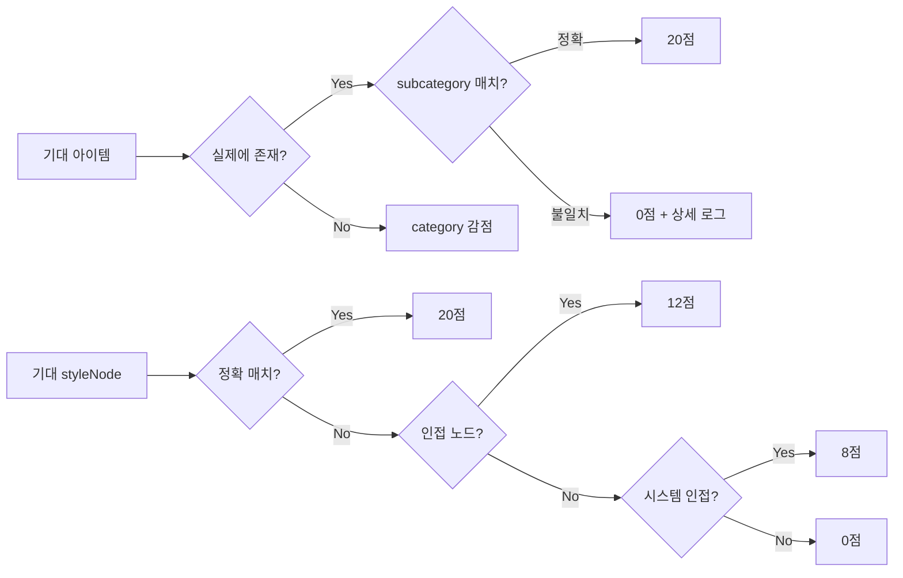
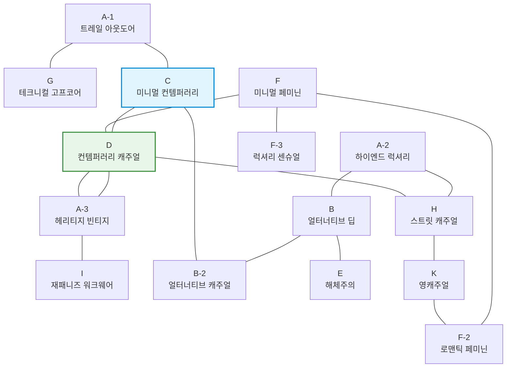
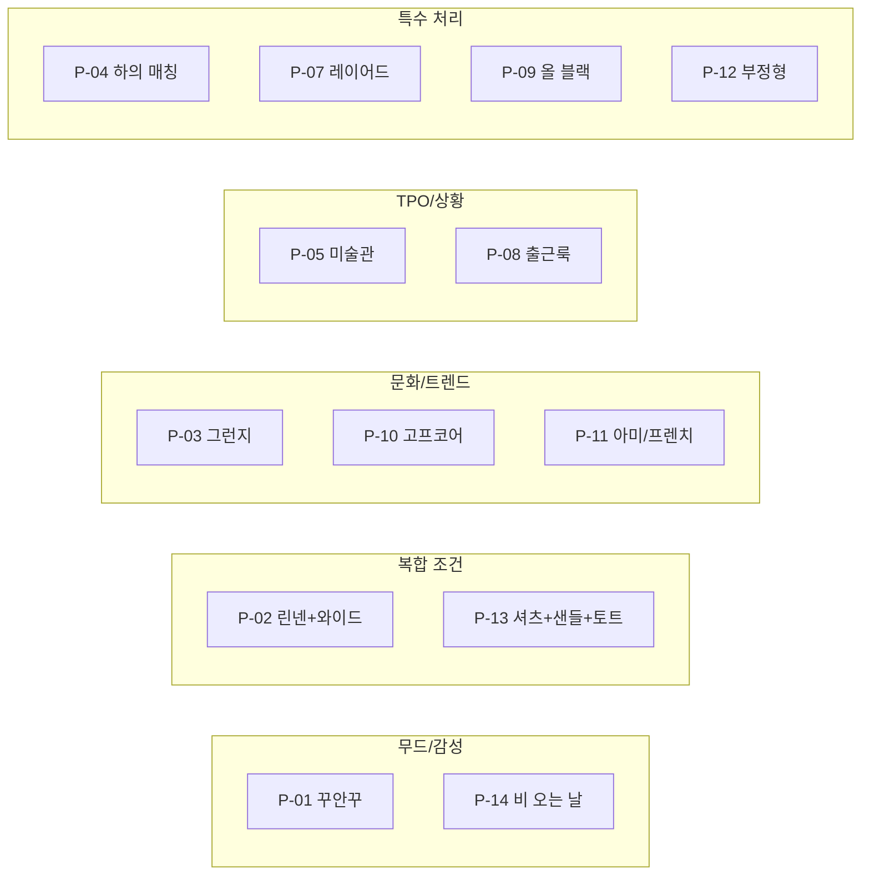
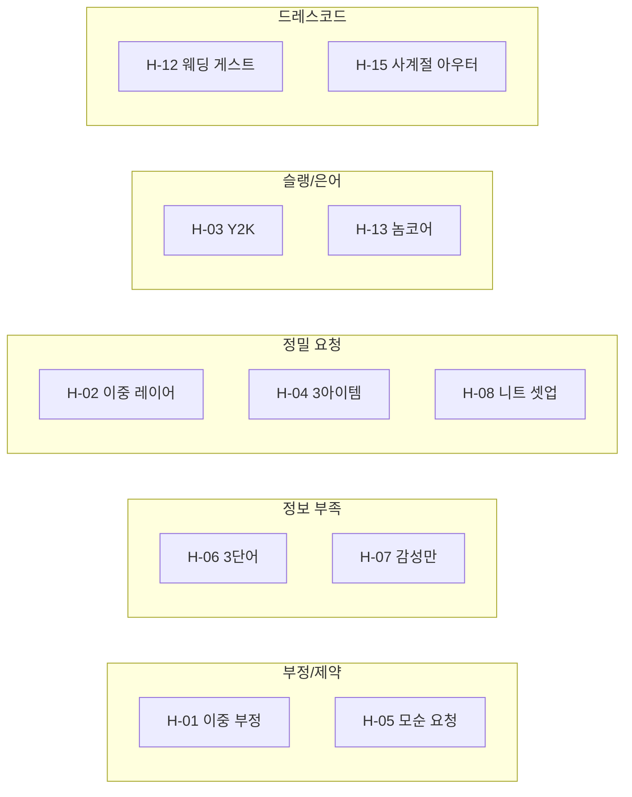

# 분석 품질 평가 파이프라인 가이드

> - 작성일: 2026-04-07
> - 대상: 팀 전체
> - 목적: 프롬프트 수정 → 자동 평가 → 품질 추적까지의 전체 흐름 공유

---

## 1. 한눈에 보는 파이프라인

```
프롬프트 수정 → 테스트 케이스 실행 → 채점 → 베이스라인 비교 → 회귀 감지 → 반복
```

### 서비스별 역할



> **eval-prompt-v2.ts가 오케스트레이터** — 테스트 케이스 로드, API 호출, 채점, 비교를 전부 순서대로 처리한다.

---

## 2. 개선 루프 (Eval-Driven Development)



### 목표 기준

| 단계 | 대상 | 목표 |
|------|------|------|
| 기본 테스트 | 15개 일반 케이스 | 평균 ≥ 95, FAIL 0 |
| 하드 테스트 | 15개 edge case | 평균 ≥ 90, FAIL 0 |
| 일관성 | 3회 반복 실행 | 일관성 ≥ 90% (spread ≤ 10점) |

---

## 3. 전체 흐름 (Sequence Diagram)



---

## 4. 채점 체계

### 가중치 구조



### 채점 로직



### styleNode 인접 관계



---

## 5. 테스트 케이스 분류

### 기본 세트 (일반 난이도)



### 하드 세트 (edge case)



---

## 6. v2 실행 명령어

```bash
# 기본 실행
npx tsx scripts/eval-prompt-v2.ts

# 하드 케이스
npx tsx scripts/eval-prompt-v2.ts --hard

# 결과 저장
npx tsx scripts/eval-prompt-v2.ts --save

# 3회 반복 일관성 테스트
npx tsx scripts/eval-prompt-v2.ts --repeat 3

# 베이스라인 비교 (회귀 감지)
npx tsx scripts/eval-prompt-v2.ts --baseline scripts/output/eval-prompt-v2-2026-04-07T03-28.json

# 풀 테스트: 하드 + 3회 반복 + 저장 + 베이스라인 비교
npx tsx scripts/eval-prompt-v2.ts --hard --repeat 3 --save --baseline scripts/output/prev.json
```

---

## 7. v1 vs v2 비교

| 기능 | v1 | v2 |
|------|----|----|
| 기본 채점 | ✅ | ✅ |
| 하드 케이스 | ✅ (--hard) | ✅ (--hard) |
| 지연시간 추적 | ❌ | ✅ (케이스별 ms) |
| 구조 준수율 | ❌ | ✅ (JSON 파싱/필드 검증) |
| 일관성 테스트 | ❌ | ✅ (--repeat N) |
| 베이스라인 비교 | ❌ | ✅ (--baseline) |
| 회귀 감지 | ❌ | ✅ (>5점 하락 경고) |
| 항목별 diff | ❌ | ✅ |

---

## 8. 파일 구조

```
scripts/
├── eval-prompt.ts              # v1 평가 스크립트
├── eval-prompt-v2.ts           # v2 평가 스크립트 (추천)
├── eval-prompt-cases.json      # 기본 테스트 15개
├── eval-prompt-cases-hard.json # 하드 테스트 15개
└── output/
    ├── eval-prompt-2026-04-07T03-17.json  # Round 1 결과
    ├── eval-prompt-2026-04-07T03-21.json  # Round 2 결과
    ├── eval-prompt-2026-04-07T03-25.json  # Round 3 결과
    ├── eval-prompt-2026-04-07T03-28.json  # Round 4 결과 (베이스라인)
    ├── eval-prompt-2026-04-07T03-31.json  # Round 5 결과 (안정성)
    └── eval-prompt-2026-04-07T03-35.json  # Round 6 결과 (하드)

src/lib/prompts/
├── prompt-search.ts    # 프롬프트 전용 시스템 프롬프트 (개선 대상)
└── analyze.ts          # 이미지 분석 시스템 프롬프트

docs/eval/
├── 26-04-07-test-cases-v1.md            # 원본 테스트 설계 (이미지 포함)
├── 26-04-07-prompt-eval-report.md       # 라운드별 개선 리포트
└── 26-04-07-eval-pipeline-architecture.md  # 이 문서
```

---

## 9. 향후 확장 방향

| 확장 | 설명 | 우선순위 |
|------|------|---------|
| 이미지 분석 eval | 로컬 이미지 → FormData 업로드 → 채점 | 높음 |
| 검색 결과 eval | 분석 → 검색까지 end-to-end 채점 | 높음 |
| LLM-as-Judge | 주관적 품질 (검색 결과가 "어울리는지") 채점 | 중간 |
| CI 통합 | PR마다 eval 실행, 점수 하락 시 차단 | 중간 |
| A/B 프롬프트 테스트 | 여러 프롬프트 버전 매트릭스 실행 | 낮음 |
| Supabase 골든셋 연동 | DB에서 케이스 로드, 결과 저장 | 낮음 |
