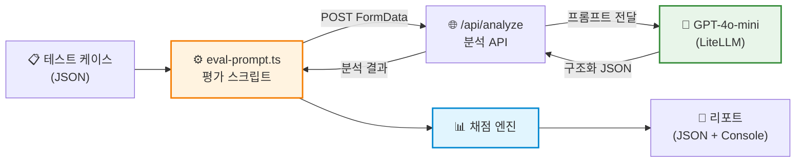
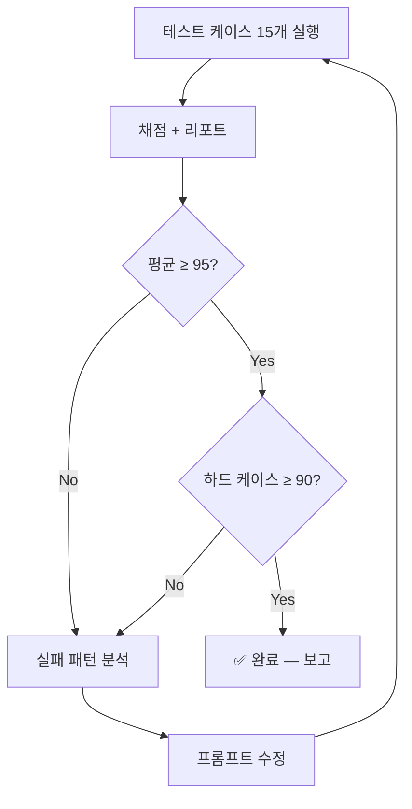
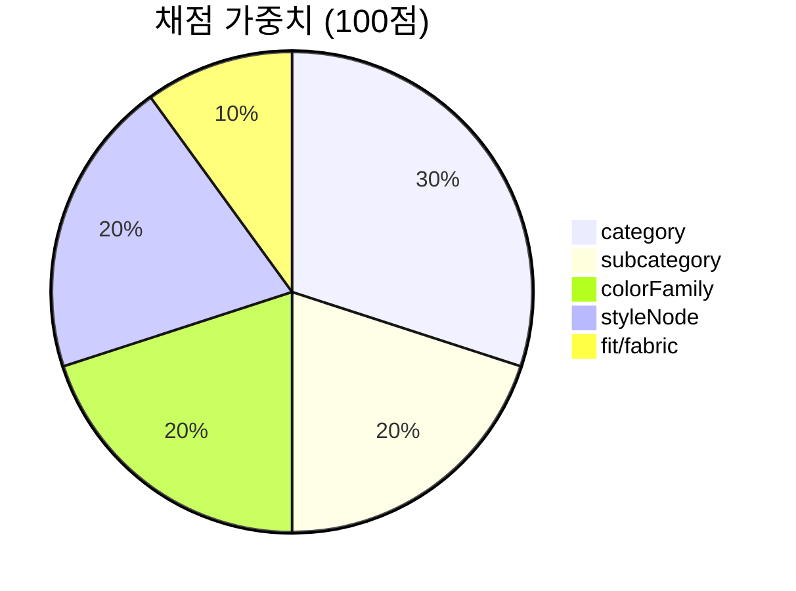

# 프롬프트 분석 품질 평가 리포트

> - 작성일: 2026-04-07
> - 대상: 프롬프트 전용 분석 (`prompt-search.ts`)
> - 목적: 프롬프트 → 아이템 추출 품질 자동 평가 + 반복 개선
> - 평가 모델: GPT-4o-mini (via `/api/analyze`)

---

## 1. 한눈에 보는 개선 결과

```
Round 1 → Round 4: 평균 58점 → 98점 (+40)
```

| 지표 | R1 | R2 | R3 | R4 | R5 (안정성) | R6 (하드) |
|------|----|----|----|----|------------|-----------|
| **평균 점수** | 58 | 93 | 96 | 98 | 98 | 93 |
| **PASS** | 2 | 13 | 14 | 15 | 15 | 13 |
| **PARTIAL** | 10 | 2 | 1 | 0 | 0 | 2 |
| **FAIL** | 3 | 0 | 0 | 0 | 0 | 0 |
| category | 24/30 | 28/30 | 29/30 | 30/30 | 30/30 | 28/30 |
| subcategory | 15/20 | 18/20 | 19/20 | 20/20 | 20/20 | 17/20 |
| colorFamily | 4/20 | 19/20 | 19/20 | 20/20 | 20/20 | 18/20 |
| styleNode | 5/20 | 18/20 | 18/20 | 18/20 | 18/20 | 19/20 |
| fit/fabric | 10/10 | 10/10 | 10/10 | 10/10 | 10/10 | 10/10 |

---

## 2. 평가 파이프라인 아키텍처

### 전체 흐름



### 개선 루프



### 채점 체계



---

## 3. 라운드별 수정 내역

### Round 1 → Round 2: colorFamily/styleNode/아이템 수 (+35점)

**발견된 문제 3가지:**

| 문제 | 원인 | 영향 |
|------|------|------|
| colorFamily 전부 null | 프롬프트에 "미언급 시 추론하라" 지시 없음 | 검색 매칭 불가 (가중치 20%) |
| styleNode 전부 null | `"styleNode: always null"` 명시되어 있었음 | 스타일 노드 기반 검색 불가 (가중치 30%) |
| 코디 요청에 1개만 추출 | 아이템 추출 규칙 미흡 | 불완전한 코디 결과 |

**수정 사항 (`prompt-search.ts`):**
1. Style Node Taxonomy를 프롬프트에 주입 + 분류 규칙 추가
2. colorFamily 추론 강제: "NEVER be null. Always make your best inference"
3. 아이템 추출 규칙: "코디/룩 → 최소 2개", "레이어드 → outer + inner 분리"
4. fabric 추론 가이드: "denim jacket → denim, t-shirt → cotton" 매핑
5. searchQuery에 color/fabric 필수 포함 규칙 강화

### Round 2 → Round 3: 이너 추출 (+3점)

**발견된 문제:** 아우터 있을 때 이너(Top) 미추출 (P-03 그런지, P-09 올 블랙)

**수정:** "When Outer is included, MUST ALSO extract inner Top layer" 규칙 + 예시 추가

### Round 3 → Round 4: 블레이저+이너 규칙 강화 (+2점)

**발견된 문제:** P-09에서 블레이저+트라우저+힐을 뽑고 이너 생략

**수정:** "This rule has NO exceptions — even a blazer needs a top underneath" + 구체적 3-item 예시 + "Outer 아웃핏은 Outer+Top+Bottom 우선, Shoes는 후순위" 규칙

---

## 4. 테스트 케이스 설계

### 기본 세트 (15개) — Round 1~5

| ID | 유형 | 난이도 포인트 | R4 점수 |
|----|------|-------------|---------|
| P-01 | 모호한 무드 (꾸안꾸) | 추상적 → 구체적 변환 | 100 |
| P-02 | 복합 조건 (린넨+와이드+시즌) | 다중 속성 파싱 | 100 |
| P-03 | 서브컬처 (90년대 그런지) | 문화적 맥락 해석 | 100 |
| P-04 | 상의 고정 → 하의 매칭 | 매칭/추천 능력 | 100 |
| P-05 | TPO (미술관 데이트) | 상황 → 드레스코드 | 100 |
| P-06 | 구체적 아이템 나열 | 직접 매핑 | 100 |
| P-07 | 간절기 레이어드 | outer+inner 분리 | 100 |
| P-08 | 직업 맥락 (스타트업 출근룩) | TPO 추론 | 100 |
| P-09 | 색상 중심 (올 블랙) | 단일 컬러 + 시크 무드 | 92 |
| P-10 | 트렌드 키워드 (고프코어) | 트렌드 → 노드 매핑 | 100 |
| P-11 | 한영 혼용 + 브랜드 암시 (아미) | 브랜드 무드 해석 | 100 |
| P-12 | 부정형 (~말고) | 제외 조건 처리 | 100 |
| P-13 | 액세서리 포함 (셔츠+샌들+토트) | 3종 혼합 추출 | 100 |
| P-14 | 추상적 무드 (비 오는 날) | 감성 → 컬러/아이템 | 92 |
| P-15 | 스포츠 믹스 (애슬레저) | 크로스오버 스타일 | 92 |

### 하드 세트 (15개) — Round 6

| ID | 유형 | 난이도 포인트 | R6 점수 |
|----|------|-------------|---------|
| H-01 | 복합 부정 (후드 말고 맨투맨도 아닌) | 이중 부정 제약 | 100 |
| H-02 | 이중 레이어 + 색상 조합 지정 | 구체적 컬러 매칭 | 100 |
| H-03 | 영어 혼용 + 슬랭 (Y2K, 크롭탑) | 트렌드 슬랭 해석 | 100 |
| H-04 | 세 아이템 동시 지정 | 3종 정확 추출 | 100 |
| H-05 | 모순적 요청 (캐주얼+포멀) | 밸런스 추론 | 100 |
| H-06 | 극도로 짧은 요청 (3단어) | 정보 부족 대응 | 80 |
| H-07 | 감성 묘사만 (도쿄 골목길) | 아이템 0개 → 추론 | 65 |
| H-08 | 소재 중심 (니트 셋업) | 소재 통일 조건 | 65 |
| H-09 | 상반된 키워드 (스트릿+깔끔) | 충돌 해석 | 100 |
| H-10 | 특정 신발만 (로퍼) | 단일 아이템 정밀도 | 100 |
| H-11 | 체형/핏 중심 (마른 체형 볼륨감) | 핏 추론 | 100 |
| H-12 | 드레스 코드 (웨딩 게스트) | 격식 추론 | 92 |
| H-13 | 한국어 은어 (놈코어, 갬성) | 슬랭 파싱 | 90 |
| H-14 | 가방만 (노트북용) | 용도 → subcategory | 100 |
| H-15 | 다중 시즌 + 다용도 | 범용성 추론 | 100 |

---

## 5. 남은 약점 분석

하드 케이스에서 발견된 잔여 문제:

| 케이스 | 점수 | 문제 | 심각도 |
|--------|------|------|--------|
| H-06 (극짧은 요청) | 80 | subcategory "jacket"(존재하지 않는 값) 반환 | 낮음 — enum 밖 값 |
| H-07 (감성 묘사) | 65 | Outer+Bottom만 추출, Top 누락 | 중간 — outer 있을 때 inner 규칙 미적용 |
| H-08 (니트 셋업) | 65 | Outer(cardigan)+Bottom, Top 누락 | 중간 — 셋업=상하의인데 cardigan을 outer로 분류 |

**공통 패턴**: "아이템을 직접 언급하지 않고 무드/소재로만 요청할 때" 아이템 추론이 약함. 이건 추가 프롬프트 튜닝으로 개선 가능하지만, 현재 기본 세트 98점이므로 ROI 대비 우선순위는 낮음.

---

## 6. 실행 명령어

```bash
# 기본 테스트 (15개)
npx tsx scripts/eval-prompt.ts

# 하드 테스트 (15개)
npx tsx scripts/eval-prompt.ts --hard

# 결과 JSON 저장
npx tsx scripts/eval-prompt.ts --save
npx tsx scripts/eval-prompt.ts --hard --save
```

결과 파일: `scripts/output/eval-prompt-{timestamp}.json`

---

## 7. 파일 목록

| 파일 | 역할 |
|------|------|
| `scripts/eval-prompt.ts` | v1 평가 스크립트 |
| `scripts/eval-prompt-cases.json` | 기본 테스트 15개 |
| `scripts/eval-prompt-cases-hard.json` | 하드 테스트 15개 |
| `scripts/output/eval-prompt-*.json` | 라운드별 결과 |
| `src/lib/prompts/prompt-search.ts` | 개선된 프롬프트 (수정 대상) |
| `docs/eval/26-04-07-test-cases-v1.md` | 원본 테스트 케이스 설계 (이미지 포함) |
