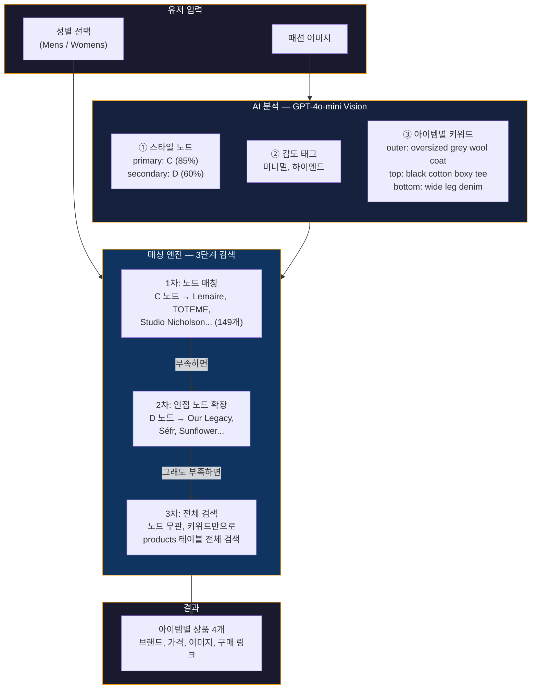
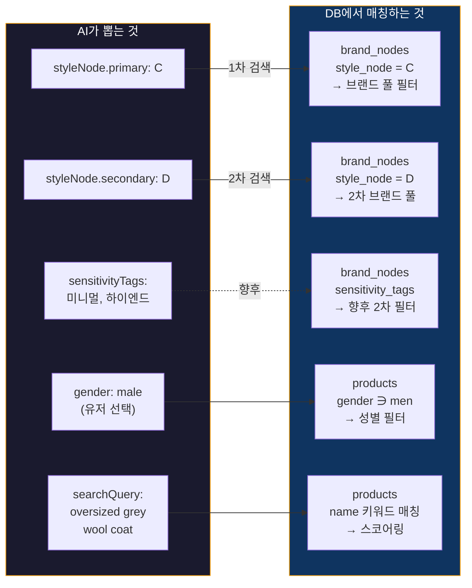
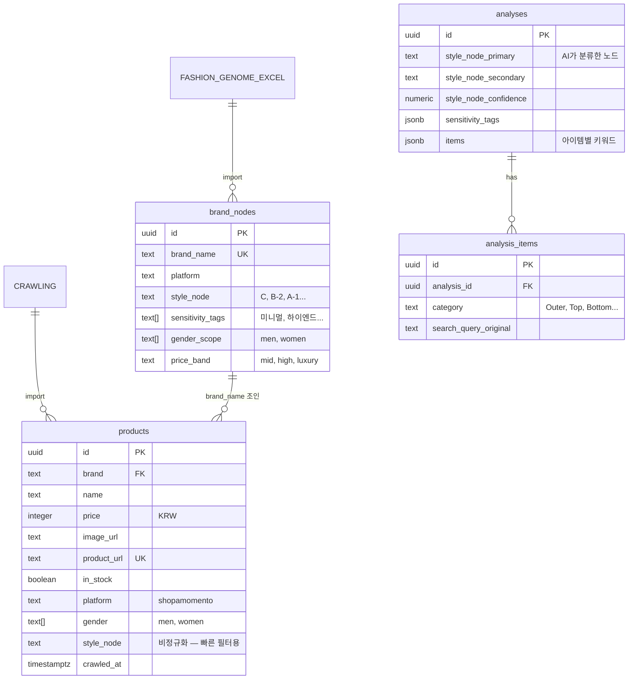
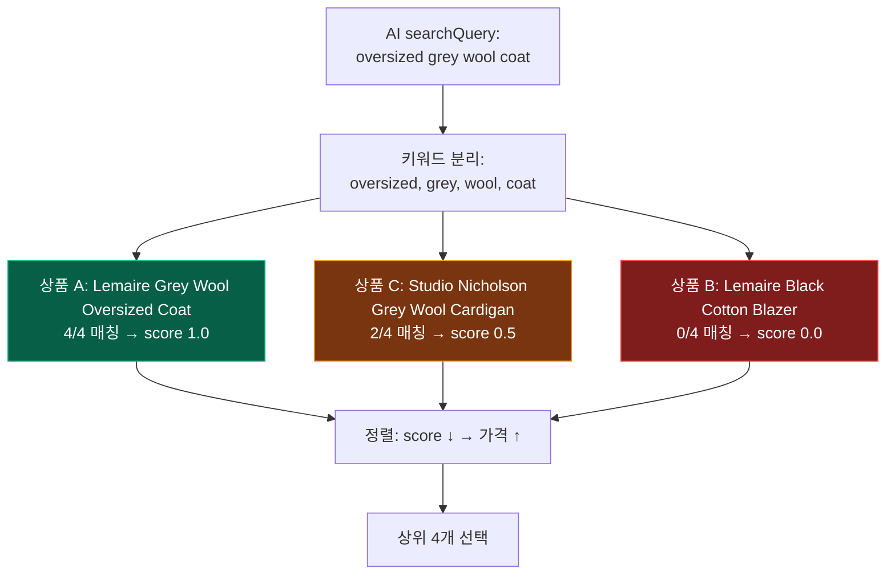
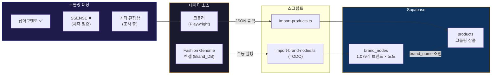

# 상품 매칭 아키텍처

> - **작성일**: 2026-03-31
> - **핵심 질문**: "이미지에서 뭘 뽑아서, 어떻게 상품까지 연결하는가"

---

## 1. 전체 파이프라인

---

## 2. AI → DB 매칭 포인트

---

## 3. 테이블 관계 (ERD)

---

## 4. 스코어링 로직

---

## 5. 데이터 소스 & 적재 흐름

---

## 6. 현재 한계 & 다음 단계

| 한계 | 해결 방향 | 시기 |
|------|-----------|------|
| 샵아모멘토만 크롤링 (상품 수 적음) | 다른 편집샵 추가 + 어필리에이트 | MVP |
| 키워드 매칭이 단순 (문자열 포함) | 임베딩 기반 유사도 검색 (벡터 DB) | MVP |
| brand_nodes 수동 import 필요 | 엑셀 → Supabase 자동 동기화 스크립트 | POC |
| 가격 필터 없음 | price_band 채운 후 필터 추가 | MVP |
| 카테고리 매칭 없음 (코트 검색에 바지 나올 수 있음) | 아이템 카테고리 태깅 추가 | MVP |
