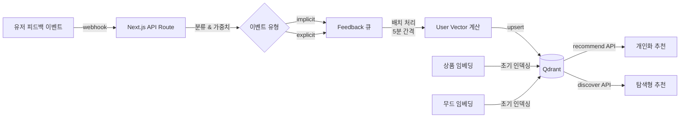
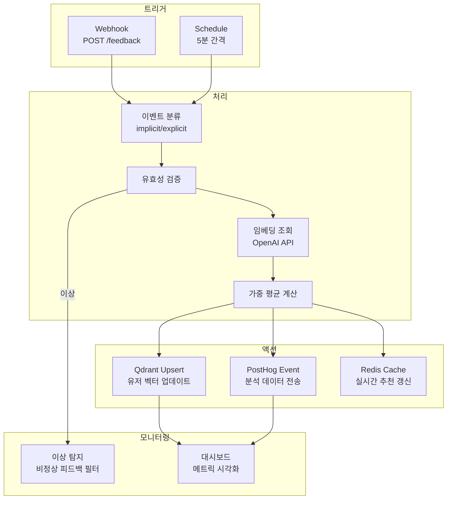

# MOODFIT 추천 피드백 파이프라인 딥 리서치

> 작성일: 2026-03-27
> 목적: 유저 피드백 기반 추천 고도화 파이프라인 설계를 위한 종합 리서치

---

## 1. Implicit vs Explicit Feedback

### 1-A. 정의 및 비교

| 구분 | Explicit Feedback | Implicit Feedback |
|------|-------------------|-------------------|
| 수집 방식 | 유저가 직접 입력 (별점, 좋아요, 설문) | 행동에서 간접 추론 (클릭, 체류, 저장, 구매) |
| 데이터 양 | 적음 (유저 피로도 높음) | 풍부 (자동 수집) |
| 정확도 | 높음 (명시적 의도) | 모호 (클릭 ≠ 선호) |
| 편향 | 선택 편향 (리뷰 남기는 유저만) | 위치/노출 편향 |
| 비용 | 높음 (UX 설계 필요) | 낮음 (로깅만으로 가능) |

**핵심 인사이트**: Implicit feedback의 수치값은 "선호도(preference)"가 아니라 "확신도(confidence)"를 나타낸다. 구매는 조회보다 높은 확신도를 부여한다.

### 1-B. 패션/비주얼 도메인에서의 최적 접근

패션 이커머스에서는 **implicit feedback이 압도적으로 우월하다**:

1. **구매 후 평가 경향**: 패션 소비자는 상품 탐색 중이 아닌 착용 후에야 평가하려 함
2. **비주얼 탐색 특성**: "좋아요" 클릭 없이도 오래 보는 것 자체가 강력한 신호
3. **데이터 풍부성**: Explicit rating의 sparsity 문제를 implicit 데이터 볼륨으로 극복

**추천 하이브리드 전략 (MOODFIT 적용)**:
- **Primary**: Implicit (클릭, 저장, 체류시간, 상품 링크 이동)
- **Secondary**: Lightweight Explicit (thumbs up/down, 무드 태그 선택)
- **Periodic**: 마이크로 설문 (Pinterest 방식, 5점 비주얼 매력도)

### 1-C. 업계 사례

#### Pinterest (2025)
- 앱 내 설문으로 5,000개 핀에 대해 1-5점 비주얼 매력도 평가 수집
- 92,000 파라미터 FC 신경망으로 **pairwise ranking** 학습
- 이미지당 최소 10개 응답으로 노이즈 제거
- Homefeed, Search, Related Pins 3개 surface에 배포 → 저품질 세션 감소, 쇼핑 CTR 증가
- **2026 계획**: VLM(Visual Language Model) 활용 확대

#### Pinterest Query Rewards (2025)
- PinnerSAGE로 유저 핀 임베딩 클러스터링 → 관심사별 그룹화
- 각 클러스터의 engagement rate를 reward로 계산
- 인게이지먼트 없는 클러스터 → reward 점진적 하락 → 선택 확률 감소
- 미노출/신규 클러스터 → 평균 가중치 부여 (exploration 보장)

#### Stitch Fix
- **"Your Opinion Matters"** 시스템: 텍스트 피드백을 BERT로 분석하여 선호 아이템 분류
- **Experts-in-the-Loop**: 스타일리스트 전문성을 알고리즘에 통합
- **Latent Style**: Matrix Factorization으로 스타일 선호 공간 자체를 이해
- 2024년 기준 AI 추천이 전체 셀렉션의 **75%** 차지
- 2025년 **Stitch Fix Vision** (AI 스타일 시각화) + **Style Assistant** (iOS 대화형 AI) 출시

#### Zalando
- **Algorithmic Fashion Companion (AFC)**: 20만+ 스타일리스트 코디 학습
- 구매/장바구니 기반 실시간 아웃핏 추천
- 과거 구매, 브라우징 행동, 저장 아이템 분석 → 개인화 검색 결과
- 2024 Q2 수익성 18% YoY 증가에 AI 기여

#### ASOS
- **Style Match**: 비주얼 서치 (앱 카메라 → 유사 상품 매칭)
- Azure OpenAI 파트너십 → 대화형 AI 인터페이스

### 1-D. Implicit Feedback 데이터 스키마

```typescript
// MOODFIT Feedback Event Schema
interface FeedbackEvent {
  // 식별자
  eventId: string;           // UUID v7 (타임스탬프 내장)
  userId: string;            // 익명 or 인증 유저
  sessionId: string;         // 세션 ID

  // 이벤트 정보
  eventType:
    | 'view'                 // 결과 화면 진입
    | 'item_click'           // 아이템 핫스팟 클릭
    | 'product_click'        // 상품 카드 클릭 (외부 링크)
    | 'product_dwell'        // 상품 카드 호버/체류
    | 'save'                 // 룩 or 아이템 저장
    | 'share'                // 공유
    | 'thumbs_up'            // 명시적 좋아요
    | 'thumbs_down'          // 명시적 싫어요
    | 'mood_select'          // 무드 태그 재선택
    | 'reanalyze'            // 동일 이미지 재분석
    | 'new_upload';          // 새 이미지 업로드

  // 컨텍스트
  analysisId: string;        // 분석 세션 ID
  itemCategory?: string;     // 'top' | 'bottom' | 'outer' | 'shoes' | 'accessory'
  productId?: string;        // 클릭한 상품 ID
  moodTags?: string[];       // 연관 무드 태그

  // Implicit 신호
  dwellTimeMs?: number;      // 체류 시간 (ms)
  scrollDepth?: number;      // 스크롤 깊이 (0-1)
  viewportPosition?: number; // 화면 내 위치

  // 메타데이터
  timestamp: string;         // ISO 8601
  platform: 'web' | 'mobile';
  referrer?: string;         // 유입 경로
}

// Confidence Weight 매핑
const CONFIDENCE_WEIGHTS: Record<string, number> = {
  'view':          0.1,
  'item_click':    0.3,
  'product_dwell': 0.4,  // dwellTimeMs > 3000일 때
  'product_click': 0.6,
  'save':          0.8,
  'thumbs_up':     1.0,
  'share':         0.9,
  'thumbs_down':  -1.0,
};
```

---

## 2. Feedback → Vector Update 파이프라인

### 2-A. 유저 선호 벡터 업데이트 접근법

#### 방법 1: Weighted Average of Item Embeddings (추천 - 소규모 팀)

유저의 선호 벡터를 상호작용한 아이템 임베딩의 가중 평균으로 표현:

```
user_vector = Σ(confidence_weight_i × item_embedding_i) / Σ(confidence_weight_i)
```

**장점**: ML 인프라 불필요, 실시간 업데이트 가능, 직관적
**단점**: 시간에 따른 취향 변화 반영 어려움

#### 방법 2: Exponential Decay Weighted Average (추천 - 점진적 고도화)

최근 상호작용에 높은 가중치 부여:

```
decay_weight = confidence_weight × exp(-λ × (now - timestamp))
user_vector = Σ(decay_weight_i × item_embedding_i) / Σ(decay_weight_i)
```

λ = 0.01 (일 단위) 정도면 30일 전 상호작용은 ~74% 가중치

#### 방법 3: Trajectory Fitting (고급 - Whatnot 사례)

유저의 구매 이력을 임베딩 공간의 궤적으로 시각화하고, 궤적에 피팅된 선 근처의 호스트/아이템을 추천. UMAP 차원 축소로 시각화.

### 2-B. Qdrant 실시간 Upsert 파이프라인



#### Qdrant 컬렉션 설계

```typescript
// Collection 1: items — 분석된 아이템 + 상품
{
  collection: "moodfit_items",
  vectors: {
    size: 1536,              // OpenAI text-embedding-3-small
    distance: "Cosine"
  },
  payload: {
    item_type: "top" | "bottom" | "outer" | "shoes" | "accessory",
    mood_tags: string[],
    color_palette: string[],
    fit: string,
    fabric: string,
    gender: "men" | "women" | "unisex",
    price_range: "budget" | "mid" | "premium" | "luxury",
    source_url: string,
    created_at: string
  }
}

// Collection 2: users — 유저 선호 벡터
{
  collection: "moodfit_users",
  vectors: {
    size: 1536,
    distance: "Cosine"
  },
  payload: {
    user_id: string,
    interaction_count: number,
    top_moods: string[],
    preferred_categories: string[],
    gender_preference: string,
    price_sensitivity: number,    // 0-1
    last_active: string,
    created_at: string
  }
}

// Collection 3: moods — 무드 벡터
{
  collection: "moodfit_moods",
  vectors: {
    size: 1536,
    distance: "Cosine"
  },
  payload: {
    mood_name: string,
    season: string[],
    occasion: string[],
    vibe_keywords: string[],
    example_count: number
  }
}
```

#### Qdrant Upsert 코드 예시

```typescript
import { QdrantClient } from '@qdrant/js-client-rest';

const qdrant = new QdrantClient({ url: 'http://localhost:6333' });

// 유저 벡터 업데이트
async function updateUserVector(
  userId: string,
  feedbackEvents: FeedbackEvent[]
) {
  // 1. 기존 유저 벡터 조회
  const existing = await qdrant.retrieve('moodfit_users', {
    ids: [userId],
    with_vector: true,
  });

  // 2. 피드백 아이템들의 임베딩 조회
  const itemIds = feedbackEvents
    .filter(e => e.productId)
    .map(e => e.productId);

  const items = await qdrant.retrieve('moodfit_items', {
    ids: itemIds,
    with_vector: true,
  });

  // 3. 가중 평균 계산
  const newVector = computeWeightedAverage(
    existing[0]?.vector,      // 기존 벡터 (있으면)
    items,                     // 아이템 벡터들
    feedbackEvents,            // 이벤트 (가중치 계산용)
    0.7                        // 기존 벡터 관성 (momentum)
  );

  // 4. Qdrant upsert
  await qdrant.upsert('moodfit_users', {
    points: [{
      id: userId,
      vector: newVector,
      payload: {
        user_id: userId,
        interaction_count: (existing[0]?.payload?.interaction_count || 0) + feedbackEvents.length,
        top_moods: extractTopMoods(feedbackEvents),
        last_active: new Date().toISOString(),
      }
    }]
  });
}
```

#### Qdrant Recommend API 활용

```typescript
// 유저의 좋아요/싫어요 기반 추천
async function getPersonalizedRecommendations(
  userId: string,
  likedItemIds: string[],
  dislikedItemIds: string[],
  filters: { gender?: string; category?: string }
) {
  return qdrant.recommend('moodfit_items', {
    positive: likedItemIds,           // 좋아요한 아이템 IDs
    negative: dislikedItemIds,        // 싫어요한 아이템 IDs
    strategy: 'best_score',           // 다양성 ↑ (average_vector 대비)
    filter: {
      must: [
        ...(filters.gender ? [{ key: 'gender', match: { value: filters.gender } }] : []),
        ...(filters.category ? [{ key: 'item_type', match: { value: filters.category } }] : []),
      ]
    },
    limit: 10,
  });
}

// Discovery API — 탐색형 (피드백 누적 시)
async function discoverNewStyles(
  targetMoodVector: number[],
  contextPairs: Array<{ positive: string; negative: string }>
) {
  return qdrant.discover('moodfit_items', {
    target: targetMoodVector,
    context: contextPairs.map(pair => ({
      positive: pair.positive,
      negative: pair.negative,
    })),
    limit: 10,
  });
}
```

### 2-C. Online Learning vs Batch Retraining

| 접근법 | Online Learning | Batch Retraining |
|--------|----------------|------------------|
| 업데이트 | 실시간/준실시간 | 스케줄 (매일/매주) |
| 복잡도 | 낮음 (가중 평균) | 높음 (모델 재학습) |
| 인프라 | Qdrant upsert만으로 충분 | GPU, 학습 파이프라인 필요 |
| 정확도 | 중간 (근사) | 높음 (전역 최적화) |
| 적합 대상 | **소규모 팀, POC** | 대규모 서비스 |

**MOODFIT 권장 전략**:

```
Phase 1 (POC): Online — 가중 평균 유저 벡터 + Qdrant upsert
Phase 2 (성장): Mini-batch — 5분 간격 배치로 벡터 업데이트
Phase 3 (스케일): Hybrid — 실시간 근사 + 일간 배치 재학습
```

---

## 3. 추천 정확도 메트릭

### 3-A. 표준 메트릭

| 메트릭 | 수식/설명 | MOODFIT 적용 |
|--------|----------|-------------|
| **CTR** | 클릭 / 노출 | 상품 카드 클릭률 |
| **Conversion Rate** | 구매 / 클릭 | 외부 쇼핑몰 이동 후 추적 어려움 → 클릭 = 전환으로 간주 |
| **Precision@K** | 상위 K개 중 관련 아이템 비율 | 상위 4개 상품 중 클릭된 비율 |
| **NDCG@K** | 관련성 + 순위 위치 반영 | 4개 상품의 클릭 순서 가중 평가 |
| **MRR** | 첫 번째 관련 결과의 역순위 평균 | 첫 클릭까지의 평균 위치 |
| **MAP@K** | Precision의 평균 | 전체 카테고리별 평균 정밀도 |

#### MOODFIT 메트릭 우선순위

```
Tier 1 (핵심):
  - Product CTR: 상품 카드 클릭률
  - Save Rate: 룩/아이템 저장률
  - Session Engagement: 세션당 상호작용 수

Tier 2 (품질):
  - NDCG@4: 4개 추천 상품의 순위 품질
  - Mood Accuracy: 유저가 선택한 무드 vs AI 분석 무드 일치율
  - Item Coverage: 5개 카테고리(상의/하의/아우터/신발/악세서리) 중 성공 매칭 비율

Tier 3 (장기):
  - Return Rate: 재방문률
  - Style Evolution: 유저 벡터 변화 추적
  - Diversity Score: 추천 결과의 다양성 (카테고리/브랜드/가격대 분포)
```

### 3-B. 패션 특화 메트릭

#### Style Relevance Score (SRS)

단순 CTR을 넘어 "스타일 적합도"를 측정:

```typescript
interface StyleRelevanceScore {
  // 1. Visual Compatibility (비주얼 호환성)
  colorHarmony: number;      // 0-1, 원본 팔레트와의 색상 조화
  silhouetteMatch: number;   // 0-1, 실루엣/핏 유사도

  // 2. Mood Alignment (무드 정합성)
  moodOverlap: number;       // 0-1, 추천 상품 무드 태그와 원본 무드 겹침
  occasionFit: number;       // 0-1, TPO 적합도

  // 3. User Preference (유저 선호 반영)
  priceAlignment: number;    // 0-1, 유저 가격대 선호와의 거리
  brandAffinity: number;     // 0-1, 브랜드 선호도 반영

  // 종합
  composite: number;         // 가중 평균 (0-1)
}

function computeSRS(item: RecommendedProduct, context: AnalysisResult): number {
  const weights = {
    colorHarmony: 0.2,
    silhouetteMatch: 0.2,
    moodOverlap: 0.25,
    occasionFit: 0.1,
    priceAlignment: 0.15,
    brandAffinity: 0.1,
  };
  // ... 각 항목 계산 후 가중 합산
}
```

#### Outfit Compatibility Score

최신 연구(2025)에서는 아웃핏 호환성을 다음과 같이 측정:

- **Theme-aware attention**: 테마(캐주얼/포멀/스트릿)별 카테고리 쌍 어텐션
- **Color modeling**: 색상 조화 기반 호환성
- **Hypergraph convolution**: 유저-아웃핏-아이템 하이퍼그래프 컨볼루션
- **Feature disentanglement**: 형태/색상/패턴을 분리하여 각각 호환성 학습

### 3-C. A/B 테스트 인프라 옵션

| 도구 | 비용 | Next.js 통합 | 특징 | MOODFIT 적합도 |
|------|------|-------------|------|---------------|
| **PostHog** | 무료 (1M 이벤트/월) | `@posthog/next` | 올인원 (분석+플래그+A/B+세션 리플레이) | **최적** |
| **Vercel Edge Config** | Vercel Pro 포함 | 네이티브 | 5ms 이하 읽기, LaunchDarkly 연동 | 좋음 |
| **LaunchDarkly** | $10/시트/월~ | Edge Config 연동 | 엔터프라이즈급 플래그 관리 | 과잉 |
| **Statsig** | 무료 (5M 이벤트/월) | Vercel Flags 연동 | 실험 + 분석 통합 | 좋음 |

**MOODFIT 추천 조합**:

```
PostHog (이벤트 트래킹 + A/B 테스트 + 세션 리플레이)
  + Vercel Edge Config (피처 플래그 저장, 글로벌 저지연)
```

PostHog Next.js 설정:

```typescript
// app/providers.tsx
'use client'
import posthog from 'posthog-js'
import { PostHogProvider } from 'posthog-js/react'

if (typeof window !== 'undefined') {
  posthog.init(process.env.NEXT_PUBLIC_POSTHOG_KEY!, {
    api_host: '/ingest',  // proxy로 ad-blocker 우회
    capture_pageview: false,  // App Router에서 수동 관리
  })
}

// 추천 피드백 이벤트 전송
posthog.capture('product_click', {
  analysis_id: 'abc-123',
  item_category: 'top',
  product_id: 'prod-456',
  mood_tags: ['minimal', 'clean'],
  position: 2,           // 추천 순위
  dwell_time_ms: 4200,
})
```

---

## 4. Collaborative Filtering vs Content-Based

### 4-A. 접근법 비교

| 접근법 | 강점 | 약점 | 패션 적합도 |
|--------|------|------|-----------|
| **Content-Based (CB)** | Cold start에 강함, 설명 가능 | 필터 버블, 세렌디피티 부족 | 아이템 속성(색상, 핏, 소재) 풍부 → **높음** |
| **Collaborative Filtering (CF)** | 세렌디피티, 트렌드 반영 | Cold start 취약, 데이터 필요 | 유저 행동 데이터 충분 시 **높음** |
| **Hybrid** | 양쪽 장점 결합 | 구현 복잡도 ↑ | **최적** |

### 4-B. 패션 도메인 특성

**Content-Based가 빛나는 순간**:
- 새로운 유저 (cold start): 업로드한 이미지의 시각적 속성만으로 추천 가능
- 특정 스타일 검색: "오버사이즈 린넨 셔츠" 같은 구체적 속성 매칭
- 아이템 속성이 풍부: 색상, 핏, 소재, 실루엣 등 다차원 메타데이터

**Collaborative Filtering이 빛나는 순간**:
- 충분한 유저 행동 데이터 축적 후
- "이 스타일을 좋아한 사람들은 이것도 좋아했습니다" 패턴
- 트렌드 반영 (많은 유저가 동시에 좋아하는 아이템)
- 세렌디피티 (유저가 몰랐던 스타일 발견)

### 4-C. MOODFIT 하이브리드 전략

```
Phase 1 — Content-Based Only (현재 ~ 유저 1,000명)
├── GPT-4o-mini Vision의 아이템 속성 분석 결과 활용
├── CLIP/OpenAI 임베딩으로 비주얼 유사도 검색
├── Qdrant에 아이템 임베딩 저장 + 메타데이터 필터
└── Cold start 문제 없음 (이미지만 있으면 즉시 추천)

Phase 2 — Hybrid: CB + 간단한 CF (유저 1,000 ~ 10,000명)
├── User-Item interaction matrix 구축
├── Neural CF (NCF) 또는 BPR 도입
├── CB 점수 × 0.6 + CF 점수 × 0.4 (가중 앙상블)
└── 신규 유저 → CB fallback, 기존 유저 → hybrid

Phase 3 — Full Hybrid + Exploration (유저 10,000명+)
├── Two-Tower Model (유저 타워 + 아이템 타워)
├── 실시간 CF + 컨텐츠 기반 retrieval
├── Thompson Sampling으로 exploration/exploitation 밸런스
└── Qdrant Discovery API로 컨텍스트 기반 탐색
```

### 4-D. Cold Start 해결 전략

| 전략 | 적용 시점 | 구현 |
|------|----------|------|
| **이미지 기반 CB** | 첫 업로드 즉시 | GPT-4o-mini 분석 + CLIP 임베딩 유사도 |
| **인기 기반 fallback** | 데이터 0일 때 | 전체 유저 인기 아이템 추천 |
| **무드 기반 클러스터** | 첫 무드 태그 선택 시 | 무드별 인기 아이템 풀 |
| **온보딩 퀴즈** | 가입 시 | 3-5개 스타일 이미지 선택 → 초기 유저 벡터 생성 |
| **Bi-clustering** | Phase 2 | 유저-아이템 동시 클러스터링으로 sparsity 완화 |

### 4-E. Daydream의 접근법 (추정)

Daydream의 Style Passport 시스템:

```
1. Explicit 온보딩: 이름, 생일, 가격대, 브랜드 선호
2. Style Quiz: 초기 스타일 프로필 생성
3. 이중 레이어 학습:
   ├── Explicit: 퀴즈 답변, 사이즈 입력, 색상 선호, 가격 범위
   └── Implicit: 브라우징 패턴, 체류 시간, 장바구니 변경, 구매/반품 이력
4. "Say More" 피드백: 대화 중 실시간 미세 조정
5. 기술 스택 (추정):
   ├── NLP: 자연어 쿼리 이해
   ├── Computer Vision: 비주얼 서치 + 상품 인식
   ├── ML: 패턴 인식 기반 추천 최적화
   └── Cloud: AWS/Google Cloud (스케일러빌리티)
6. 데이터 플로우:
   유저 입력 → 데이터 집약 → AI 모델 처리 → 개인화 추천 → 유저 피드백 → 모델 재학습
```

---

## 5. 피드백 자동화 도구 & 파이프라인

### 5-A. n8n 워크플로우 설계



#### n8n 워크플로우 구현

```json
{
  "name": "MOODFIT Feedback Pipeline",
  "nodes": [
    {
      "name": "Webhook Receiver",
      "type": "n8n-nodes-base.webhook",
      "parameters": {
        "path": "moodfit-feedback",
        "httpMethod": "POST"
      }
    },
    {
      "name": "Classify Event",
      "type": "n8n-nodes-base.switch",
      "parameters": {
        "rules": [
          { "value": "thumbs_up", "output": "explicit_positive" },
          { "value": "thumbs_down", "output": "explicit_negative" },
          { "value": "product_click", "output": "implicit_positive" },
          { "value": "save", "output": "implicit_positive" }
        ]
      }
    },
    {
      "name": "Compute Weight",
      "type": "n8n-nodes-base.code",
      "parameters": {
        "code": "const weights = { view: 0.1, item_click: 0.3, product_click: 0.6, save: 0.8, thumbs_up: 1.0, thumbs_down: -1.0 }; return { weight: weights[$input.item.json.eventType] || 0 };"
      }
    },
    {
      "name": "Qdrant Upsert",
      "type": "n8n-nodes-base.httpRequest",
      "parameters": {
        "url": "http://qdrant:6333/collections/moodfit_users/points",
        "method": "PUT",
        "body": "={{ $json.upsertPayload }}"
      }
    },
    {
      "name": "PostHog Track",
      "type": "n8n-nodes-base.httpRequest",
      "parameters": {
        "url": "https://app.posthog.com/capture/",
        "method": "POST"
      }
    }
  ]
}
```

### 5-B. 피드백 UI 위젯

#### 추천 접근: 커스텀 경량 위젯 (shadcn/ui 기반)

외부 위젯(HappyReact, Sentry) 대신 MOODFIT 디자인 시스템에 맞는 자체 구현 권장:

```typescript
// 상품 카드 내 피드백 버튼 구조
interface ProductFeedback {
  // Tier 1: 원클릭 (마찰 최소)
  thumbsUp: boolean;          // 👍
  thumbsDown: boolean;        // 👎
  save: boolean;              // 북마크

  // Tier 2: 옵셔널 (탭 시 확장)
  styleMatch: 1 | 2 | 3;     // 스타일 매치도 (3단계)
  priceFeeling: 'cheap' | 'fair' | 'expensive';

  // Tier 3: 주기적 마이크로 설문 (Pinterest 방식)
  visualAppeal?: 1 | 2 | 3 | 4 | 5;
}
```

**UI 패턴**:
1. 상품 카드 하단에 👍/👎 + 저장 아이콘 (항상 노출)
2. 세션 종료 시 "이번 추천 어땠어요?" 1-5점 슬라이더 (선택적)
3. 10세션마다 스타일 퀴즈 리프레시 제안

### 5-C. 피드백 → Qdrant 파이프라인 (MOODFIT 전용)

```
[유저 액션]
    │
    ▼
[Next.js API: /api/feedback]
    │ 이벤트 로깅 (PostHog)
    │ 이벤트 큐잉 (Vercel KV / Upstash Redis)
    ▼
[5분 배치 or 실시간 트리거]
    │
    ├──→ [OpenAI Embedding API] ← 새 아이템 임베딩 생성
    │
    ├──→ [가중 평균 계산] ← 유저 벡터 재계산
    │         │
    │         ▼
    │    [Qdrant: upsert user vector]
    │
    └──→ [Qdrant: recommend/discover API]
              │
              ▼
         [개인화된 추천 결과 캐싱]
```

---

## 6. 전체 아키텍처 제안

### Phase 1: POC (현재 → 3개월)

```
기존 파이프라인:
  이미지 → GPT-4o-mini Vision → 무드/아이템 분석 → SerpApi 검색 → 결과

추가:
  + PostHog 이벤트 트래킹 (모든 유저 행동 로깅)
  + 상품 카드 thumbs up/down UI
  + Vercel KV에 피드백 이벤트 저장
  + 기본 메트릭 대시보드 (CTR, Save Rate, Session Engagement)
```

### Phase 2: 개인화 (3 → 6개월)

```
추가:
  + Qdrant Cloud 연동
  + 아이템 임베딩 인덱싱 (OpenAI text-embedding-3-small)
  + 유저 벡터 계산 + 실시간 upsert
  + Qdrant Recommend API 기반 개인화 추천
  + A/B 테스트 (PostHog): 기존 SerpApi vs Qdrant 추천 비교
  + Style Relevance Score 도입
```

### Phase 3: 고도화 (6 → 12개월)

```
추가:
  + Hybrid 추천 (CB + CF 앙상블)
  + Qdrant Discovery API로 탐색형 추천
  + n8n 파이프라인 자동화
  + 온보딩 스타일 퀴즈
  + 유저 대시보드 (나의 스타일 프로필)
  + Outfit Compatibility Score
```

---

## 참고 자료

### 학술 / 리서치
- [Beyond Explicit and Implicit: User Feedback for Recommendations (CHI 2025)](https://dl.acm.org/doi/10.1145/3706598.3713241)
- [Learning to Rank for Personalised Fashion Recommender Systems via Implicit Feedback](https://link.springer.com/chapter/10.1007/978-3-319-13817-6_6)
- [Engagement-weighted and Style-aware Scoring for Fashion Compatibility (Stanford CS231n 2025)](https://cs231n.stanford.edu/2025/papers/text_file_840593249-CS231n_Final%20(3).pdf)
- [Agentic Personalized Fashion Recommendation in the Age of Generative AI](https://arxiv.org/html/2508.02342v1)
- [A Review of Modern Fashion Recommender Systems (ACM Computing Surveys)](https://dl.acm.org/doi/10.1145/3624733)

### 업계 엔지니어링 블로그
- [Pinterest: Improving Quality of Recommended Content through Pinner Surveys](https://medium.com/pinterest-engineering/improving-quality-of-recommended-content-through-pinner-surveys-eebca8a52652)
- [Pinterest: Query Rewards — Building a Recommendation Feedback Loop](https://medium.com/pinterest-engineering/query-rewards-building-a-recommendation-feedback-loop-during-query-selection-70b4d20e5ea0)
- [Pinterest: 16k+ Lifelong User Actions Supercharge Recommendations](https://medium.com/pinterest-engineering/next-level-personalization-how-16k-lifelong-user-actions-supercharge-pinterests-recommendations-bd5989f8f5d3)
- [Stitch Fix Algorithms Blog](https://multithreaded.stitchfix.com/algorithms/blog/)
- [Whatnot: Going from 0 to 1 Modeling User Preferences](https://medium.com/whatnot-engineering/going-from-0-to-1-modeling-user-preferences-for-personalized-recommendations-1b4e30aac45a)
- [Zalando Engineering — Machine Learning](https://engineering.zalando.com/tags/machine-learning.html)

### 도구 / 플랫폼
- [Qdrant: New Recommendation API (positive/negative, best_score strategy)](https://qdrant.tech/articles/new-recommendation-api/)
- [Qdrant: Discovery API (context-based exploration)](https://qdrant.tech/articles/discovery-search/)
- [Qdrant: Upsert Points API Reference](https://api.qdrant.tech/api-reference/points/upsert-points)
- [PostHog: Next.js Integration](https://posthog.com/docs/libraries/next-js)
- [Vercel: Edge Config + LaunchDarkly](https://vercel.com/blog/edge-config-and-launch-darkly)
- [Vercel: Feature Flags](https://vercel.com/docs/feature-flags)
- [n8n Workflow Automation](https://n8n.io/)

### 메트릭 / 평가
- [Shaped.ai: Evaluating Recommendation Systems (MAP, MRR, NDCG)](https://www.shaped.ai/blog/evaluating-recommendation-systems-map-mmr-ndcg)
- [Evidently AI: 10 Metrics to Evaluate Recommender Systems](https://www.evidentlyai.com/ranking-metrics/evaluating-recommender-systems)
- [Weaviate: Retrieval Evaluation Metrics](https://weaviate.io/blog/retrieval-evaluation-metrics)

### 경쟁사
- [Daydream: AI Fashion Shopping Agent](https://daydream.ing/faqs)
- [Daydream Launch (Fashionista)](https://fashionista.com/2025/06/daydream-ai-shopping-fashion-platform-launch)
- [Daydream: Index Ventures Investment Thesis](https://www.indexventures.com/perspectives/bringing-ai-to-the-fashion-industry-our-investment-in-daydream/)
- [Daydream Architecture Analysis (Idea Usher)](https://ideausher.com/blog/ai-fashion-shopping-app-development-daydream/)
