# 메인 플로우 — Instagram 포스트 → 상품 추천

> 활성 진입점 `/` 의 단일 플로우. 입력 = IG 포스트 URL (`?img_index=N` 옵션), 출력 = strongMatches(브랜드 일치) + general(일반) 2섹션 카드.
>
> v2 머지: 2026-04-26 (PR #31). 구 oEmbed → web_profile_info 체인 폐기, Apify 스크래퍼 + 단일 슬라이드/아이템 정밀 매칭으로 전환.

## 데이터 흐름

```mermaid
flowchart TD
    URL(["IG 포스트 URL<br/>?img_index=N (옵션)"])
    URL -->|parsePostUrl| FETCH

    FETCH["Step 1 · /api/instagram/fetch-post<br/>shortcode + imgIndex 추출"]
    FETCH --> CACHE{"shortcode 캐시<br/>(instagram_post_scrapes)"}
    CACHE -->|HIT| SCRAPE
    CACHE -->|MISS| APIFY["Apify run-sync<br/>instagram-post-scraper<br/>(~5-10s)"]
    APIFY --> R2COPY["R2 복사 + DB insert"]
    R2COPY --> SCRAPE

    SCRAPE(["scrapeId + slides[] + imgIndex"])

    SCRAPE --> COND{"imgIndex<br/>URL에 있나?"}
    COND -->|있음| ANALYZE
    COND -->|없음| PICK_SLIDE["Step 2 · 슬라이드 picker UI<br/>썸네일 그리드 → 사용자가 1장 선택"]
    PICK_SLIDE --> ANALYZE

    ANALYZE["Step 3 · /api/find/analyze-post<br/>{scrapeId, slideIndex} → 단일 슬라이드 Vision"]
    ANALYZE --> GATE{"isApparel<br/>+ items.length > 0"}
    GATE -->|true| ITEMS
    GATE -->|false| ERR_NA(["NOT_APPAREL"])

    ITEMS(["VisionAnalysisResult.items[]"])
    ITEMS --> COND2{"items.length"}
    COND2 -->|=== 1| SEARCH
    COND2 -->|> 1| PICK_ITEM["Step 4 · 아이템 picker UI<br/>그리드 → 사용자가 1개 선택"]
    PICK_ITEM --> SEARCH

    SEARCH["Step 5 · /api/find/search<br/>{item, taggedHandles}"]
    SEARCH --> RB["resolve-brands<br/>@handle → brand names"]
    RB --> SE["selectEngine(SEARCH_ENGINE_VERSION)<br/>SearchEngine port"]
    SE --> SP["v5 adapter (기본)<br/>· v5 ⇒ breaker+v4-degraded · v6 seam"]
    SP --> RESULTS

    RESULTS(["strongMatches + general<br/>(2 sections)"])

    classDef step fill:#1565c0,stroke:#0d47a1,color:#fff
    classDef data fill:#2e7d32,stroke:#1b5e20,color:#fff
    classDef gate fill:#f57f17,stroke:#e65100,color:#fff
    classDef ext fill:#6a1b9a,stroke:#4a148c,color:#fff
    classDef err fill:#c62828,stroke:#8e0000,color:#fff

    class FETCH,ANALYZE,SEARCH,RB,SP,R2COPY,PICK_SLIDE,PICK_ITEM step
    class URL,SCRAPE,ITEMS,RESULTS data
    class CACHE,COND,GATE,COND2 gate
    class APIFY ext
    class ERR_NA err
```



클라이언트 상태는 `src/app/_components/find-client.tsx` 가 `useState` 슬롯으로 직접 관리하는 4-step 머신: `idle → fetching_post → picking_slide? → analyzing → picking_item? → searching → success`. picker 들은 조건부 — img_index 가 있으면 슬라이드 picker 스킵, items.length===1 이면 아이템 picker 스킵.

API 경로 prefix `/api/find/*` 는 historical naming — 메인 승격 후에도 그대로 유지.

> 📦 **SPEC-ARCH-APP-001 (2026-05-17)**: 본 문서의 `src/lib/instagram/*` · `src/lib/analyze/run-vision.ts` · `src/lib/prompts/analyze.ts` 등 `src/lib/...` 경로는 **re-export shim** (동작 불변) — 실체는 `src/domains/{instagram,vision,brand-resolution}/` · `src/shared/{enums,utils}/`. `api/admin/*/route.ts` 도 thin shim, 본문은 `src/domains/admin-tools/`. 신규 코드는 실체 경로 직접 참조. 상세 토폴로지: `docs/ARCHITECTURE.md`.

---

## Step 1 — Apify 스크래핑 + 캐시

`POST /api/instagram/fetch-post` (입력: `{input: string}`).

### 파이프라인

1. `parsePostUrl(input)` — URL 파싱 → `{shortcode, imgIndex}` (1-indexed, 없으면 `null`)
2. **캐시 lookup** — `instagram_post_scrapes` 에서 같은 shortcode + `status='success'` 찾으면 즉시 반환 (~50ms)
3. **cache MISS 시 Apify 호출**:
   - `apify/instagram-post-scraper` actor의 `run-sync-get-dataset-items` 엔드포인트
   - Authorization: `Bearer $APIFY_TOKEN` (헤더 — URL query 사용 X, 보안)
   - 입력: `{username: ["https://www.instagram.com/p/<shortcode>/"], addParentData: false}`
   - 응답 시간: 보통 5~10초 (cold), 캐시 히트 시 < 1초
   - 단가: $0.0023 / post (실측, FREE plan $5 credit = ~2,173 post 무료)
4. R2 복사 + Supabase `instagram_post_scrapes` / `instagram_post_scrape_images` 저장
5. 응답: `{scrapeId, shortcode, slides[], mentionedUsers[], imgIndex, cached: bool}`

### 응답 필드 매핑 (Apify → 우리 스키마)

| Apify 응답 | 우리 필드 |
|---|---|
| `shortCode` | `instagram_post_scrapes.shortcode` (캐시 키) |
| `type` (`Image`/`Video`/`Sidecar`) | `media_type` |
| `productType` (`clips`) | → `REEL_NOT_SUPPORTED` reject |
| `caption` | `caption` |
| `taggedUsers[]` (post-level only) | `mentioned_users` (caption mentions 와 머지) |
| `childPosts[]` | `slides[]` (캐러셀일 때) |
| `displayUrl` | 단일 image/video 일 때 `slides[0].imageUrl` |
| `mentions` | 자동 추출됨 (자체 파서 불필요) |
| 전체 페이로드 | `raw_data jsonb` 에 통째 저장 |

> **중요 한계**: Apify는 per-slide `taggedUsers` 를 보존 안 함 (post-level만). 슬라이드별 brand narrowing 안 됨 — Vision 단일 아이템 검출이 narrowing 담당.

### 에러 코드

| 코드 | 조건 |
|---|---|
| `INVALID_URL` | URL 파싱 실패 |
| `REEL_NOT_SUPPORTED` | `/reel/` 경로 (파서 단계) 또는 Apify 응답 `productType=clips` |
| `POST_NOT_FOUND` | Apify 빈 응답 (삭제/지역제한/비공개) |
| `APIFY_FAILED` | Apify 5분 타임아웃, 402 결제 필요, 401 auth 실패 등 |
| `PRIVATE` | (deprecated) — 현재 `POST_NOT_FOUND` 로 통합됨 |
| ~~`TOO_OLD`~~ | (deprecated, v1 잔재) — Apify 가 임의 post 가능하므로 throw 안 됨 |

### 보안 가드

- **APIFY_TOKEN**: `Authorization: Bearer` 헤더 전송 (URL query string 사용 안 함 — 액세스 로그 누출 방지)
- **로그 PII 최소화**: 전체 URL 대신 shortcode만 로깅
- **SSRF 화이트리스트**: 이미지 다운로드는 `cdninstagram.com`, `fbcdn.net` 호스트만 허용 (`src/lib/instagram/client.ts:downloadImage`)
- **이미지 사이즈 캡**: 15MB 초과 reject
- **프록시**: `PROXY_HOST` 환경변수 (Apify 자체 프록시 사용하므로 v2에선 사실상 불필요)

핵심 파일:
- `src/lib/instagram/parse-post-url.ts` — URL 파서, shortcode + imgIndex 추출, `/reel/` 거부
- `src/lib/instagram/apify-client.ts` — Apify run-sync 클라이언트, Bearer 인증, 5분 타임아웃
- `src/lib/instagram/parse-apify-response.ts` — Apify 응답 → `InstagramPostDetail` 매퍼
- `src/lib/instagram/post-client.ts` — `fetchPostByShortcode` 통합 진입점
- `src/lib/instagram/save-post-images.ts` — R2 병렬 업로드
- `src/lib/instagram/client.ts` — undici 이미지 다운로드 + SSRF 가드 (`downloadImage` 만 사용)
- `src/lib/instagram/types.ts` — 타입 + 에러 코드
- `src/app/api/instagram/fetch-post/route.ts` — 캐시 lookup + Apify 호출 + 단계별 timing 로그

---

## Step 2 — 슬라이드 picker (조건부)

URL 에 `?img_index=N` 이 **없을 때만** 노출. `src/app/_components/slide-picker.tsx`.

- 캐러셀 슬라이드 thumbnail 그리드 (모바일 2열 / 태블릿 3열 / 데스크탑 4열)
- 비디오 슬라이드는 dim + disabled (`isVideo` alt 명시)
- 클릭 시 1-indexed slideIndex 반환

URL 에 imgIndex 있으면 자동 점프 → 이 picker 노출 안 됨.

---

## Step 3 — 단일 슬라이드 Vision 분석

`POST /api/find/analyze-post` (입력: `{scrapeId, slideIndex, userPrompt?}`).

| 항목 | 값 |
|---|---|
| 모델 | OpenAI `gpt-4o-mini` Vision |
| 호출 패턴 | 단일 슬라이드 1회 호출 (병렬 팬아웃 X — v1 폐기) |
| temperature | 0.3 |
| max_tokens | 2500 |
| detail | `auto` |
| 비용 | ~$0.003 / 호출 |
| 평균 latency | ~15-20초 (현재 프롬프트 ~30k 토큰 — 슬림화 시 ~5초로 단축 가능, 백로그) |

### 입력 검증

- `scrapeId` UUID 형식 검증
- `slideIndex` 1..50 정수 (parse-post-url 의 imgIndex 검증과 일관)
- `userPrompt` 500자 cap

### 게이트

- 슬라이드가 비디오 (`is_video=true`) → `SLIDE_IS_VIDEO` reject
- 슬라이드 R2 URL 이 `R2_PUBLIC_URL` prefix 가 아니면 → `R2_CONFIG_ERROR`
- Vision 응답 `isApparel: false` 또는 `items.length === 0` → `NOT_APPAREL` reject

### 응답

```ts
{
  scrapeId, shortcode, ownerHandle, caption,
  mentionedUsers,
  slideIndex,        // 1-indexed
  r2Url,             // 분석한 슬라이드 R2 URL
  result: {
    isApparel: true,
    items: [{id, category, subcategory, name, fit, fabric, colorFamily, searchQuery, ...}, ...],
    styleNode, mood, palette, sensitivityTags, style,
  }
}
```

### LLM 라우팅 (LiteLLM 토글)

```ts
const useLiteLLM =
  !!process.env.LITELLM_BASE_URL &&
  process.env.LITELLM_DISABLED !== "true"
```

켜지면 `${LITELLM_BASE_URL}/v1` 로 baseURL 덮어씀. 현재 prod 미가동 — EC2 인스턴스는 존재하나 OFF. 상세는 `docs/infra/deployment.md`.

핵심 파일:
- `src/app/api/find/analyze-post/route.ts` — 단일 슬라이드 모드, 입력 검증
- `src/lib/analyze/run-vision.ts` — 단일 이미지 Buffer → Vision 호출, `isApparel` 게이트, `items[]` 다중 검출
- `src/lib/prompts/analyze.ts` — `getAnalyzeSystemPrompt()` thin wrapper → `buildPrompt("vision-analyze")` 호출. 프롬프트 본문은 `prompts` 테이블(situation='vision-analyze') 에서 fetch. 편집은 /admin/prompts

---

## Step 4 — 아이템 picker (조건부)

`items.length > 1` 일 때만 노출. `src/app/_components/item-picker.tsx`.

- 좌측에 선택된 슬라이드 미리보기, 우측에 검출 아이템 카드 그리드
- 각 카드에 이름 + 색상/핏/소재 메타 + 디테일 한 줄
- 클릭 시 단일 `VisionAnalysisItem` 반환

`items.length === 1` 이면 자동 선택 → picker 스킵.

> 패턴 출처: archived `_archive-qa/_qa/step-confirm.tsx` 의 그리드 + 선택 패턴을 단순화 (edit attrs 코드 드롭).

---

## Step 5 — 검색 트리거 (SearchEngine port · 기본 v5-direct · v4 degraded 폴백 opt-in)

`POST /api/find/search` (입력: `{item, imageUrl, taggedHandles, gender, styleNode, moodTags, priceFilter, ...}`).

> ✅ **현재 코드 동작 (2026-05-17, SPEC-SEARCH-UNIFY-001 적용 후, `src/app/api/find/search/route.ts`)**: 엔진 호출은 버전 스왑 가능한 `SearchEngine` port 뒤로 위임(`selectEngine(SEARCH_ENGINE_VERSION).search(req)`). 입력검증·handle→brand resolution·`imageUrl && AI_SERVER_URL` 게이트·HTTP 엔벨로프는 route 에 잔류. **interim banner 제거됨** — 문서가 다시 코드와 일치.
>
> **기본 (`SEARCH_ENGINE_VERSION` 미설정 ⇒ `v5-direct`)**: v5 어댑터 단독, 회로차단기·v4 폴백 **미개입**. AI 서버 5xx/timeout 시 **HTTP 502 `AI_SERVER_FAILED`** — #57 이후 실상과 byte-identical (특성화 13개로 고정). `imageUrl` 또는 `AI_SERVER_URL` 없으면 진입 거부(400).
>
> **opt-in (`SEARCH_ENGINE_VERSION=v5`, `CB_ENABLED≠false`)**: v5 실패가 임계 초과 시 회로차단기가 열리고 **v4 raw-RPC degraded 폴백** 자동 진행(`engine: "v4-degraded"`). v4 fallback 은 v5 완전 실패 시에만 발동하는 안전망 — 평시 v5 정상 경로 동작·품질·화면 불변(HARD). 단일 env 토글로 즉시 원복(`CB_ENABLED=false` ⇒ breaker bypass = 순수 v5-direct).

현재 흐름:
1. `taggedHandles` → `resolveIgHandlesToBrands()` 로 brand 이름 배열 산출 (route)
2. `AI_SERVER_URL` 설정 + `imageUrl` 있으면 → `selectEngine(SEARCH_ENGINE_VERSION).search(req)` (port)
   - `v5-direct`(기본) ⇒ v5 어댑터 단독 → ai `POST /recommend`
   - `v5` ⇒ `CircuitBreaker(v5, v4-degraded)` → 평시 v5, 실패 임계 초과 시 v4 degraded
   - `v4` ⇒ v4 degraded 강제 / `v6` ⇒ v6 드롭인 SEAM (스코프 외)
3. 엔진 `failed` ⇒ **502 `AI_SERVER_FAILED`**. 미설정 / 이미지 없음 → 400
4. 성공 응답에 `engine: "v5"`(기본) 또는 `"v4-degraded"`(폴백) 포함 — 브라우저는 동일 렌더, 품질 저하는 내부 메트릭

> 상세 토폴로지·상태머신·롤백·v6 seam: [`search-engine.md` § SearchEngine port](search-engine.md#searchengine-port-spec-search-unify-001)

### AI 서버 호출

> v5 어댑터(`src/domains/search/adapters/v5-adapter.ts`) 내부 — route.ts 에서 verbatim 추출.

```ts
const ctl = new AbortController()
const timer = setTimeout(() => ctl.abort(), AI_SERVER_TIMEOUT_MS)  // 기본 60000ms
const res = await fetch(`${AI_SERVER_URL.replace(/\/$/, "")}/recommend`, {
  method: "POST",
  headers: {"content-type": "application/json"},   // X-Internal-Token 은 백로그 (미송출)
  body: JSON.stringify({
    item, imageUrl, gender, styleNode, moodTags, priceFilter,
    brandFilter,                       // strong 호출에만 포함
    tolerance: strongTolerance ?? 0.5, // strong | general
  }),
  signal: ctl.signal,
})
// non-2xx / fetch throw / abort ⇒ null ⇒ (general 기준) RecommendResponse.failed
```

상세 사양: [endurance-ai/ai-server `docs/features/pipeline.md`](https://github.com/endurance-ai/ai-server/blob/dev/docs/features/pipeline.md)

### v4 degraded 폴백 (SPEC-SEARCH-UNIFY-001, opt-in)

`src/domains/search/adapters/v4-fallback-adapter.ts` — search-products route 핸들러를 in-process import 하지 않는다. `domains/search-v4` 의 `searchByEnums` 를 **직접** 호출(raw RPC만, scorer/ranker 재유지보수 X — REQ-SU-007), 결과를 route 엔벨로프로 정규화하고 `engine:"v4-degraded"` 표기. 회로차단기가 v5 실패 임계 초과 시에만 진입(`SEARCH_ENGINE_VERSION=v5`). v4 어댑터는 supabase 결합이라 **lazy import** — 기본 `v5-direct` 경로 로드 그래프에서 제외.

**왜 함수 직접 호출**: HTTP fetch·route 핸들러 재진입 없음 → SSRF 표면 제거 + 라운드트립 제거 + 입력검증 중복 회피.

### 두 갈래 (병렬 실행, AI/v4 공통)

| 갈래 | brandFilter | tolerance | 응답 키 |
|---|---|---|---|
| 강한 매칭 | post-level taggedUsers + caption @mentions → resolve-brands → brand 이름 배열 | `strongMatchTolerance` (기본 0.5) | `strongMatches` |
| 일반 매칭 | 없음 | `generalTolerance` (기본 0.5) | `general` |

`brandFilter` 활성 시 (v5/v4 모두) 브랜드당 max 캡이 완화됨.

### 단일 아이템 모드

`queries[]` 배열 길이 1 — 사용자가 picker 에서 선택한 1개 아이템만 검색.

### resolve-brands

`src/lib/find/resolve-brands.ts` — IG @handle 배열을 입력받아 `products.brand` 컬럼과 퍼지 매칭. 모듈 레벨 캐시로 콜드 스타트 후 빠름.

### 보안

- 내부 search-products 에러 body 클라이언트 노출 X — `{error: "Search failed", code: "SEARCH_FAILED"}` 만 반환
- **기본 (`v5-direct`)**: AI 서버 호출 실패 시 502 `AI_SERVER_FAILED` (폴백 없음). **opt-in (`SEARCH_ENGINE_VERSION=v5`)**: 회로차단기 경유 v4 degraded 폴백 자동 진행, 브라우저는 `engine` 필드로만 엔진 인지 (동일 렌더)

### 환경변수

| 키 | 의미 | 기본 |
|---|---|---|
| `AI_SERVER_URL` | AI 서버 base URL (예: `http://<EIP>:8000`) | 미설정 시 진입 거부(400) — route 게이트에서 차단, 엔진 미도달 |
| `AI_SERVER_TIMEOUT_MS` | v5 어댑터 ai 호출 타임아웃 (AbortController) | 60000 |
| `SEARCH_ENGINE_VERSION` | active 엔진 선택 (port). 미설정 ⇒ `v5-direct`(현 동작 불변) / `v5`(breaker+v4) / `v4` / `v6` | (미설정) |
| `CB_ENABLED` | `false` ⇒ 회로차단기 bypass = 순수 v5-direct (무중단 롤백) | `true` |
| `CB_FAILURE_THRESHOLD` | open 전환 연속 실패 임계 | 5 |
| `CB_COOLDOWN_MS` | open → half-open 쿨다운 | 30000 |
| `INTERNAL_API_TOKEN` | AI 서버 인증 헤더 (`X-Internal-Token`) — 백로그, 미송출 | (백로그) |

핵심 파일:
- `src/app/api/find/search/route.ts` — 입력검증·게이트·엔벨로프 + `selectEngine(...).search(req)` 위임 (SPEC-SEARCH-UNIFY-001)
- `src/domains/search/` — `engine-port.ts` / `registry.ts` / `adapters/{v5,v4-fallback,v6}-adapter.ts` / `circuit-breaker.ts` (상세: `search-engine.md`)
- `src/lib/find/resolve-brands.ts` — @handle → brand name resolver
- `src/app/api/search-products/route.ts` — 어드민 search-debugger 의 v4 엔진 진입점. find/search 폴백은 이 핸들러가 아니라 `domains/search-v4` `searchByEnums` 를 v4 어댑터가 직접 호출 (상세: `search-engine.md`)
- `database/migrations/030_search_products_v5.sql` — v5 RPC (AI 서버가 호출)

---

## 결과 렌더링 + 리파인먼트

| 컴포넌트 | 역할 |
|---|---|
| `src/app/_components/find-result.tsx` | strongMatches + general 2-섹션 카드 그리드 |
| `src/app/_components/refinement-bar.tsx` | cheaper / same-mood / different-vibe / free prompt 4가지 재검색 옵션 |

리파인먼트는 같은 분석 결과(선택된 단일 아이템)를 가지고 `/api/find/search` 만 다시 호출 — fetch-post / analyze-post 재실행 X.

| 리파인먼트 종류 | 동작 |
|---|---|
| `cheaper` | `priceFilter: {maxPrice: 100000}` 추가 |
| `same-mood` | `taggedHandles = []` (브랜드 편향 제거) |
| `different-vibe` | styleNode primary↔secondary 스왑, generalTolerance 0.5 → 0.8 |
| `prompt: <text>` | searchQuery 에 자유 텍스트 suffix 결합 |

---

## 비용 (실측, 월 트래픽 100/day 기준)

| 항목 | 단가 | 월 부담 |
|---|---|---|
| Apify scrape (cache hit 30%) | $0.0023/post | ~$5 (free credit 안에서 cover) |
| GPT-4o-mini Vision (단일 슬라이드) | $0.003/호출 | ~$9 |
| **합계 POC** | — | **~$10~15/월** |
