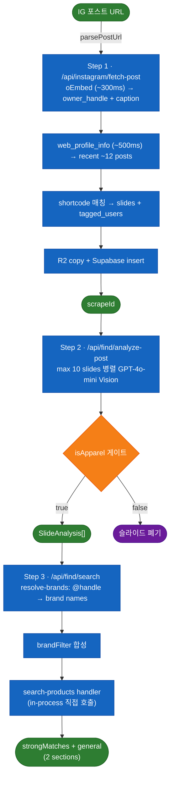

# 메인 플로우 — Instagram 포스트 → 상품 추천

> 활성 진입점 `/` 의 단일 플로우. 입력 = IG 포스트 URL, 출력 = strongMatches(브랜드 일치) + general(일반) 2섹션 카드.

## 데이터 흐름



클라이언트 상태는 `src/app/_components/find-client.tsx` 가 `useState` 슬롯으로 직접 관리. 단계별 결과/에러를 데이터 존재 여부로 판단.

API 경로 prefix `/api/find/*` 는 historical naming — 메인 승격 후에도 그대로 유지.

---

## Step 1 — Instagram 포스트 스크래핑

`POST /api/instagram/fetch-post` 가 두 단계 체인으로 동작한다.

| 단계 | 호출 | 시간 | 산출 |
|---|---|---|---|
| 1 | oEmbed `/api/v1/oembed/?url=...` | ~300ms | `owner_handle`, `caption` |
| 2 | `web_profile_info?username=<handle>` | ~500ms | 최근 ~12개 포스트 배열 |
| 3 | shortcode 매칭 | — | target post full data (slides + tagged_users) |

이후 R2로 이미지 복사 + Supabase `instagram_post_scrapes` / `instagram_post_scrape_images` 에 저장 → `scrapeId` 반환.

### 에러 코드

| 코드 | 조건 |
|---|---|
| `INVALID_URL` | URL 파싱 실패 |
| `REEL_NOT_SUPPORTED` | `/reel/` 경로 — 파서 단계 즉시 reject |
| `TOO_OLD` | 대상 shortcode가 owner의 최근 ~12개 포스트 밖 |
| `PRIVATE` | 비공개 계정 — `web_profile_info` 빈 응답 |

### 보안 가드

- **SSRF 화이트리스트**: 이미지 다운로드는 `cdninstagram.com`, `fbcdn.net` 호스트만 허용
- **사이즈 캡**: 이미지 15MB 초과 시 reject
- **프록시**: `PROXY_HOST` 환경변수로 undici `ProxyAgent` 활성 (선택)

핵심 파일:
- `src/lib/instagram/parse-post-url.ts` — URL 파서, `/reel/` 거부
- `src/lib/instagram/post-client.ts` — oEmbed + web_profile_info 체인
- `src/lib/instagram/client.ts` — undici 호출 + 이미지 다운로드 + SSRF 가드
- `src/lib/instagram/save-post-images.ts` — R2 업로드
- `src/lib/instagram/types.ts` — `InstagramPostDetail`, `InstagramPostSlide`, `InstagramTaggedUser`, 에러 코드

---

## Step 2 — 슬라이드별 Vision 분석

`POST /api/find/analyze-post` 가 `scrapeId` 받아서 슬라이드를 병렬 처리.

| 항목 | 값 |
|---|---|
| 모델 | OpenAI `gpt-4o-mini` Vision |
| temperature | 0.3 |
| max_tokens | 2500 |
| detail | `auto` |
| 슬라이드 cap | 최대 10장 |
| 비용 상한 | ~$0.003/슬라이드 × 10 = **포스트당 ~$0.03** |

### 게이트

- `is_video=true` 슬라이드 → 호출 자체 스킵
- 응답의 `isApparel: false` → 결과 폐기 (비의류 판별)
- Vision에 넘기는 이미지 URL은 `R2_PUBLIC_URL` prefix 인 것만 허용 (SSRF)

### LLM 라우팅

```ts
const useLiteLLM =
  !!process.env.LITELLM_BASE_URL &&
  process.env.LITELLM_DISABLED !== "true"
```

켜지면 `${LITELLM_BASE_URL}/v1` 로 baseURL 덮어씀. 현재 prod 미가동 — EC2 인스턴스는 존재하나 OFF. 상세는 `docs/infra/deployment.md`.

핵심 파일:
- `src/app/api/find/analyze-post/route.ts` — 병렬 팬아웃 + 게이트
- `src/lib/analyze/run-vision.ts` — 단일 이미지 Buffer → Vision 호출, `isApparel` 필드 포함

---

## Step 3 — 검색 트리거 (브랜드 필터 + 일반 매칭)

`POST /api/find/search` 가 분석 결과 + 태그 핸들 받아 두 갈래 검색을 병렬 실행.

```ts
import {POST as searchProductsPost} from "@/app/api/search-products/route"

const req = new NextRequest("http://internal/api/search-products", {
  method: "POST",
  headers: {"content-type": "application/json"},
  body: JSON.stringify(payload),
})
const res = await searchProductsPost(req)
```

**왜 in-process 호출**: HTTP fetch 안 씀 → SSRF 표면 제거 + 쿠키/host-header 포워딩 회피 + 라운드트립 제거.

### 두 갈래

| 갈래 | brandFilter | tolerance | 응답 키 |
|---|---|---|---|
| 강한 매칭 | caption @ + slide tagged_users → resolve-brands → brand 이름 배열 | `strongMatchTolerance` (기본 0.5) | `strongMatches` |
| 일반 매칭 | 없음 | `generalTolerance` (기본 0.5) | `general` |

`brandFilter` 활성 시 search-products 내부에서 브랜드당 max 캡이 완화됨.

### resolve-brands

`src/lib/find/resolve-brands.ts` — IG @handle 배열을 입력받아 `products.brand` 컬럼과 퍼지 매칭. 모듈 레벨 캐시로 콜드 스타트 후 빠름.

핵심 파일:
- `src/app/api/find/search/route.ts` — strong/general 두 갈래 + in-process 호출
- `src/lib/find/resolve-brands.ts` — @handle → brand name resolver
- `src/app/api/search-products/route.ts` — 실제 검색 엔진 (상세는 `docs/features/search-engine.md`)

---

## 결과 렌더링 + 리파인먼트

| 컴포넌트 | 역할 |
|---|---|
| `src/app/_components/find-result.tsx` | strongMatches + general 2-섹션 카드 그리드 |
| `src/app/_components/refinement-bar.tsx` | cheaper / same-mood / different-vibe / free prompt 4가지 재검색 옵션 |

리파인먼트는 같은 분석 결과를 가지고 search 만 다시 호출 (analyze-post 재실행 X).
