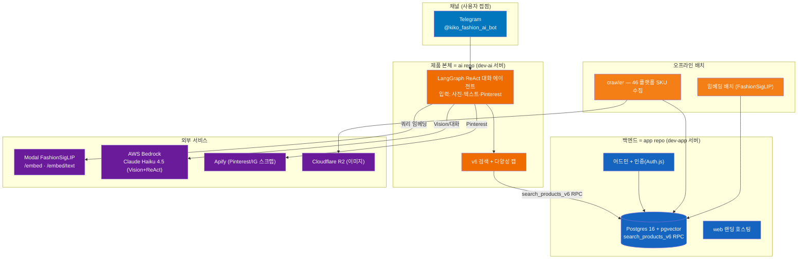
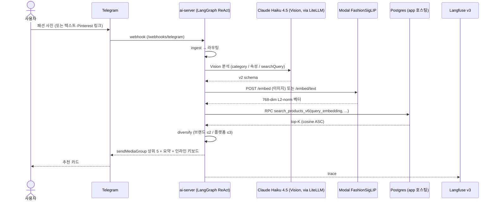
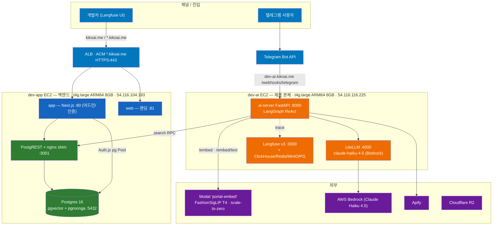
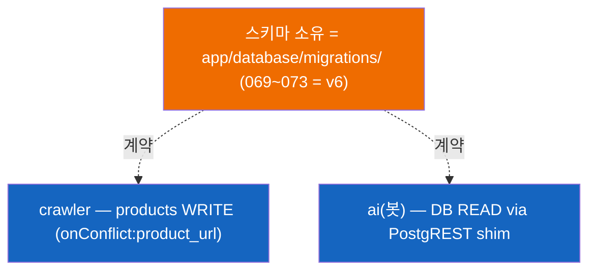

# 01 — 시스템 아키텍처

> - 작성일: 2026-05-24
> - 상태: 인수인계 — 토폴로지 스냅샷
> - 대상·목적: 4개 repo + 인프라가 어떻게 맞물리는지. 후임이 "무엇이 어디서 돌고 무엇에 의존하는지" 파악
> - 검증 기준: `docs/00-overview.md`·`docs/01-architecture.md`, 각 repo CLAUDE.md, `ai/.env.example`, `app/.github/workflows/deploy-dev.yml` 직접 확인
> - 더 상세: [`docs/01-architecture.md`](../../../docs/01-architecture.md) (인프라 정의 IaC 위치 포함)

---

## 1. 역할 구분 (가장 중요)

| 구성 | repo | 역할 | 비고 |
|---|---|---|---|
| 봇 (제품 본체) | `ai` | 텔레그램 대화 에이전트. 멀티모달 입력 → 대화 → 추천 | 실질 메인 |
| 백엔드 | `app` | Postgres·web 호스팅 + 어드민 + 인증. **DB 스키마 소유** | IG 분석 플로우는 레거시(미사용) |
| 랜딩 | `web` | 마케팅 1페이지 | app이 호스팅 |
| 수집 | `crawler` | 46 플랫폼 SKU 수집. DB가 app과의 유일 계약 | 임베딩 안 함 |

## 2. 한 턴 흐름 (봇, 이미지 입력 기준)

## 3. 인프라 토폴로지 (서버 2대)

> AWS `ap-northeast-2` (서울). 단일 dev 인스턴스, 무사용자 POC. 인프라 정의(docker-compose + Modal 배포 스크립트)는 **별도 IaC 레포**에 있으며 인계 시 위치를 공유한다 (→ [03](03-environment-and-secrets.md) §서버 접근).

### EC2 2대

| 인스턴스 | 역할 | 스펙 | 도는 것 |
|---|---|---|---|
| **dev-ai** `54.116.116.225` | 제품 본체 | t4g.large ARM64 8GB | ai-server(:8000), LiteLLM(:4000), Langfuse v3(:3000) + ClickHouse/Redis/MinIO/내부 PG. 메모리 빠듯(~5.25/8GB) |
| **dev-app** `54.116.104.193` | 백엔드 | t4g.large ARM64 8GB · gp3 100GB | Postgres16(pgvector+pgroonga), PostgREST+nginx shim(:3001), app(:80), web(:81) |

### ALB 라우팅 (ACM 와일드카드 `kikoai.me` + `*.kikoai.me`)

| 도메인 | 타겟 | 용도 |
|---|---|---|
| `kikoai.me` (apex) | dev-app web :81 | 마케팅 랜딩 |
| `dev-app.kikoai.me` | dev-app app :80 | 어드민/인증 |
| `dev-ai.kikoai.me` | dev-ai ai-server :8000 | **봇 webhook** (`/webhooks/telegram`) |

## 4. 외부 서비스 매트릭스

| 서비스 | 용도 | 핵심 사실 | 참조 env |
|---|---|---|---|
| **Modal `portal-embed`** | 런타임 쿼리 임베딩 | `gpu=T4`, `min_containers=0`(scale-to-zero) → idle 후 콜드스타트. 엔드포인트 `/embed`·`/embed/text`·`/embed/batch`·`/health`. 모델 `Marqo/marqo-fashionSigLIP`(768-dim L2-norm) | `MODAL_EMBED_URL`·`MODAL_EMBED_TOKEN` |
| **AWS Bedrock** (via LiteLLM) | 봇 LLM(ReAct) + Vision | `claude-haiku-4-5` → `bedrock/us.anthropic.claude-haiku-4-5-…`. LiteLLM 프록시 경유 | `LITELLM_BASE_URL`·`LITELLM_MASTER_KEY` |
| **Apify** | Pinterest/IG 스크랩 | actor `apify~instagram-post-scraper`. free-credit 소진 시 IG 분기 차단(쿨오프) | `APIFY_TOKEN`·`APIFY_INSTAGRAM_ACTOR` |
| **Cloudflare R2** | 상품 이미지 저장 | 단일 버킷, prefix 분리. crawler/app 측 처리 | (⚠️ 키 변수명 확인 필요 — [03](03-environment-and-secrets.md)) |
| **Langfuse v3** | LLM/파이프라인 trace | dev-ai에 self-host (web+worker+ClickHouse+Redis+MinIO+PG) | `LANGFUSE_HOST`·`LANGFUSE_PUBLIC_KEY`·`LANGFUSE_SECRET_KEY` |

## 5. 데이터/배포 경계

- `public` 스키마(상품/브랜드/검색) = **app 소유** (`app/database/migrations/`, SQL).
- `ai` 스키마(대화/세션/취향) = **ai-server 소유** (`ai/migrations/` alembic). app_user는 `ai` 스키마 SELECT-only.
- **배포**: app/ai 둘 다 ECR 이미지 → docker-compose, GitHub Actions + SSH. 2026-05-10 Supabase·Vercel 폐기 후 EC2 자체호스팅. 상세 → [05](05-operations-runbook.md).
- 데이터 모델/마이그레이션/임베딩 → [04](04-data-and-database.md).
