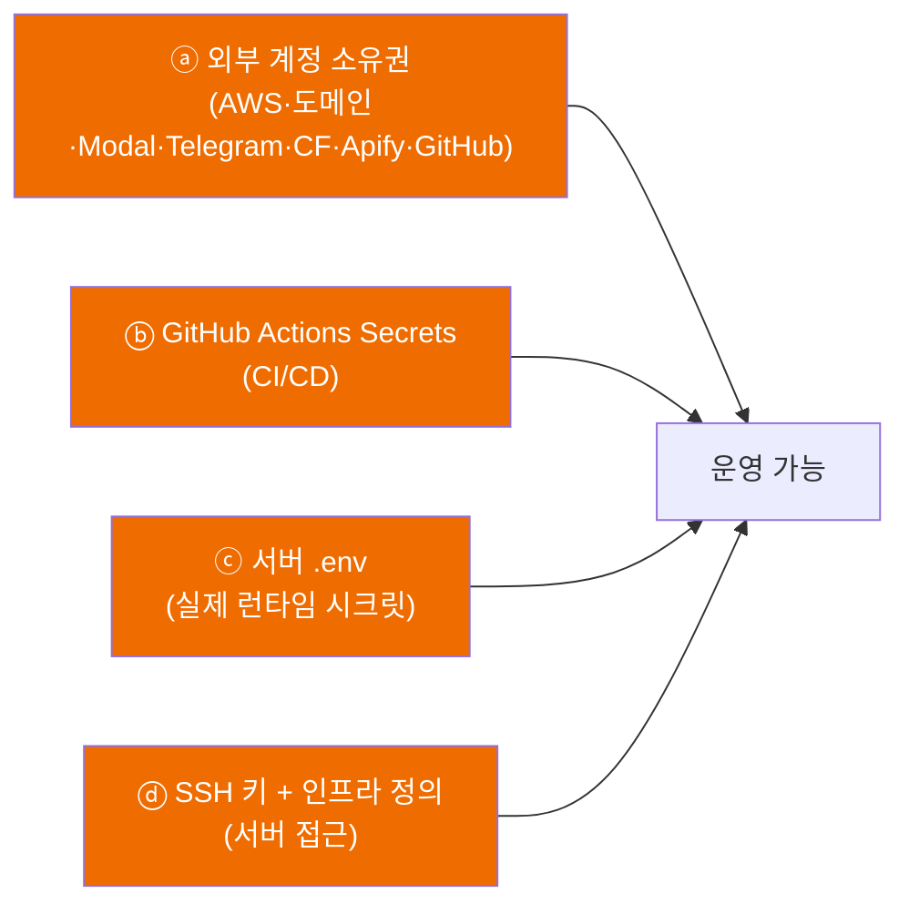

# 03 — 환경변수 · 시크릿 · 계정 인계

> - 작성일: 2026-05-24
> - 상태: 인수인계 — **가장 실무적인 문서**. 무엇을 인계받아야 운영이 되는지
> - 대상·목적: 후임이 받아야 할 계정 소유권 + 시크릿 + 서버 접근을 빠짐없이 확인
> - 검증 기준: `ai/.env.example`(실제 템플릿), app/crawler 코드의 `process.env` 직접 추출(node_modules 제외), 각 repo `.github/workflows/` 의 `secrets.*` 직접 확인
> - **보안 원칙**: 이 문서에는 **값(secret value)을 절대 적지 않는다**. 이름·소스·인계 방법만. 실제 값은 서버 `.env`와 각 계정 콘솔에 있다

---

## 1. 인계는 4겹이다 (먼저 이해)

> **핵심**: 실제 런타임 시크릿(DB 비번·봇 토큰·Modal 토큰 등)은 **코드에도 GitHub Secrets에도 없고 각 서버의 `.env`에 있다**. 따라서 서버 접근(ⓓ)과 서버 `.env`(ⓒ)가 끊기면 시크릿도 함께 잃는다 — 인계 시 반드시 함께 확보.

## 2. ⓐ 외부 계정 / 소유권 이전

| 자산 | 무엇이 걸려 있나 | 인계 방식 | 비고 |
|---|---|---|---|
| **AWS 계정** (`ap-northeast-2`) | EC2 2대(dev-ai, dev-app), ECR(`kikoai-dev/*`), ALB, ACM `*.kikoai.me`, IAM | 계정 이전 또는 IAM 사용자 발급 | **Bedrock(Claude Haiku 4.5)** 도 이 계정 |
| **도메인 `kikoai.me`** | DNS + ACM 와일드카드 인증서 | 등록기관 계정 이전 | ⚠️ 등록기관 확인 필요 |
| **Telegram 봇** `@kiko_fashion_ai_bot` | BotFather 소유 + 봇 토큰 | BotFather에서 토큰 재발급/봇 양도 | webhook은 `dev-ai.kikoai.me/webhooks/telegram` |
| **Modal** | `portal-embed` 앱 + Volume `portal-embed-cache` (FashionSigLIP T4) | Modal 워크스페이스/계정 이전 | scale-to-zero |
| **Cloudflare** | R2 버킷(상품 이미지) | 계정/버킷 이전 | ⚠️ R2 키 변수명 확인 필요 |
| **Apify** | `instagram-post-scraper` actor + 토큰 | 계정 이전 | free-credit 소진 시 IG 차단 |
| **GitHub** `endurance-ai` org | `ai-server`·`kiko.ai-app`·`crawler`·`kiko.ai-web` | repo/org 소유권 이전 | repo별 Secrets도 함께 |
| **OpenAI** | 레거시 — 현재 LiteLLM 경유로 대체 | 키 공유 또는 폐기 | ⚠️ 실사용 여부 확인 |

## 3. ⓑ GitHub Actions Secrets (CI/CD)

각 repo **Settings → Secrets and variables → Actions** 에 설정됨. `deploy-dev.yml` / `ci.yml` 이 참조.

| Secret | 용도 | app | ai | web | crawler |
|---|---|:--:|:--:|:--:|:--:|
| `AWS_ACCESS_KEY_ID` | ECR 푸시 + AWS | ✅ | ✅ | ✅ | — |
| `AWS_SECRET_ACCESS_KEY` | 위 짝 | ✅ | ✅ | ✅ | — |
| `SSH_HOST` | 배포 대상 EC2 | ✅ | ✅ | ✅ | — |
| `SSH_USER` | EC2 계정 | ✅ | ✅ | ✅ | — |
| `SSH_PRIVATE_KEY` | 배포 SSH 키 | ✅ | ✅ | ✅ | — |
| `PERSONAL_TOKEN` | GH PAT (크로스 repo) | ✅ | ✅ | ✅ | ✅ |

> crawler는 자동 배포가 없어 `PERSONAL_TOKEN` 만.

## 4. ⓒ 서버 런타임 `.env` (실제 시크릿 — 여기에만 존재)

> 운영 단계: POC라 키를 서버 `.env`에 둠 (운영 시 Parameter Store 전환은 미완 — [06](06-status-and-known-issues.md)). 인계 시 서버에서 `.env`를 안전 채널로 전달받을 것.

### 4.1 ai (dev-ai 서버 `.env`) — `ai/.env.example` 기준

| 변수 | 분류 | 의미 |
|---|---|---|
| `DB_URL` / `DB_TOKEN` | DB(HTTP) | PostgREST nginx shim 엔드포인트 + 토큰 |
| `DB_DSN` | DB(wire) | Postgres 직결 DSN (psycopg3 — 세션/취향 영속, SPEC-MEMORY-001) |
| `MODAL_EMBED_URL` / `MODAL_EMBED_TOKEN` | 외부 | Modal 임베딩 엔드포인트 + Bearer |
| `LITELLM_BASE_URL` / `LITELLM_MASTER_KEY` | 외부 | LiteLLM 프록시(=봇 LLM 게이트웨이) |
| `LANGFUSE_HOST` / `LANGFUSE_PUBLIC_KEY` / `LANGFUSE_SECRET_KEY` | 관측성 | Langfuse v3 self-host |
| `TELEGRAM_BOT_TOKEN` / `TELEGRAM_BOT_USERNAME` / `TELEGRAM_WEBHOOK_SECRET` / `TELEGRAM_PUBLIC_URL` | 채널 | 봇 토큰 + webhook 인증 |
| `APIFY_TOKEN` / `APIFY_INSTAGRAM_ACTOR` | 외부 | Pinterest/IG 스크랩 |
| `INTERNAL_API_TOKEN` | 보안 | `/recommend`·`/debug` 내부 인증 |
| (feature flags 다수) | 튜닝 | `VISION_SCHEMA_V2`, `SELF_CRITIQUE_*`, `SEARCH_*CAP`, `AGENT_*`, `REDIS_URL` 등 — 전체는 `ai/.env.example` |

### 4.2 app (dev-app 서버 `.env`) — 코드 `process.env` 기준

| 변수 | 분류 | 의미 |
|---|---|---|
| `DATABASE_URL` | DB(wire) | Auth.js pg Pool용 Postgres 직결 |
| `DB_URL` / `DB_TOKEN` | DB(HTTP) | PostgREST shim |
| `AUTH_SECRET` | 인증 | **Auth.js v5가 직접 읽음** (코드 grep엔 안 잡힘 — 필수 누락 주의) |
| `MODAL_EMBED_URL` / `MODAL_EMBED_TOKEN` / `MODAL_EMBED_TIMEOUT` | 외부 | (어드민 디버거/임베딩) |
| `LITELLM_BASE_URL` / `LITELLM_API_KEY` / `LITELLM_DISABLED` | 외부 | Vision/LLM 토글 (현재 OFF) |
| `OPENAI_API_KEY` | 외부 | 레거시 Vision |
| `INTERNAL_API_KEY` / `INTERNAL_API_TOKEN` | 보안 | ai-server 연동 |
| `AI_API_URL` / `AI_SERVER_URL` | 연동 | ai-server 호출 base |
| R2 자격 | 외부 | 이미지 저장 (⚠️ 변수명 확인 필요) |

### 4.3 crawler (`.env.local`) — 코드 `process.env` 기준

| 변수 | 의미 |
|---|---|
| `DB_URL` / `DB_TOKEN` | PostgREST shim (products write) |
| `LITELLM_BASE_URL` / `LITELLM_API_KEY` / `LITELLM_MODEL` | 브랜드 enrich 등 LLM |
| `INTERNAL_API_KEY` | 내부 인증 |
| `APP_URL` | app 연동 base |
| `CRAWLER_VALIDATION_ENABLED` | 검증 토글 |

### 4.4 web

- **런타임 시크릿 없음.** 정적 랜딩.

## 5. ⓓ 서버 접근

| 항목 | 값 / 방법 |
|---|---|
| SSH 키 | `kikoai-key.pem` (전역 표준 키) |
| dev-ai | `ssh -i kikoai-key.pem <user>@54.116.116.225` |
| dev-app | `ssh -i kikoai-key.pem <user>@54.116.104.193` |
| 리전/프로필 | `ap-northeast-2` / AWS 프로필 `kiko.ai` |
| 인프라 정의 | docker-compose + Modal 배포 스크립트가 담긴 **별도 IaC 레포** — 인계 시 위치 공유 |

## 6. ⚠️ 인계 전 직접 확인 필요 (미검증 3건)

| # | 항목 | 왜 |
|---|---|---|
| 1 | 도메인 `kikoai.me` 등록기관 | 어느 레지스트라 계정인지 코드에 없음 |
| 2 | Cloudflare R2 키 변수명 | app/crawler `process.env`에 직접 노출 안 됨 — 설정 파일/SDK 확인 |
| 3 | `OPENAI_API_KEY` 실사용 여부 | LiteLLM 경유로 대체됐을 수 있음 — 폐기 가능하면 폐기 |

> 인수 체크리스트는 [06](06-status-and-known-issues.md) §인수 체크리스트.
