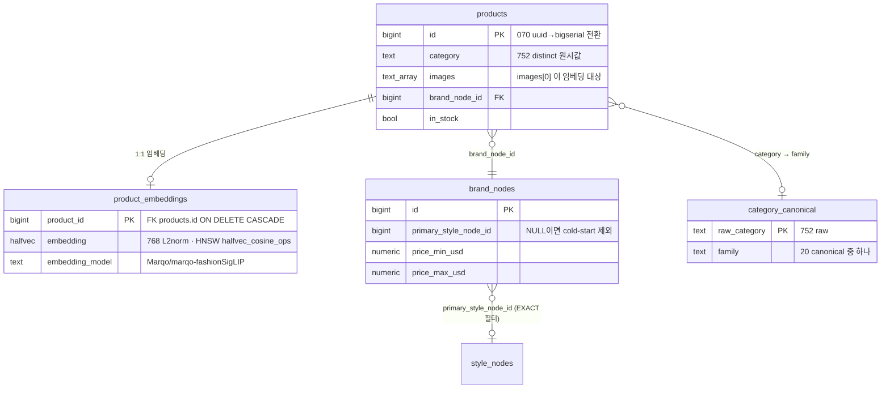
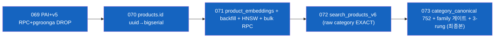
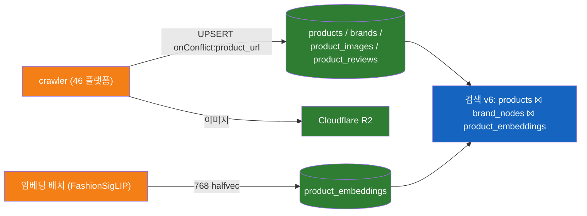

# 04 — 데이터 & 데이터베이스

> - 작성일: 2026-05-24
> - 상태: 인수인계 — 스키마·마이그레이션·임베딩 데이터·백업
> - 대상·목적: 후임이 DB 구조·소유 경계·데이터 자산·복원 방법을 파악
> - 검증 기준: `app/database/migrations/*.sql`(87개, 089까지), `ai/migrations/versions/*.py`(8개), `docs/05-data-crawler.md` 직접 확인
> - 더 상세: [`docs/05-data-crawler.md`](../../../docs/05-data-crawler.md), [`docs/02-search-engine-v6.md`](../../../docs/02-search-engine-v6.md)

---

## 1. 단일 Postgres, 두 스키마 (소유 경계)

dev-app EC2의 **Postgres 16 (pgvector + pgroonga)** 하나가 시스템 전체의 데이터 토대. 스키마 2개로 소유가 갈린다:

| 스키마 | 소유 repo | 마이그레이션 | 내용 | 타 repo 권한 |
|---|---|---|---|---|
| `public` | **app** | `app/database/migrations/*.sql` (SQL, 089까지 87개) | 상품·브랜드·임베딩·검색 RPC | crawler가 products WRITE |
| `ai` | **ai-server** | `ai/migrations/versions/*.py` (alembic, 8개) | 대화/세션/취향/임베딩 캐시 | app_user는 SELECT-only |

## 2. 핵심 테이블 (ERD)



## 3. 데이터 규모 (인계 시점)

| 항목 | 값 |
|---|---|
| products(SKU) 총계 | **~118,504** |
| 임베딩 완료 | **전량(~118k)** — 풀배치 2026-05-19. (구 "71k/60%"는 마이그 071 시점 스냅샷) |
| 브랜드 | ~2,072 (`primary_style_node_id` 배정 1,300+) |
| 크롤 플랫폼 | 46개 (Cafe24 KR 20 + Shopify global 17 + 기타) |
| category 원시 distinct | 752 → 20 canonical family 수작업 매핑 (migration 073) |

## 4. 검색 v6 마이그레이션 footprint (`public`)



- `search_products_v6` = embedding-first(cosine, distance ASC) → top-50 RPC. 이후 Python에서 다양성 캡(브랜드≤2/플랫폼≤3) → top-15.
- 074~089는 정리/드롭 위주 (`085~089` 미사용 객체·레거시 컬럼 DROP).
- **HNSW 인덱스는 직렬 빌드 강제** (컨테이너 `/dev/shm` 64MB 제한) — 재인덱싱 시 lock 길어짐 ([06](06-status-and-known-issues.md) 참조).

## 5. 데이터 흐름 (수급 → 검색)



- crawler 쓰기 = `upsert onConflict:"product_url"`(자연키) → id 미생성, 070 bigint 전환에 안전. **임베딩/AI 분석 안 함**.
- 임베딩 배치 = 별도 Python (로컬/GPU). 신규 SKU는 다음 배치 전까지 미임베딩 = 검색 제외.

## 6. 백업 · 복구 ⚠️ 인계 핵심

### 6.1 함께 묶인 덤프 (이 핸드오프 첨부)

| 항목 | 값 |
|---|---|
| 파일 | `dump/kikoai_260524.dump` (이 폴더 하위) |
| 크기 / 포맷 | **406MB · PostgreSQL custom format (`pg_dump -Fc`)** |
| 생성 | dev-app `db` 컨테이너, `pg_dump (PostgreSQL) 16.13`, 2026-05-24 |
| 범위 | **풀 덤프** — `public`(상품·임베딩 118,504) + `ai`(세션·취향) 두 스키마 전체 |
| git | **커밋 금지** — `dump/.gitignore` 로 제외됨 (406MB + 실데이터). 안전 채널로 별도 전달 |

> ⚠️ 복원에는 **PostgreSQL 16+ 클라이언트 툴(`pg_restore`)** 이 필요하다 (덤프 포맷 v1.15). 구버전/미설치 환경에선 `pg_restore -l` 이 빈 결과를 낸다.

### 6.2 복원 명령

```bash
# 빈 DB 생성 후 custom-format 복원 (권장)
createdb kikoai
pg_restore --no-owner --no-privileges -d kikoai dump/kikoai_260524.dump
# TOC 먼저 확인하려면:
pg_restore -l dump/kikoai_260524.dump | less
```
> 복원 후 `product_embeddings` HNSW 인덱스가 재빌드되면 직렬 빌드 제약(`/dev/shm` 64MB) 유의 — [05](05-operations-runbook.md) §3.

### 6.3 기존 백업 자동화 (운영 중 확인됨)

- **dev-app에 매일 19:00 UTC `pg_backup` → S3 cron 이 이미 존재.** 단 **EC2 가 running 일 때만** 실행 — 서버를 `stop`(중단) 해두면 그 기간 백업 누락 → S3 백업 stale.
- 따라서 "DR 없음"이 아니라 "**단일 인스턴스 + EC2 running 의존 백업**" — 인계 후엔 중단 정책에 맞춰 백업 전략 재점검 권장 (리스크 [06](06-status-and-known-issues.md) R4).
- 상세 복구 runbook 이 별도 IaC 레포에 존재 (`...pg-restore-runbook.md`) — 인계 시 위치 공유.

## 7. 코드 위치

| 개념 | 위치 |
|---|---|
| `public` 스키마/마이그 | `app/database/migrations/` (069~073 = v6) |
| `ai` 스키마/마이그 | `ai/migrations/versions/` (alembic) |
| 검색 RPC 클라이언트 | `ai/app/infrastructure/repositories/search_repository.py` |
| family 정규화 | `ai/app/infrastructure/repositories/category_family.py` |
| 크롤 엔트리 / 플랫폼 config | `crawler/src/cli.ts` · `crawler/src/configs/platforms.ts` |
| 임베딩 배치 스크립트 | 별도 IaC 레포 (`batch_embed_full.py`) |
