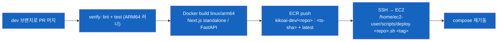

# 05 — 운영 런북

> - 작성일: 2026-05-24
> - 상태: 인수인계 — 배포·기동/정지·헬스체크·장애·중단 절차
> - 대상·목적: 후임이 시스템을 실제로 띄우고/내리고/고칠 수 있게
> - 검증 기준: `app/.github/workflows/deploy-dev.yml`(+ai 동일 패턴), `docs/01-architecture.md`, 각 repo CLAUDE.md 직접 확인

---

## 1. 배포 (CI/CD)

`app`·`ai`·`web` 는 GitHub Actions로 자동 배포. `crawler` 는 자동 배포 없음(수동).



| 단계 | 내용 |
|---|---|
| 트리거 | `dev` 브랜치로의 PR **머지** (`pull_request: closed` + merged) 또는 `workflow_dispatch` 수동 |
| verify | `pnpm lint` + `pnpm test`(app/web) / ruff+pytest(ai). 실패 시 배포 중단 |
| build+push | ARM64 네이티브 러너에서 Docker 빌드 → ECR `kikoai-dev/<repo>` 에 `<YYYYMMDDhhmmss>-<short_sha>` + `latest` 태그 push |
| deploy | `appleboy/ssh-action` 으로 EC2 접속 → `/home/ec2-user/scripts/deploy.<repo>.sh <image_tag>` 실행 (이미지 pull + compose 재기동) |
| 동시성 | 같은 ref deploy 직렬화 (cancel 안 함) |

> 필요 GitHub Secrets는 [03](03-environment-and-secrets.md) §ⓑ. ECR repo prefix `kikoai-dev/*` 에 대한 IAM push 권한 필요.

## 2. 서버 기동 / 정지 / 헬스체크

> 인프라 정의(docker-compose)는 별도 IaC 레포. 서버 SSH 접근은 [03](03-environment-and-secrets.md) §ⓓ. SSM 사용 안 함 — SSH 키 기반.

### dev-ai (제품 본체)

```bash
ssh -i kikoai-key.pem <user>@54.116.116.225
cd /home/ec2-user/docker      # (정확 경로는 IaC 레포 기준)
docker compose ps             # 9 컨테이너 상태
docker compose logs ai-server --tail 50
curl -s localhost:8000/health # liveness (no auth)
```
- 컨테이너: ai-server(:8000), litellm(:4000), litellm-db, langfuse-web(:3000), langfuse-worker, langfuse-db, clickhouse, redis, minio. 메모리 빠듯(~5.25/8GB) — 동시 재기동 주의.

### dev-app (백엔드)

```bash
ssh -i kikoai-key.pem <user>@54.116.104.193
docker compose ps             # db / postgrest / nginx shim / app / web
docker exec db pg_isready -U postgres -d kikoai
curl -s localhost:80          # app (어드민)
```

### Telegram webhook

- 봇 webhook은 `dev-ai.kikoai.me/webhooks/telegram` 로 설정됨 (ai-server lifespan이 `setWebhook` 수행).
- 확인: `curl https://api.telegram.org/bot<TOKEN>/getWebhookInfo` (토큰은 서버 `.env`).

### Modal (임베딩)

- scale-to-zero라 평소 컨테이너 0개 — 첫 요청 시 콜드스타트.
- 재배포: IaC 레포의 Modal 스크립트로 `modal deploy embed_app.py` (수동).
- 헬스: Modal 엔드포인트 `/health`.

### 관측성 (Langfuse)

- dev-ai에 self-host. UI: `:3000` (ALB 경유 접근 — 키는 서버 `.env`의 `LANGFUSE_*`).

## 3. 흔한 장애 / 대응

| 증상 | 원인 | 대응 |
|---|---|---|
| 첫 추천이 수십 초 지연 | Modal **콜드스타트** (`min_containers=0`) | 정상 동작. 상시 warm 필요하면 `min_containers=1`(T4 24h 과금) 트레이드오프 |
| 봇 무응답 | webhook 끊김 / ai-server 다운 | `getWebhookInfo` 확인 + `docker compose logs ai-server` |
| 검색 결과 0건인데 정상 | 봇은 `p_style_node_id`=NULL → FILTER1 dead → 항상 `degraded=true` (의도된 동작) | [`docs/02-search-engine-v6.md`](../../../docs/02-search-engine-v6.md) |
| 재인덱싱 중 테이블 lock 김 | HNSW **직렬 빌드 강제** (`/dev/shm` 64MB) | dev 단독·무사용자라 허용. 근본해결 = compose `db`에 `shm_size: 1g` |
| dev-ai 메모리 압박 | 9 컨테이너 8GB | 동시 재기동 피하고 순차 재기동 |
| LLM 모델 혼선 | config 기본값 `nova-lite` ↔ 배포 `.env` `claude-haiku-4-5` drift | 운영 모델은 서버 `.env` 기준 ([06](06-status-and-known-issues.md)) |

## 4. 중단(보존) 절차 — 운영을 접을 때

비용을 0에 가깝게 두고 데이터·자산을 보존하는 순서:

1. **DB 덤프 확보**: `pg_dump -Fc` 로 최신 덤프 → 안전 보관 ([04](04-data-and-database.md) §백업·복구). **가장 먼저.**
2. **봇 webhook 해제**: `deleteWebhook` (사용자 유입 차단).
3. **EC2 정지**: dev-ai · dev-app `stop`(종료 아님 — EBS 보존). 또는 compose down.
4. **Modal**: scale-to-zero라 유휴 비용 ~$0 — 그대로 둬도 무방. 완전 정리 시 앱 delete.
5. **R2/이미지**: 버킷 보존(저비용). 필요 시 백업.
6. **도메인/ACM**: 갱신만 유지하면 됨.

> 완전 종료(데이터까지 폐기)는 비가역 — 덤프·이미지·계정 권한 정리까지 끝낸 뒤에만. 인계 단계에선 **정지(보존)** 권장.

## 5. 운영 메모

- 단일 dev 환경·무사용자 POC — 이중화/오토스케일/온콜 없음.
- 비용 상세·절감 포인트: [`docs/260519-cost-estimate.md`](../../../docs/260519-cost-estimate.md).
- 개선 후보: [`docs/260519-improvement-plan.md`](../../../docs/260519-improvement-plan.md).
